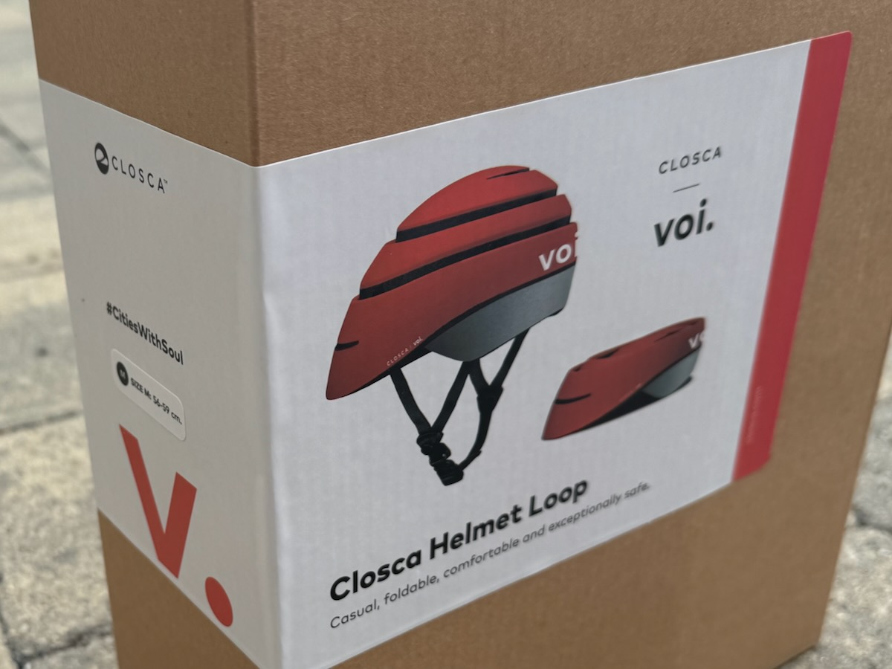
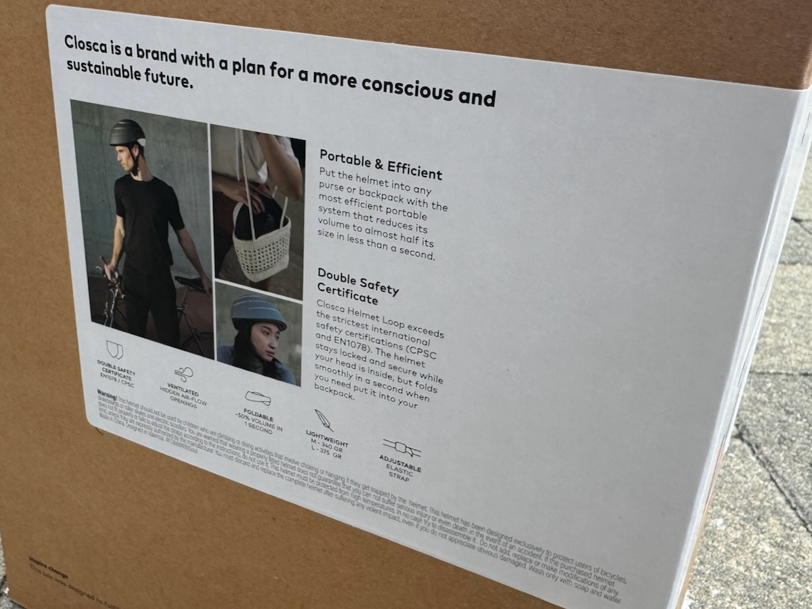

We attended the media launch of Edinburgh's new hire e-bikes last Friday, the 22nd August.

Amidst the scrum for carefully choreographed photographs, Council quotes and on-bike videos with the 'real' press, we managed to get some answers from [Voi](https://www.voi.com/) representatives about various aspects of the scheme - as well as finding out which bits are still being fine-tuned ahead of the public launch **next Wednesday 3rd September**. We've laid all of these out below.

Click down into the images below view larger with description. _You can move through the gallery with arrow keys, swiping on a touchscreen device, or the buttons on-screen for non-touchscreen devices._

<link rel="stylesheet" href="/articles/2025-08-24-voi-hire-bikes-media-launch/assets/photoswipe/photoswipe.css">

  <figure class="pswp-gallery__item">
    
    <figcaption class="hidden-caption-content">The Voi team ready the bikes for press and political figures, while CEC Transport & Environment Convener Cllr Stephen Jenkinson is interviewed in the background.</figcaption>
  </figure>
  <figure class="pswp-gallery__item">
    
    <figcaption class="hidden-caption-content">Cllr Stephen Jenkinson and Voi UK's General Manager James Bolton take to North Meadow Walk on Voi's hire e-bikes for press onlookers.</figcaption>
  </figure>
  <figure class="pswp-gallery__item">
    
    <figcaption class="hidden-caption-content">The larger of Voi's two e-bike models coming to Edinburgh, the Explorer 4.</figcaption>
  </figure>
  <figure class="pswp-gallery__item">
    
    <figcaption class="hidden-caption-content">The smaller from Voi's cycles destined for Edinburgh, the Explorer Light 1, is 25% lighter and slightly more powerful on hill climbs.</figcaption>
  </figure>  
  <figure class="pswp-gallery__item">
    
    <figcaption class="hidden-caption-content">'Cities made for living', Voi's slogan, adorning their pop-up demo shelter.</figcaption>
  </figure>
  <figure class="pswp-gallery__item">
    
    <figcaption class="hidden-caption-content">Cllr Jenkinson and James Bolton from Voi pose for the cameras.</figcaption>
  </figure>
  <figure class="pswp-gallery__item">
    
    <figcaption class="hidden-caption-content">One last shot for the media, with the whole young team in tow.</figcaption>
  </figure>
   

## 🧮 So what's the extent of the imminent rollout?

**Fifty bikes** will be on-street from Wednesday 3rd September, with around **twenty geofenced parking locations**. To begin with, these will be primarily sited on open public spaces off the carriageway, but in other cities Voi have a track record of working with local authorities to get the appropriate traffic orders in place to turn over car parking spaces to hire cycle parking, fitting twelve bikes in a typical single-car space.

The team were keen to reassure press in attendance that accessibility and pedestrian space will be respected in the siting of parking locations.

## 🗺️ What exactly does 'City Centre' mean, in terms of the perimiter of use?

This is still being pinned down by team Voi, along with exact parking locations; they're targeting the inclusion of as many higher education campuses as possible, and we're definitely 'beyond the meadows' in terms of the initial zone.

In terms of forward notice, it seems pretty likely we won't see any further details until the scheme goes live on Wednesday 3rd September.

## 🚲 What's on offer?

Voi's all-electric fleet for Edinburgh consists of two e-bike models; the Voi Explorer 4 and the Voi Explorer Light 1 - both in a delightfully _heritage-appropriate_ pastel 'coral' colour scheme, which looks pretty classy compared to some of the competitors who lost out on the contract. Both bikes featuring a spring-back central kickstand and wide tyres.

### Voi Explorer 4

This is the larger of the two cycles, ridden by Cllr Jenkinson in our photos. At 36kg it's substantial, and offers a soft, height-adjustable saddle, front cargo basket, 'be seen' running lights and a bell. While the app encourages you to use a helmet - listing it in the app along with the rules for riding - they're not provided with the hire of the bike.  

### Voi Explorer Light 1

This cycle is a little more nimble, nippier up a hill, and weighs significantly less than its Explorer 4 counterpart at 25kg. If like us you'll be recommending pals get a first try of an e-bike using the scheme, this might be the one to highlight for a first try. Smaller wheels might not contend as well with Edinburgh's pothole-slash-crater situation and accompanying road ravines, but given how driven by usage data this scheme will be as it grows, we'll soon see if riders have a preference.

## 💸 Bike shareonomics

Dott and Lime's models for operating in the city seemed very focussed around the festival, likely in order to subsidise the service year-round; in contrast, Voi's peak months in comparable cities like Oxford and Cambridge are September and October, as student populations arrive and explore the city - many by bike.

The team emphasised a continued availability of cycles into the winter months, with a typical low season of December, January and February - but no intention to scale back supply over that time.

While Voi's team talked around the subject of the council recovering mis-parked cycles — they have a mix of AI and offshore staff checking the photo a rider has to take of their parking job before ending their trip, so have high confidence in their parking process — we know that thanks to a Green amendment at the Transport committee approving the cycle hire scheme that the council will have the right to collect up any abandoned or incorrectly parked bikes and charge Voi for their return.

## 📈 How quickly will the supply of bikes ramp up?

An initial stock of fifty bikes feels quite low in number with a demographic like the student hordes in mind, but this feels intentional in terms of testing the waters with a small and controlled scheme to iron out any issues that arise - and, no doubt having been briefed on the feral young teams' literal interpretation of the name 'Just Eat Bikes', keen not to lay out too much of a banquet before seeing how readily the appetisers are set about. 

The Voi team talked about an upper bound of eight hundred bikes for the city, and placed a heavy emphasis on the amount of usage data and monitoring data available to them to see how their initial offering is used. When new bikes are added, or a new area of the city is expanded to, users of the scheme can expect to be updated by push notification and email, as well as the communications team for the organisation publicising any additions in the capital.

## 🤷🏻‍♂️ Are they just going to get minched, and trashed?

The proof of the pudding, as they say, is in the Just-Eating; but at first glance, these units are far heavier, and not possible to ride away without unlocking via the app. The cycle will make audible bleeps and bloops when knocked or handled, and has both a motor lock and wheel lock mechanism preventing them being shifted easily - as well as an alarm if enough of the wrong handling tips into algorithmically identified 'shenanigans' territory. It's hard to see them being a big target beyond an initial period of novelty - the march of technology means these things are pretty well laden with tracking and prevention measures, and it's been a long time and a lot of advancement since the flashing blue-red lights of a stolen Serco bike graced the streets of Auld Reekie. 

For maintenance, there will be a Voi team based in Edinburgh, hiring locally before long, and dealing with the maintenance and management of the cycle units directly.

## 🚨 Relocation, relocation, relocation

Always a question with bike hire schemes: how to address the need for 'rebalancing' the availability of bikes across the network. In the extremes, a point of obsession for end-users — see the brilliant short film ['The Point of a Ride' by Peter Gerard](https://vimeo.com/284731660?fl=pl&fe=vl) — and in opposing examples, just a headache for a local operations team.

Voi's answer is somewhere in the middle - their operations team will have a hand in staying on top of matters, but there are also a couple of layers at play to keep the network riding. Logic in their platform can look speculatively not just at where there has been demand, but also anticipate future demand from past patterns, identifying when bikes need to be shifted around - giving that ops team a helping hand.

There's also pricing incentives that can involve riders of the bikes, both when parking and hiring a bike - shown in the app when consulting the map, but also indicated with a particular light on the cycle itself if the system would ideally have it relocated elsewhere.

## ✨ Let's see where this goes!

As Transport Convener Cllr Stephen Jenkinson pointed out in conversation at the event, folk visiting the city are often surprised that we don't already have a cycle hire operation in Edinburgh. Voi seem like a pretty positive force in a space where not every player wears a social concience on their marketeering sleeve, and we look forward to seeing this scale up into a really useful bit of the transport puzzle in the capital.

## Related:
- 2025-08: [Gallery: The Voi App ahead of Edinburgh Launch](/projects/2025-08-voi-app)

_Transparency: Along with the (real) journalists and officers in attendance, we were gifted a nifty wee collapsable, Voi-branded bike helmet at the event, but we've tried not to let it... 'go to our heads'_ 😉 _in terms of this article nor any others we write in the coming months._

  <figure class="pswp-gallery__item">
    
  </figure>
  <figure class="pswp-gallery__item">
    
  </figure>

