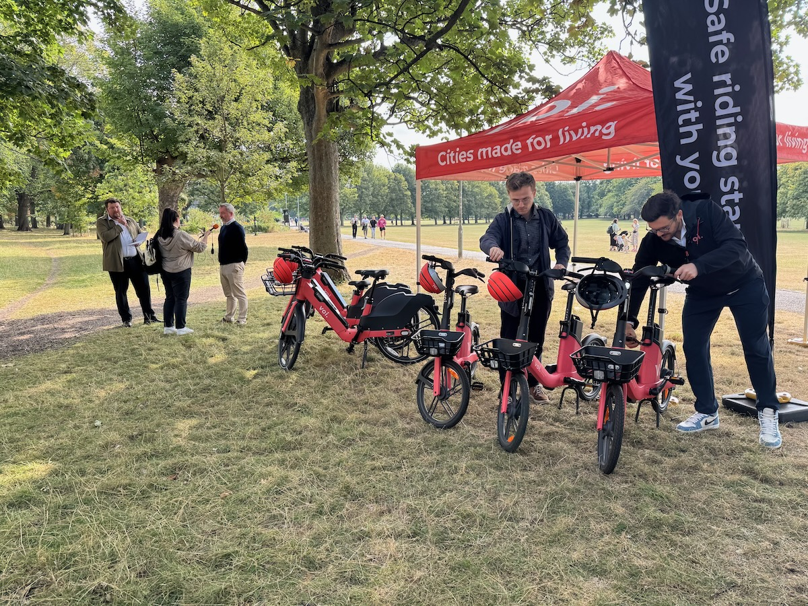
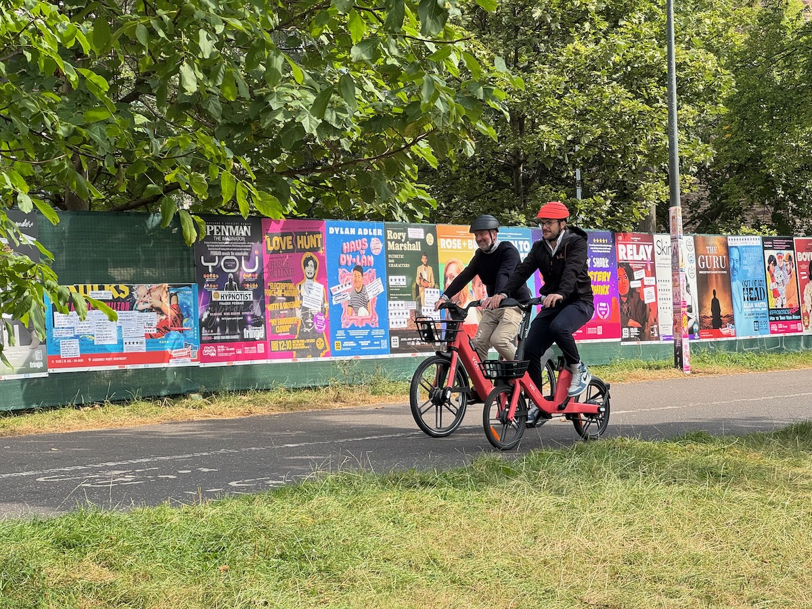
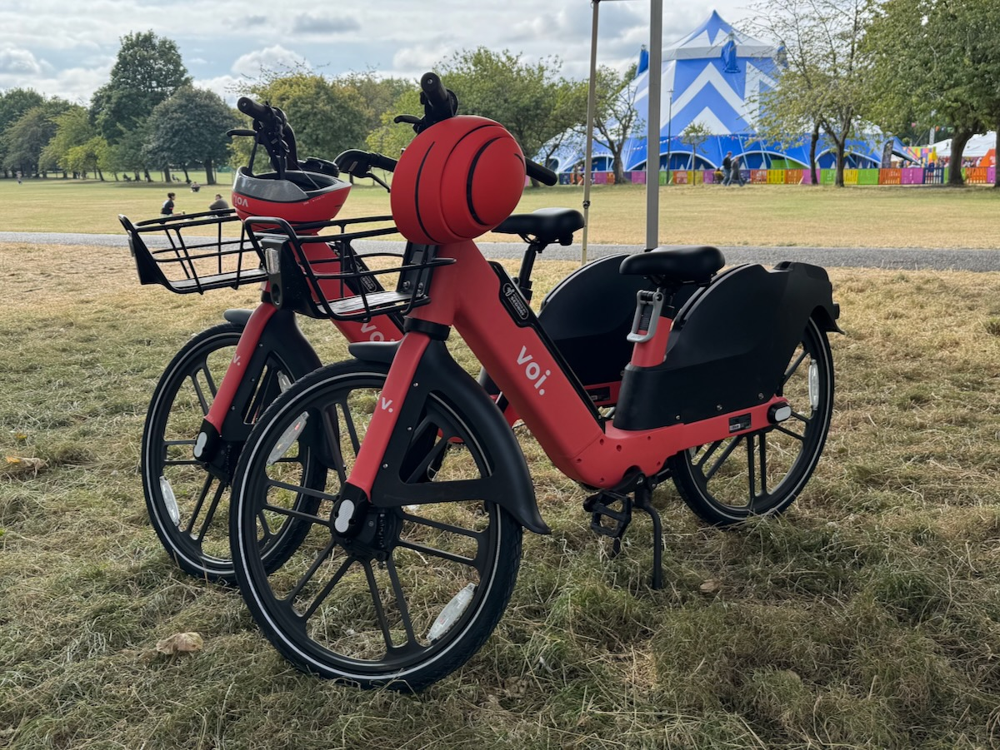
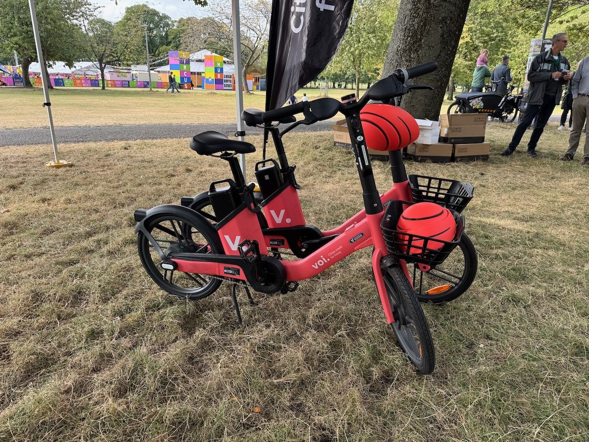
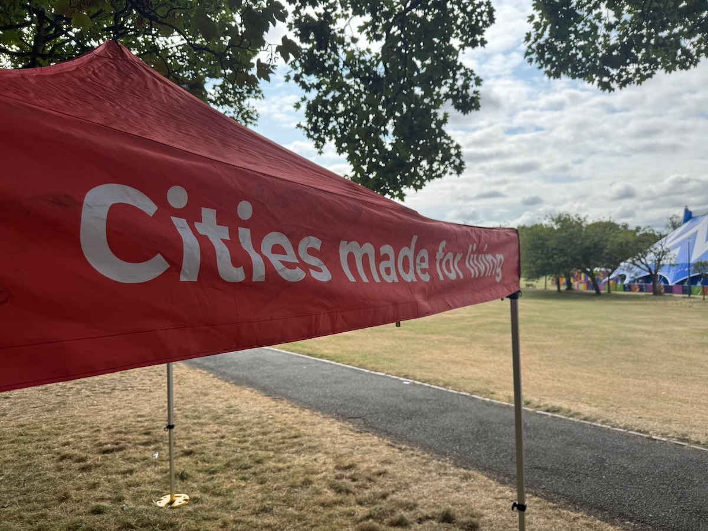
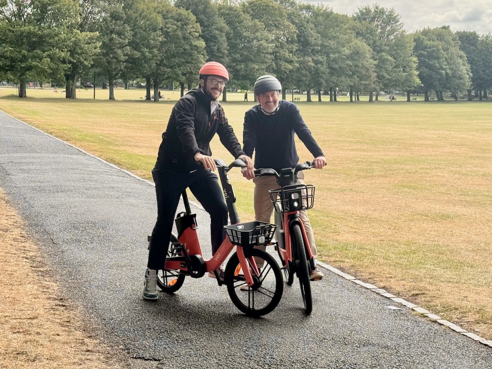
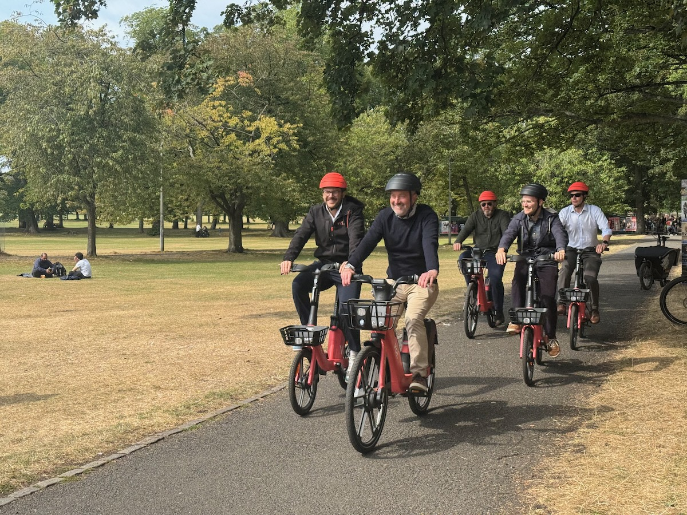

We attended the media launch of Edinburgh's new hire e-bikes last Friday, the 22nd August.

Amidst the scrum for carefully choreographed photographs, Council quotes and on-bike videos with the 'real' press, we managed to get some answers from Voi representatives about various aspects of the scheme - as well as finding out which bits are still being fine-tuned ahead of the public launch **next Wednesday 3rd September**.

Click down into the images below view larger with description. _You can move through the gallery with arrow keys, swiping on a touchscreen device, or the buttons on-screen for non-touchscreen devices._

<link rel="stylesheet" href="/articles/2025-08-24-voi-hire-bikes-media-launch/assets/photoswipe/photoswipe.css">

  <figure class="pswp-gallery__item">
    
    <figcaption class="hidden-caption-content">The Voi team ready the bikes for press and political figures, while CEC Transport & Environment Convener Cllr Stephen Jenkinson is interviewed in the background.</figcaption>
  </figure>
  <figure class="pswp-gallery__item">
    
    <figcaption class="hidden-caption-content">Here's an example (Liverpool) of how the perimeter of use manifests on the map, with zones and rentable bikes/scooters.</figcaption>
  </figure>
  <figure class="pswp-gallery__item">
    
    <figcaption class="hidden-caption-content">Zooming in closer we can start to see individual scooters - which won't be in Edinburgh, pending legislation required to allow them - and different zones, parking etc.</figcaption>
  </figure>
  <figure class="pswp-gallery__item">
    
    <figcaption class="hidden-caption-content">The top icon on the map view - the direction arrow - looks to offer GPS navigation / directions, but will show a warning if the destination is outside the usage perimiter in your city.</figcaption>
  </figure>  
  <figure class="pswp-gallery__item">
    
    <figcaption class="hidden-caption-content">The second icon in the top corner of the map view is a filter to show only bikes or scooters on the map.</figcaption>
  </figure>
  <figure class="pswp-gallery__item">
    
    <figcaption class="hidden-caption-content">The 'Voi pass' tab shows pricing options - this, and the next shot, are plans in Liverpool.</figcaption>
  </figure>
  <figure class="pswp-gallery__item">
    
    <figcaption class="hidden-caption-content">Scrolling through the different (Liverpool) monthly plans.</figcaption>
  </figure>
   

