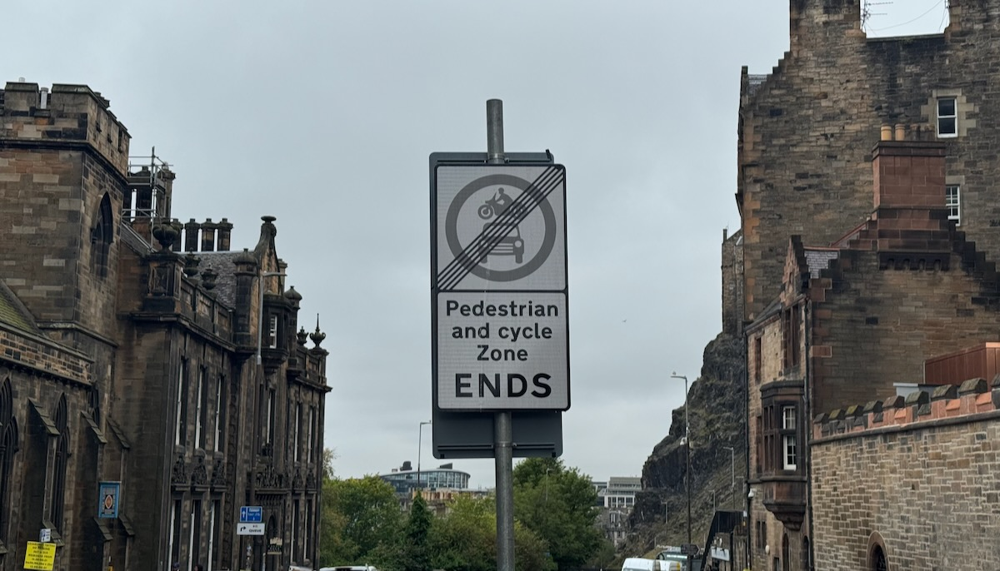
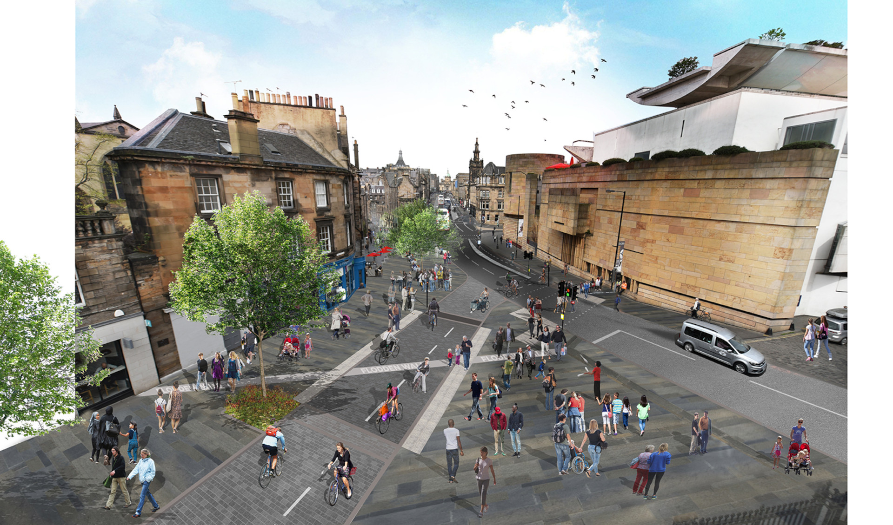

The meeting papers have been published for the council's [Traffic Regulation Order Sub-Committee](https://democracy.edinburgh.gov.uk/ieListDocuments.aspx?CId=645&MId=7796&Ver=4){target="_blank" rel="noopen noreferrer"} (or 'TRO Sub') meeting this Thursday 4th September.

This Sub-Committee controversially has been putting safe cycle infrastructure in jeoapardy through their recent decisions and deferrals, so all eyes are on them as they meet to once more quasi-ly adjudicate the statutory roads process in Edinburgh later this week.

## 📋 Agenda 

There's a number of matters coming to TRO Sub for their approval this week:

* 🌳 **Meadows to George Street** project, TRO/21/32
and Redetermination Order RSO/21/08 - [Report and appendices](https://democracy.edinburgh.gov.uk/documents/g7796/Public%20reports%20pack%2004th-Sep-2025%2010.00%20Traffic%20Regulation20Orders%20Sub-Committee.pdf?T=10#page=7){target="_blank" rel="noopen noreferrer"} » [PDF, page 7]
* _'Late Reports'_ - 🚲 **Travelling Safely East Area** ETRO/21/28A - [Report and appendices](https://democracy.edinburgh.gov.uk/documents/b26852/Late%20Reports%2004th-Sep-2025%2010.00%20Traffic%20Regulation%20Orders%20Sub-Committee.pdf?T=9#page=9){target="_blank" rel="noopen noreferrer"} » [PDF, page 3]
* _'Late Reports'_ - 🌴 **Travelling Safely North West and Arboretum Place** ETRO/21/27B, ETRO21/30A and ETRO/23/23A - [Report and appendices](https://democracy.edinburgh.gov.uk/documents/b26852/Late%20Reports%2004th-Sep-2025%2010.00%20Traffic%20Regulation%20Orders%20Sub-Committee.pdf?T=9#page=261){target="_blank" rel="noopen noreferrer"} » [PDF, page 261]

_(There are other matters on the agenda regarding bins and controlled parking areas, but we will generally try and 'stay in our lane' and focus on cycle infrastructure and policy.)_

## ✨ Some notes of interest

> 🏔️ The paperwork mountain involved in all of the different orders coming to this meeting is a bit gnarly to climb solo, so here's a number of interesting bits that apply across the city as a whole that have emerged from these reports.

In recent meetings both the costs involved for upgrading the 'Travelling Safely' schemes from rubber kerbs to stone kerb segregation and pavement build-outs, and the safety of the existing 'Rosehill Rubber Cycle Lane' kerb/bollards have come into question, and both are addressed in the sections below quoted from these new reports. Additionally, Officers have put together indicative timescales for the entire city's programme, all the way up to 2034.

---

### 💰 'Travelling Safely' upgrades budget and overall programme estimate

While the initial 5-year rolling programme of £2.5m will cover a lot of the highest priority upgrades with regard to safety and the most pressing aesthetic improvements, it could be extended:

> **5.1.5** A preliminary budget level cost estimate for upgrading prioritised measures across the whole Travelling Safely programme is £4.1 million. Further detail is provided in Appendix 27. This estimate has been prepared on the basis of all projects being retained permanently, which will be subject to decisions made at this and future Sub-Committee meetings;
>
> **5.1.6** As it is now anticipated that the currently approved five-year rolling programme of infrastructure upgrades would be insufficient to upgrade all prioritised infrastructure, should all schemes be retained permanently, the next annual review of the CMP CIP will recommend that this programme be extended in duration until all prioritised infrastructure is upgraded;
>
> **5.1.7** Upgrades to Travelling Safely infrastructure will be delivered on a prioritised basis; and
>
> **5.1.8** The planned annual reviews of the CMP CIP will also allow future consideration to be given to further upgrades or replacement of Travelling Safely infrastructure, not prioritised at this stage.

---

### ⬆️ The prioritisation framework for upgrading Travelling Safely schemes

You can read the newly published **Upgrading of Infrastructure at Measures Retained Permanently - Prioritisation Framework and Criteria** at PDF page 140 of [this appendix PDF](https://democracy.edinburgh.gov.uk/documents/s87677/Appendix%2013%20-%2028%20NWA.pdf#page=140){target="_blank" rel="noopen noreferrer"}. 

It lays out criteria and aims for spending during the five-year rolling programme of upgrades to Travelling Safely schemes.

---

### ⏳ The timescale and costs involved in making each Travelling Safely scheme permanent

On the next pages (143-145) of the same [appendix PDF](https://democracy.edinburgh.gov.uk/documents/s87677/Appendix%2013%20-%2028%20NWA.pdf#page=143){target="_blank" rel="noopen noreferrer"}, reside a table of costs, timescales and a map for **Upgrading of Infrastructure at Measures Retained Permanently - Preliminary Cost Estimate and Anticipated Implementation Timescales**. 

This is a list of every scheme or measure, the corresponding ETRO they were bundled with, costs, when the decision on permanence is expected, and when they could be implemented - **with the longest lead time stretching all the way to 2033/2034.** 😅 

---

### 🤔 The safety of rubber lane defender units

The Councils' own stats show that there have been no injury claims as a result of rubber kerbs since 2023, with the lion's share occurring when the schemes were brand new;

> **4.19** Since these types of units started being installed in Edinburgh in 2020, the Council has received 28 claims for personal injury and three claims for vehicle damage relating to them. Eight of these claims relate to incidents that occurred in 2020, 17 to incidents in 2021, five to incidents in 2022 and one to an incident in 2023. No claims have been received for any incidents occurring since 2023. Eighty percent of claims therefore relate to the 2021-22 period when most of the units were being installed and there has only been one claim received for an incident occurring within the last three years...
>
> **4.21** Where specific locations of concern have been identified, either through the receipt of an incident claim or through other means, the road layouts were reviewed and modified, where it was considered that this could reduce the potential for similar incidents to recur.
>
> **4.22** The Council does not therefore consider there to now be a significant risk to road safety posed by the soft segregation units.
>
> **4.23** Due to their nature and the materials used in their construction, it is anticipated that these units will have a shorter serviceable lifespan than infrastructure built using materials more traditionally used for such purposes, such as asphalt, concrete or natural stone; and therefore, they will eventually require to be replaced or upgraded. 
>
> **4.24** However, at some locations it will be possible to retain the current infrastructure without concern until it reaches the end of its serviceable lifespan; at which time it can either be upgraded or replaced on a like-for-like basis.

---

In all cases, there is more than enough justification for not only the financial side being in order, but also the continued use of the materials we have already where Officers deem necessary (or lower priority). For more on why that's significant, read on for a tale of woe about one of the first of these 'Travelling Safely' schemes to come before TRO Sub.

## 🔥 Up this week: East Areas ETRO

📄 [Report and appendices](https://democracy.edinburgh.gov.uk/documents/b26852/Late%20Reports%2004th-Sep-2025%2010.00%20Traffic%20Regulation%20Orders%20Sub-Committee.pdf?T=9#page=9){target="_blank" rel="noopen noreferrer"} » [PDF, page 3]

_This report also includes some materials on the 'City Centre' ETRO, which was approved by the TRO Sub back in May._

---

### 📖 The story so far

This Sub-Committee has twice deferred a decision on making permanent the 'Travelling Safely' schemes in the **East Areas** Experimental Traffic Regulation Order ('ETRO') in recent months. 

In May, TRO Sub felt they couldn't approve the schemes becoming permanent without knowing there was funding in place to upgrade the materials used for them - funding that was subsequently approved by the Transport & Environment Committee ('TEC') as part of the catchily-named _'City Mobility Plan Capital Investment Programme'_, a ten-year plan listing in priority order the projects the council want to take on in infrastructure, placemaking and public realm.  

With the clock ticking down on the East ETRO's expiry date, the TRO Sub scheduled a 7th August 'special' meeting to review once more - after funding would have been approved or denied - and try to make a decision. This time, TRO Sub managed to get bogged down in the detail of how schemes would be implemented, which are arguably beyond the scope of the Sub-Committee, such as which materials the cycle lane segregation was comprised of, and the timescale for it receiving upgrades.

Without further detail from Officers - who had not been expecting to need to provide it - the TRO Sub elected to once more kick the can down the road, leaving very little time between their meeting this week to finally decide, and the expiry of the East Areas ETRO in late October.

The programme of upgrades approved at TEC as part of the prioritisation project is a rolling, £2.5m pot to upgrade Travelling Safely infrastructure across the city, but is being planned and prioritised on a city-wide basis. So there's no guarantee for any one area ETRO coming before the Sub-Committee about the timescale or exact design - because design work will follow the Council's decision to make the ETRO permanent. The ETRO itself consists of minor road closures, waiting, loading and parking restrictions, rather than any detail about what materials are used to create protected cycleways there, or even the cycleways themselves. 

The meeting itself can be [watched back here](https://edinburgh.public-i.tv/core/portal/webcast_interactive/1009303){target="_blank" rel="noopen noreferrer"} or you can read [our transcript](https://docs.google.com/document/d/1MgTxWouHu5IF7HuXoAoxHj9WQZYfgSPTziqI7Z15_TQ/edit?tab=t.0){target="_blank" rel="noopen noreferrer"} of the proceedings.

---

### ✍🏽 An Open Letter

This continued overreach and kicking of the proverbial can down the road lead to ourselves and [Spokes](http://spokes.org.uk){target="_blank" rel="noopen noreferrer"} penning an [Open Letter to the TRO Sub and TEC Conveners](https://edi.bike/files/2025/publications/Open-Letter-RE-TRO-Sub-Committee-and-the-East-Areas-ETRO.pdf){target="_blank" rel="noopen noreferrer"} - as well as copying in many Councillors, executives and Council Officers - calling for greater scrutiny on the remit and actions of the TRO Sub-Committee, who to our eyes are subverting the process and intentions of the Transport Committee and the council's City Mobility Plan, threatening vital protected cycle infrastructure used by residents and visitors to move safely through the East of the city.

The letter was co-signed by sixteen active travel organisations from across the city, underscoring the seriousness of what's at stake here if the TRO Sub is allowed to continue as a 'mini-TEC', undermining policy and the outcomes of what have been really positive changes for those walking, wheeling and cycling.

---

### 🔁 Back once again

So we have detail and reassurances from officers; 
* There have been no injury claims as a result of 'soft segregation' rubber kerbs since 2023, with a clear peak of safety issues when the materials were first used in the city;
* There is a costed programme to upgrade materials not only over the next five years, but would be wholly addressed in the long term with another five year extension when reviewed;
* There are prioritisations being refined on which schemes need the most attention, the most quickly;
* There is a full schedule of the expected work needed.

In the face of this - and hopefully, all eyes within the council and beyond on the TRO Sub and whether it's upholding council policy on safe Active Travel provision - we'll see sense prevail this week and the East Area ETRO made permanent.  

## 🧭 Up this week: North and West ETROs

📄 [Report and appendices](https://democracy.edinburgh.gov.uk/documents/b26852/Late%20Reports%2004th-Sep-2025%2010.00%20Traffic%20Regulation%20Orders%20Sub-Committee.pdf?T=9#page=261){target="_blank" rel="noopen noreferrer"} » [PDF, page 261]

More Travelling Safely schemes up for making permanent, this time packaged as:

**'West'** - ETRO/21/30A - expires 16 December 2025
> * A90 (Queensferry Rd)
> * Cammo
> * Drum Brae
> * Fountainbridge, Dundee St
> * Lanark Rd
> * Longstone Rd
> * Meadowplace Road
> * Pennywell Rd, Muirhouse

These originally also included measures in Silverknowes, which were then spun out into a standalone ETRO for this area (as with some measures elsewhere in the city).

**'Arboretum Place'** - ETRO/23/23A - expires 14 January 2026

_(A separate ETRO that was split out from the 'North' package when changes needed to be made on the ground during the trial)._

**'North'** - ETRO/21/27B - also expires 14 January 2026
> * Bellevue, Canonmills
> * Comely Bank
> * Crewe Rd South
> * Ferry Rd
> * West Shore, Marine Dr

We know that these measures have bedded in, become part of the city's urban fabric, improved conditions for people walking, wheeling and cycling, and have also generated a lot of frothy-mouthed objections - objections which run counter to the Council's policies on a reduction in car kilometres travelled, the City Mobility Plan, and establishing a cycle network for the city so cycling can be a real choice for residents to travel; even if they're just starting out or feel nervous cycling in general traffic.

And again, the TRO Sub has the opportunity here to pay close attention to whether there is any real merit in the objections being put forward, whether they stand up to even basic scrutiny, and pay attention to the newly published prioritisations and costs hurriedly prepared for TRO Sub to consider since their 'special' meeting in early August.

## 🌳 Up this week: Meadows to George Street project

📄 [Report and appendices](https://democracy.edinburgh.gov.uk/documents/g7796/Public%20reports%20pack%2004th-Sep-2025%2010.00%20Traffic%20Regulation20Orders%20Sub-Committee.pdf?T=10#page=7){target="_blank" rel="noopen noreferrer"} » [PDF, page 7]

Lastly, but certainly not least-ly: The [Meadows to George Street](https://meadowstogeorgestreet.info/){target="_blank" rel="noopen noreferrer"} gets its moment in the statutory sunshine of the TRO Sub. This key infrastructure project sees Forrest Rd, George IV Bridge, North Bank St and The Mound set apart as a key corridor for active travel and public transport, with a bus gates introduced on North Bank Street and Candlemaker Row with only passage for buses, black cabs and cycles allowed. 

This project sees the (almost) complete pedestrianisation of Forrest Rd - a cycle street linking with the key paths through the Meadows - with traffic re-routed except for cycles and timed vehicular deliveries, leading to a bi-directional protected cycleway down the east side of George IV Bridge and the Mound, linking up to future changes at Hanover St, George St and the popular City Centre West to East Link.

<figure>
  
  <figcaption>Image: City of Edinburgh Council</figcaption>
</figure>

## 📰 More coverage next week!

If you haven't already, [subscribe to edi.bike](https://edi.bike) to receive our weekly news digest about cycling in Edinburgh - and stay tuned for the outcomes from this committee.