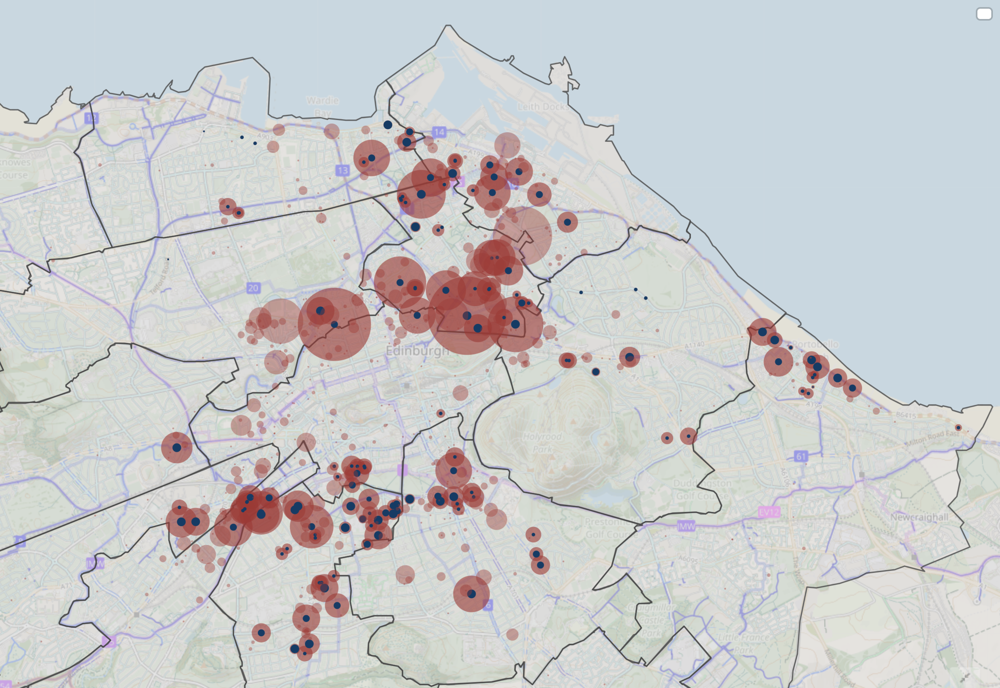

> There are now 4,400 people waiting for a spot in a secure cycle hangar in Edinburgh - that figure has grown by nearly 1,000 in just the last year. My map of hangars and demand [can be found here](https://rpubs.com/edtiss/hangars){target="_blank" rel="noopen noreferrer"}, along with a [summary table here](https://rpubs.com/edtiss/hangars-table){target="_blank" rel="noopen noreferrer"}. 

There are 1,500 people who have made a request for a hangar on their street and 2,900 people who are on a waiting list for an existing hangar. Only 1,200 spots are currently provided - the same as last year despite [promises from the Council to increase the number](https://democracy.edinburgh.gov.uk/documents/s76885/Item%207.3%20-%20Secure%20On-Street%20Cycle%20Parking%20and%20Public%20Bike%20Parking%20update.pdf){target="_blank" rel="noopen noreferrer"} [PDF]. 

The most requests have come in from people living on Easter Road; the largest waiting list is at West Montgomery Street with 100 people waiting for a spot in 2 hangars. 

Demand for cycle hangars roughly correlates with the number of people who live in flats - however, there are some parts of the city where cycling appears to be more pervasive, such as Leith Walk and Morningside.

Thanks to Edinburgh Council for making the [data available here](https://www.edinburgh.gov.uk/homepage/10467/freedom-of-information-foi-disclosure-log?month=&year=2025&keywords=hangar&action=Search){target="_blank" rel="noopen noreferrer"}. 

*This article was originally published as a* [*thread on Bluesky*.](https://bsky.app/profile/edtiss.bsky.social/post/3lyvdgfh7yk2k){target="_blank" rel="noopen noreferrer"}