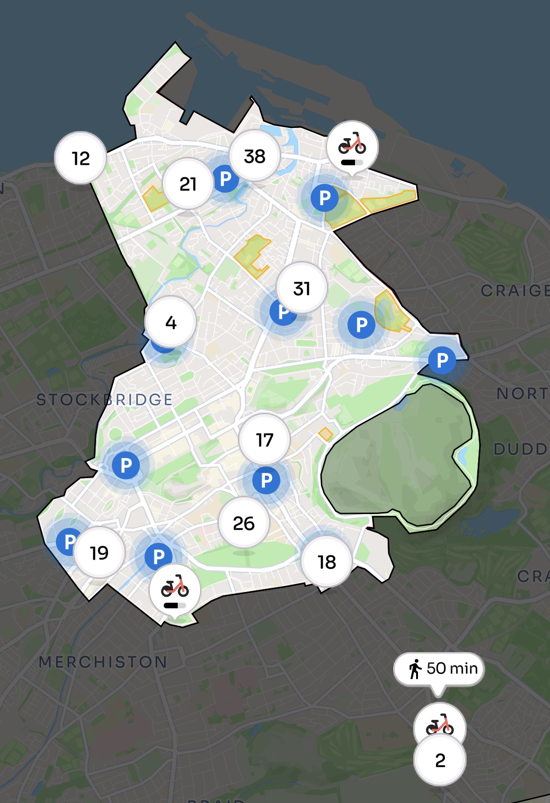
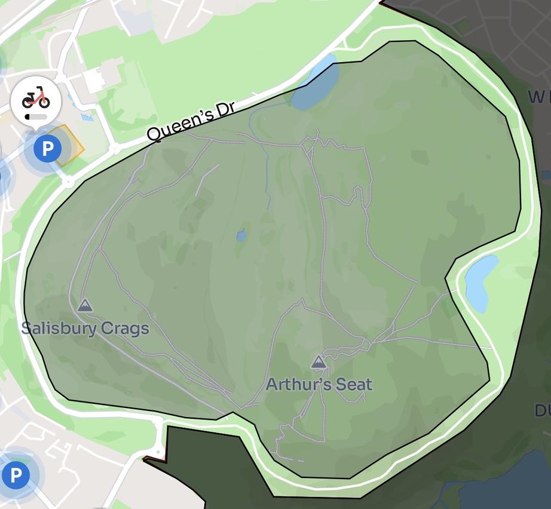
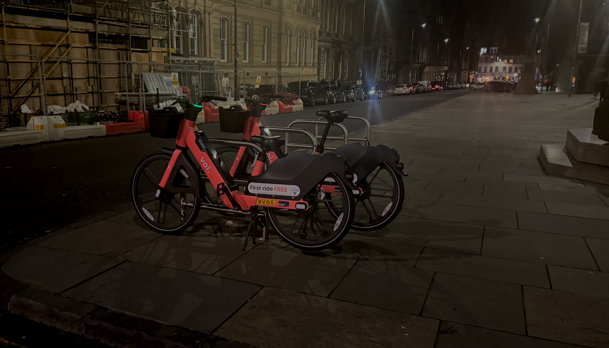
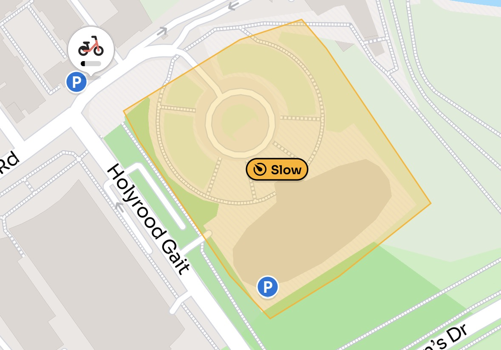
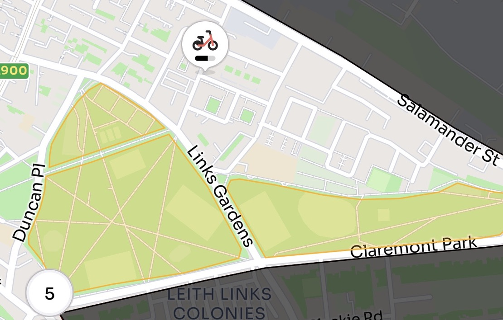

Following [recent news](https://www.scotsman.com/news/edinburgh-voi-bike-scheme-edinburgh-expand-5369513){target="_blank" rel="noopen noreferrer"} about the initial successes of the fifty-cycle 'trial' scheme by hire e-bike provider Voi since launching in Edinburgh in early September — with over 21.7k individual trips by more than 5,000 users — Samhain came around and saw the scheme's perimiter grow as promised, along with a gradual increase in the number of available bikes.

There's a few new features - read on for our round-up.

---

## ⬆️ Fleet increases, but not there yet...

> The expansion of the scheme has been confirmed to include Holyrood Park, Meadowbank and further north, taking in Bonnington, Leith and Newhaven.
>
> The changes will mean a total of **around 340 e-bikes** on the streets of the capital from October 31. — [The Scotsman](https://www.scotsman.com/news/edinburgh-voi-bike-scheme-edinburgh-expand-5369513){target="_blank" rel="noopen noreferrer"}

The Voi-eurism thread keeping a watchful eye over fleet numbers over at [City Cycling Edinburgh](http://citycyclingedinburgh.info/bbpress/topic.php?id=17899&page=63#post-381780){target="_blank" rel="noopen noreferrer"} saw the fleet gradually increasing from Friday 31st onwards, but seemingly has only reached around 220 cycles at its peak so far, with one commenter observing **"the slow way the numbers are increasing kinda feels like being rolled out by 1 man & a van."**

---

## 🗺️ Extended Zone

The city centre zone within which you can hire, ride and park cycles now includes the High road around Arthur's seat, Leith, Newhaven, Bonnington and Canonmills.

Notably, the inclusion of Arthur's seat has been quite tightly restricted - the bikes will work with assistance on the High road and Queen's Drive, but none of the inner path network (which seems pretty sensible...)

---

## 🅿️ More bikes, and more places to park them

From the intitial fifty-strong fleet and twenty geofenced parking places, we're now seeing upwards of **sixty to seventy** parking spots on the map. 

New parking locations can be [suggested to Voi online](https://form.jotform.com/230523910816047){target="_blank" rel="noopen noreferrer"}.

In practice, geofenced sharing of pedestrian spaces has been a mixed bag, with the GPS lock not necessarily being quite as fine-grained as to be able to ensure bikes are always left exactly within their assigned four-metre-diameter circlet. This can lead to blocked footways and cycles being left in adjacent racks intended for locking up personal bikes, taking up valuable parking space. 

> 🅿️ We're documenting instances of Voi bikes being left blocking existing cycle parking - so if you have any images to contribute, please send them in to [hello+voiracks@edi.bike](mailto:hello+voiracks@edi.bike) along with a note of where the image was taken.

---

## 🐌 Go slow zones across the city

From memory alone, there was just one go-slow zone implemented initially, to slow down the maximum speed of the e-bikes when being ridden up and down the ramped side of Dynamic Earth to the parking location just behind its main, elevated building.

Now, there are a good number across the map, ensuring that safe speeds are mandated in public parks especially:

One has to wonder what it must be like using a cycle and not realising these zones exist - perhaps there's feedback on the bike itself - and wondering if there's something wrong with it as you cross Leith links or other green spaces.

---

More as the Voi-age unfolds!