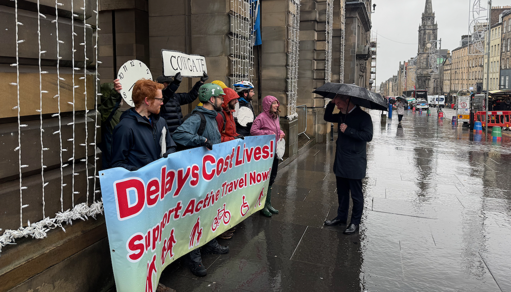

The City of Edinburgh Council's **Transport and Environment Committee** ('TEC') met last Thursday, 13th November 2025, we've summarised decisions and discussion either cycling or cycling-adjacent. For background and some extra bits not discussed at the meeting itself, see our [article from last week](/articles/2025-11-09-november-transport-committee-agenda){target="_blank" rel="noopen noreferrer"} going over the agenda.

<figure>
  
  <figcaption>
    TEC Convener Cllr Stephen Jenkinson speaks to campaigners from <a href="https://edinburghcriticalmass.wordpress.com/" target="_blank" rel="noopen noreferrer">Edinburgh Critical Mass</a> outside the Transport & Enviornment Committee on 13th November, who were gathered to protest about the lack of inaction on road safety in the Cowgate a year on from a fatal accident in the street, slated as part of the City Mobility Plan to be largely pedestrianised but with still no changes made to its substantial levels of through-traffic nor narrow footways.
  </figcaption>
</figure>

> 🌐 [Meeting Page & Agenda](https://democracy.edinburgh.gov.uk/ieListDocuments.aspx?CId=136&MId=7655&Ver=4){target="_blank" rel="noopen noreferrer"}    📺 [Webcast Page](https://edinburgh.public-i.tv/core/portal/webcast_interactive/1035540){target="_blank" rel="noopen noreferrer"}   PDFs:  📑 [Full Agenda Reports Pack](https://democracy.edinburgh.gov.uk/documents/g7655/Public%20reports%20pack%2013th-Nov-2025%2010.00%20Transport%20and%20Environment%20Committee.pdf?T=10){target="_blank" rel="noopen noreferrer"}     💼 [Business Bulletin](https://democracy.edinburgh.gov.uk/documents/s90345/6.1%20-%20Business%20Bulletin_November%202025.pdf){target="_blank" rel="noopen noreferrer"}     📋 [Work Programme](https://democracy.edinburgh.gov.uk/documents/s90339/Work%20Programme%2013.11.25.pdf){target="_blank" rel="noopen noreferrer"}     🎙️ [Deputations](https://democracy.edinburgh.gov.uk/documents/b27129/Deputations%2013th-Nov-2025%2010.00%20Transport%20and%20Environment%20Committee.pdf?T=9){target="_blank" rel="noopen noreferrer"}     📑 [Motions & Amendments](https://democracy.edinburgh.gov.uk/documents/b27169/Motions%20and%20Amendments%2013th-Nov-2025%2010.00%20Transport%20and%20Environment%20Committee.pdf?T=9){target="_blank" rel="noopen noreferrer"} 

---

## 💼 Business Bulletin 
📄 [PDF](https://democracy.edinburgh.gov.uk/documents/s90345/6.1%20-%20Business%20Bulletin_November%202025.pdf){target="_blank" rel="noopen noreferrer"} »
📺 [Webcast](https://edinburgh.public-i.tv/core/portal/webcast_interactive/1035540){target="_blank" rel="noopen noreferrer"} from 1h07m in

The Business Bulletin is home to more minor items that don't warrant a full report, or further updates on more significant past reports. Items below were briefly discussed with questions asked by assembled Councillors.

---

### 🚦 Page 3: Local Traffic Improvement Delivery Programme 

Cllr Kevin Lang asked whether the LTIP scheme is on track, or ahead of / behind schedule, and whether  Ward Councillors be informed on individual projects in their localities.

Officers responded that the current projects were progressing well and to schedule, with the team working closely with communities, keeping in touch with project sponsors, and following up after design work is done to check it meets the needs of the residents involved — with some delays due to traffic regulation order processes.

You can see the current list of Local Traffic Improvement Programme projects on [Business bulletin pages 3-5](https://democracy.edinburgh.gov.uk/documents/s90345/6.1%20-%20Business%20Bulletin_November%202025.pdf#page=3){target="_blank" rel="noopen noreferrer"} [PDF] »

---

ℹ️ Items from **Page 6: Entrance to Holyrood Park Road and Strategy Update on Progress** and **Page 8: Layby Provision Close to Tram Line** covered in our [agenda review last week](/articles/2025-11-09-november-transport-committee-agenda){target="_blank" rel="noopen noreferrer"} were not discussed at the meeting. 

---
### 🚋 Page 9: Trams to Newhaven Outstanding Issues

Link: [Most recent project update](https://www.edinburgh.gov.uk/tramstonewhaven/news/article/425/trams-to-newhaven-issues-resolution-update){target="_blank" rel="noopen noreferrer"} »

Cllr Chas Booth asked what 'regular updates' on the project means in practice; and with ninety 'red' issues remaining, what the timetable for the resolution of the most pressing defects looks like.

Officers responded that 27 of the remaining 'red' issues are already in progress, with a number of the 'soft landscaping' works remaining waiting for the planting season to come around; the deadline for all 'red' items to be completed is the 31st of March 2026. Regarding updates, there is a project update every two months by Newsletter, with an update to the number of issues on the project's website every month.

Cllr Booth then asked about the pedestrian and cycle crossing wait times over London Road at the top of Elm Row, where with the reintroduction of the left turn for vehicles from Leith Walk along London Rd, users of the crossing are facing [up to a ten minute wait](https://bsky.app/profile/edtiss.bsky.social/post/3m5h7q5vdys2j){target="_blank" rel="noopen noreferrer"}. Officers response was that they will investigate the issue, and circulate findings to Ward Councillors.

---

## 🗳️ Items for Decision

### 🚌 7.4 Bus Lanes and Bus Gates – Consideration of Permitting Access to Private Hire Vehicles 
📄 [Report](https://democracy.edinburgh.gov.uk/documents/s90337/7.4%20-%20Bus%20Lanes%20and%20Bus%20Gates%20-%20Consideration%20of%20permitting%20access%20to%20PHVs.pdf){target="_blank" rel="noopen noreferrer"} [PDF] »
📺 [Webcast](https://edinburgh.public-i.tv/core/portal/webcast_interactive/1035540){target="_blank" rel="noopen noreferrer"} - starting from **2h23m**

Deputations (which are taken at the very start of the meeting) from a number of parties on this item, each presenting both written submissions and in person on the day:
- 🚌 **Edinburgh Bus Users Group**, written [page 6](https://democracy.edinburgh.gov.uk/documents/b27129/Deputations%2013th-Nov-2025%2010.00%20Transport%20and%20Environment%20Committee.pdf?T=9#page=6){target="_blank" rel="noopen noreferrer"}, verbally from **__**
- 🚲 **Spokes**, page [page 12](https://democracy.edinburgh.gov.uk/documents/b27129/Deputations%2013th-Nov-2025%2010.00%20Transport%20and%20Environment%20Committee.pdf?T=9#page=12){target="_blank" rel="noopen noreferrer"}, verbally from **__**
- 🚙 Private Hire trade body, the **Scottish Private Hire Association** on [page 13](https://democracy.edinburgh.gov.uk/documents/b27129/Deputations%2013th-Nov-2025%2010.00%20Transport%20and%20Environment%20Committee.pdf?T=9#page=13){target="_blank" rel="noopen noreferrer"}, verbally from **__**
- 🚕 **GMB Union** representing both black cab and private hire drivers (page 9) [page 9](https://democracy.edinburgh.gov.uk/documents/b27129/Deputations%2013th-Nov-2025%2010.00%20Transport%20and%20Environment%20Committee.pdf?T=9#page=9){target="_blank" rel="noopen noreferrer"}, verbally from **__**

In a deputation at the start of the meeting, Alex from [Spokes](http://spokes.org.uk){target="_blank" rel="noopen noreferrer"}, EBUG TODO

_I made the rash assumption that the verbal deputations from the taxi and private hire bodies were in favour of PHCs in bus lanes as per their written submissions, and haven't watched them. Tempus fugit._

---

### 🚌 7.6 Road Safety Delivery Plan 2025/26 – Six-month update  
📄 [Report](https://democracy.edinburgh.gov.uk/documents/s90335/7.6%20-%20Road%20Safety%20Delivery%20Plan%202025_26%20-%20Six%20month%20update.pdf){target="_blank" rel="noopen noreferrer"} [PDF] »
📺 [Webcast](https://edinburgh.public-i.tv/core/portal/webcast_interactive/1035540){target="_blank" rel="noopen noreferrer"} - starting from __ 

7.6 – Road Safety Delivery Plan 2025/26 – Six-month update
Deputations from Living Streets Edinburgh Group (written, page 19) and Living Rent Lochend (verbal, starting from **__**). 
Doc https://democracy.edinburgh.gov.uk/documents/b27129/Deputations%2013th-Nov-2025%2010.00%20Transport%20and%20Environment%20Committee.pdf?T=9 [PDF]

---

## 🔎 Items for Scrutiny

These items may or may not be discussed at the meeting, depending on whether there are questions or points raised by Councillors on the day.

📺 [Webcast](https://edinburgh.public-i.tv/core/portal/webcast_interactive/1035540){target="_blank" rel="noopen noreferrer"} - starting from __ 

---

### 👀 8.1 Review of the Traffic Regulation Orders Sub-Committee
📄 [Report PDF](https://democracy.edinburgh.gov.uk/documents/s90334/8.1%20-%20Review%20of%20the%20Traffic%20Regulation%20Orders%20Sub-Committee.pdf){target="_blank" rel="noopen noreferrer"} »

Verbal deputation from New Town & Broughton Community Council from **__**

[after our open letter with Spokes and others](/articles/2025-08-31-looking-ahead-to-tro-sub-4th-september){target="_blank"}

---
### 🕳️ 8.5 Save the Burnside (Longstone Sinkhole) – Motion Councillor McKenzie
📄 [Report PDF](https://democracy.edinburgh.gov.uk/documents/s90331/8.7%20-%20Save%20the%20Burnside%20Longstone%20Sinkhole%20motion%20by%20Councillor%20McKenzie.pdf){target="_blank" rel="noopen noreferrer"} »

Details of the sinkhole issue on this key link in Longstone - the land ownership, results of investigations and details of works underway to repair. The Council will not adopt nor widen the route, but it's good to see it being reinstated and made safe. 

---
### 🌧️ 8.7 2030 Climate Strategy Update – referral from the Policy and Sustainability Committee
📄 [Report PDF](https://democracy.edinburgh.gov.uk/documents/s90338/8.7%20-%202030%20Climate%20Strategy%20-%20Referral%20from%20PS%20to%20TEC.pdf){target="_blank" rel="noopen noreferrer"} »

This appears to have been referred to TEC in order to ask that the Convener escalates issues of single year vs. multi-year funding to the First Minister; the referral decision from the Policy and Sustainability Committee includes: 

> “To note the importance of the delivery of the City Mobility Plan and the Local Heat and Energy Efficiency Strategy in tackling key emissions sectors in the city and that implementation of these strategies would continue to drive forward citywide emissions reduction over the next two years.”

It also lays out barriers and next actions:

> “…the lack of multi-year funding continued to be significant barriers to delivering the investment needed to decarbonise buildings and transport; to note that the Transport and Environment Convener wrote to the Scottish Government about multi-year funding on 14 July 2025 and received a reply on 11 August 2025; to note the reply gave no commitment to transition to multi year funding, and therefore to agree that the Council Leader would write to the First Minister raising the lack of multi-year funding...“

A long report follows this, but includes some interesting stats:

* 📊 Edinburgh is below average UK-wide for emissions reductions, but slightly ahead Scotland-wide;
* 🧮 Since 2021 the report boasts of the **"installation of 15.6 miles of cycling infrastructure, growing Edinburgh’s total cycle network to over 142 miles"**. Here's hoping we can do a bit more than four miles a year going forward...

---

## ✍🏽 Motions and Amendments

At time of publication, the Motions & Amendments pack has not yet been published, but here are the cycling-adjacent motions already filed:

### 🖌️ 9.1 Motion by Councillor Lang - Action to address faded road markings

📺 [Webcast](https://edinburgh.public-i.tv/core/portal/webcast_interactive/1035540){target="_blank" rel="noopen noreferrer"} - starting from __ 

> “Committee
>
> 1) Notes the exchange between Cllr Lang and Cllr Jenkinson at the Council meeting of 28 August 2025 in relation to item 10.8 on faded road markings.
> 
> 2) Notes that road markings are currently assessed using the carriageway defect risk assessment criteria set out in the Risk Based Approach to Safety Inspections.
> 
> 3) Expresses concern that this current approach can lead to important markings at crossings and junctions not being prioritised for repainting, potentially creating safety issues.
> 
> 4) Therefore, seeks a short report to the next committee meeting setting out the current approach to the repainting of faded road markings, the basis for this system or prioritisation, an assessment of what safety issues this can present, and what opportunities exist to change the approach to ensure faded markings are repainted more quickly to address road safety concerns”

There are a huge number of faded-out advanced stop zones (bike boxes at traffic lights), painted cycle lanes, and other such markings that create safety concerns and conflict when not properly maintained. It's good to see this raised as a safety issue, rather than purely maintenance.

---

### 🛣️ 9.3 Motion by Councillor Cuthbert - Support for Midlothian Council's A701 Relief Road & A702 Link Road Project

📺 [Webcast](https://edinburgh.public-i.tv/core/portal/webcast_interactive/1035540){target="_blank" rel="noopen noreferrer"} - starting from __ 

9.3 – Motion by Councillor Cuthbert - Support for Midlothian Council's A701 Relief Road &
A702 Link Road Project - written deputation from Spokes (page 21). 
Doc https://democracy.edinburgh.gov.uk/documents/b27129/Deputations%2013th-Nov-2025%2010.00%20Transport%20and%20Environment%20Committee.pdf?T=9 [PDF]

---

The Transport & Enviroment Committee will next meet on **Thursday, 29th January 2026**.

## Related Articles:

- [🔭 Looking ahead - agenda for November 2025 Transport & Environment Committee](/articles/2025-11-09-november-transport-committee-agenda)