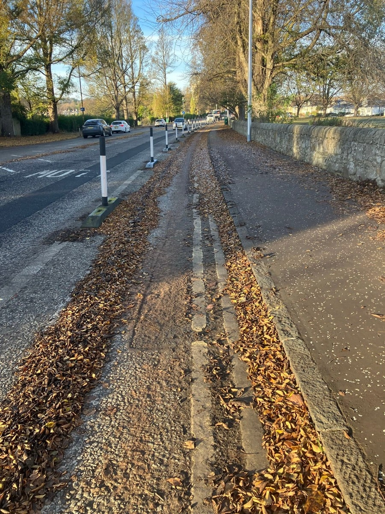
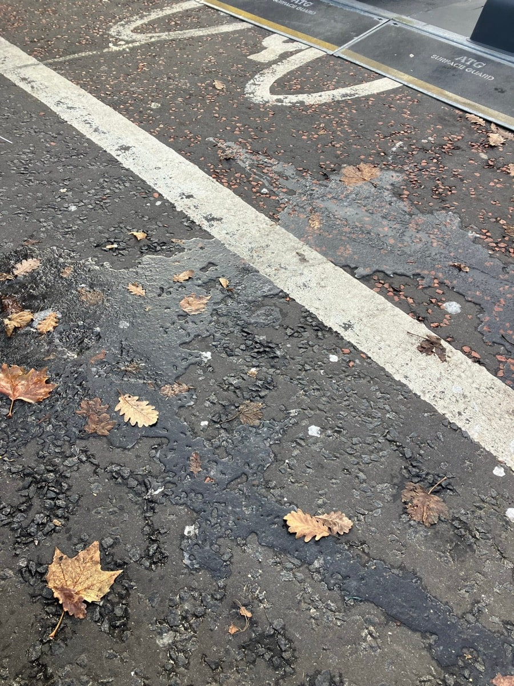
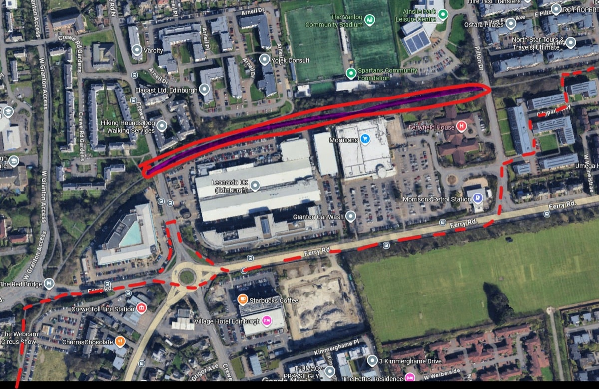

_Published 2025-11-23_ 

Edinburgh has an aspiration to lessen car kilometres driven and increase its cycling network, and therefore increase the number of people cycling. Let’s check in on how that’s going, via [this thread](https://bsky.app/profile/iammelissa.bsky.social/post/3m65j2j5vbk2a) [sign-in required] from **Melissa** on Friday:

> Edinburgh has lost the plot. Today my kid and I (me w/2 more kids on my bike) had to bike through frozen leaves on Queensferry Rd. We tried to use the road but a Range Rover decided we were impinging on his freedom and drove us into the wands. The leaves are well done falling and yet they remain…
>
> 
> 
> But that wasn’t the only danger today. We get to George St and the Ice Bar is leaking water onto the road leaving streams of ice over the bike path. This is a photo of the ice from the ice rink. I get that tourists are tops in winter but actively laying traps for cyclists seems… wild? And yet
>
> 
> 
> Coming back from George St we’re meant - I think - to use the left lane to cross the intersection to Charlotte Square. I cannot get my cargo bike to do this turn. I keep trying to take photos. Private businesses making this entirely unusable. Plus some of those blocks are really hard to get pass!
>
> 
> 
> Now reading that one alt route via Ferry Rd is closed for 2 months. I’m sorry this is all far too much and too difficult. We don’t own a car, Edinburgh Council - you should be making things safer not actively dangerous!

Melissa’s experience is not uncommon, here; Edinburgh seems to really lack follow-up on both maintenance and preservation of cycle routes. To extend the old cycle infrastructure adage: 

> If you build it, they will come; **and they will expect to be able to rely on using it**.

---

Only last week, we covered the **abrupt closure of St. Mark’s path** at Powderhall, and contributions to [this thread on Bluesky](https://bsky.app/profile/spokes.org.uk/post/3m5nsvqn4ec2o ). That’s a development where _the council itself is the client_, so it’s unforgivably bad planning to enact such a closure without a serviceable diversion route.

Elsewhere, the works to build Edinburgh Arena out near Edinburgh Park have [closed Quiet Route 8](https://bsky.app/profile/spokes.org.uk/post/3m67pww7mok23 ), with the diversion provided taking in **a lovely twenty stairs to carry your cycle up** - which might work for some, but those of us toting kids and a fifty kilo cargo cycle, users of assistive cycles or folks with other mitigating health factors are stuck.

This week’s ‘monster of the week’? Come Friday 21st, as per the end of Melissa’s thread:

> **Robbie Ainsworth**
>  [@robbieainsworth.bsky.social](https://bsky.app/profile/robbieainsworth.bsky.social )
> Ferry Road Path CLOSED to pedestrians and cyclists from today to 16 January for installation of a security fence at Leonardo. TTRO closure order was signed on Wednesday with the below diversion: 
> [https://www.edinburgh.gov.uk/downloads/fi…](https://www.edinburgh.gov.uk/downloads/file/38417/temp-25-148 ) 
> 

The [resulting discussion thread](https://bsky.app/profile/robbieainsworth.bsky.social/post/3m64tzglp522n ) will give you a sense of how this news went down with path users; it’s akin to closing a rabbit-hole in a fence and encouraging the rabbits to use a handy diversion through the adjacent pie factory’s ‘INBOUND’ gate. Crewe Toll roundabout is one of the most unsafe cycling experiences to be had, and in a city like Edinburgh that’s truly saying something - suggesting users of a quiet and off-road path just take on the gargantuan, saturated five-arm-two-lane roundabout is beyond laughable. 

Behind the scenes, Robbie (of Spokes’ planning group, and this ‘ere newsletter) was given a heads up by roads officers on Thursday, and was able to submit [a detailed email](./initial-email){target="_blank"} Friday morning. Thanks to Robbie and the Planning Group’s endeavours, by early Saturday morning [Councillors were posting having been reassured that the path would reopen](https://www.facebook.com/share/16XXzBDieP/?mibextid=wwXIfr ), lessons would be learned, and an alternative would be sought. 

In reality, the path remained closed on Saturday, with promises that on-duty officers would be contacted to get the route reinstated.

> What's come to light is that the new fence is installed with permission on the council's land, and is a continuation of the exact same fence installed by Leonardo in 2010 without closing the path. The 2010 planning drawings state this commitment to keep the path open during works, presumably part of agreement with the City of Edinburgh Council and now forgotten.

This was raised by Robbie in [a subsequent email](./later-email){target="_blank"} to CEC officers and Councillors.

---

To the uninitiated, you'd look at the nascent cycle network and say - we just need these swept of leaves as the dropping season finishes up. It doesn't seem that big an undertaking. Maybe buy some wee machines that would fit down the cycle lanes.

You'd look at all these closures and say that the Council should clearly set out guidance for how works deal with avoiding disruption to cycle journeys, given that we're trying to enable, grow and promote them. 

The thing is, the street sweepers already exist. 

And as per Robbie's email - [the guidance already exists too](http://www.spokes.org.uk/wp-content/uploads/2021/10/1905-Council-factsheet-based-on-current-law-Access-for-People-on-Bikes-Guidance.pdf). 

**It just doesn't seem to make a difference that it does.**

If cycling is to be taken seriously as an option in the capital, then the routes that make it safe — and for some folks, even an viable choice at all — have to be treated as an uncompromisable, unbreakable network that people rely on to move around, and **protected and maintained as such**.