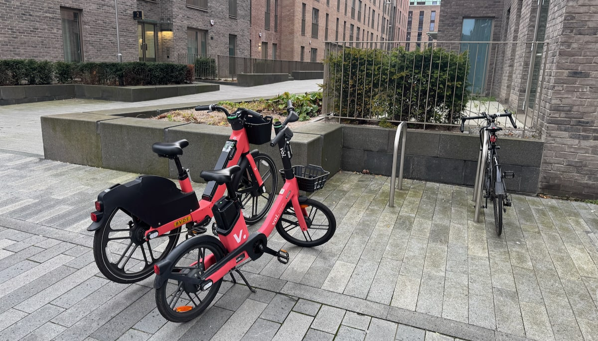
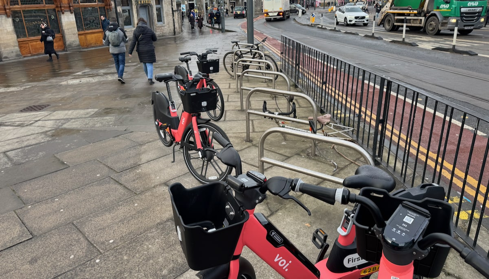

_Published 2025-12-07_ 

As we've outlined previously, on our project page, 🔒 [Keeping Edinburgh's cycle parking free of hire bikes](/projects/2025-11-voi-cycle-rack-parking){target="_blank"};

> During this 'trial' period in Edinburgh, there are a number of issues cropping up with the impact of the bikes on the streetscape - and as some had predicted, the parking of the bikes is creating some less than ideal situations for pedestrians and cyclists alike. Among these is the parking of Voi bikes in cycle parking racks, which we're taking up with Voi as something we'd like to see action on.

A couple of weeks into the campaign, [gathering photos and locations](/projects/2025-11-voi-cycle-rack-parking#rack-parking-in-pictures){target="_blank"} from readers of edi.bike of locations where cycle racks are being blocked or taken up, hire bike operators [Voi](https://www.voi.com/){target="_blank" rel="noopen noreferrer"} reached out, offering to discuss the impact the scheme is having in the capital - and possible changes.

We also heard from Voi that **while a fleet size of 800 is the current goal for the city, this won't be rolled out by the end of the year** as has been reported elsewhere - but instead on a more gradual, incremental basis. This is good news for those of us looking to feed back on the effects of the scheme on amenities and the capital's public realm. 

## ☎️ Meeting with Voi

On Wednesday 3rd December, we were able to hold a video call with Voi's new Customer Success Manager for Edinburgh & Glasgow — and their head of Public Policy for the UK — along with Alex Robb of [Spokes](http://spokes.org.uk) to discuss the scheme in Edinburgh. At this time, with the hiring of ebikes being under a two-year 'trial' period, we've found Transport Officers at the City of Edinburgh Council are very receptive to feedback on parking and other issues and proactive in trying to address them — and we're thrilled to report that Voi are engaging with us in a similarly positive way.

Voi operate in twelve countries total, and within the UK have 21 city locations. Additionally, London itself is not a single location, but a series of numerous boroughs each with local authority and differing rules and requirements. This is bad news for Voi — given the amount of complexity to manage, where one would imagine a 'one size fits all' approach would be far easier on the organisation — but it's great news for any of the local authorities they work with that want to shape the impacts of a hire bike scheme. 

It was clear from our conversation that Voi, perhaps more than some of the other companies in the running to operate the trial hire scheme, are flexible and able to adapt to the authority they find themselves operating in; and also that they are already working closely with the City of Edinburgh Council to react to issues with the parking zones that have been introduced, on an ongoing basis.  

> **"A key priority for Voi is that we want to make the scheme work for the whole community - not just users of the bikes - and for it to be something the city can be proud of. We're keen on collaboration and partnership to get things right for Edinburgh"** — Harry Foskin, Public Policy Manager at Voi.

## ✨ Parking in cycle racks - behaviours and realities

It's pretty clear from [the geographic spread](https://www.google.com/maps/d/u/0/viewer?hl=en&mid=11ypMYa6hSnjid1HMFuv78IyAdwpVo0w&ll=55.9626341041915,-3.1919221878051807&z=10){target="_blank" rel="noopen noreferrer"} and different uses of cycle racks for Voi bikes in the city that there are a few key factors at play:

* 🏠 The 'natural' home for a bike is a bike rack - particularly to Voi users who don't cycle their own bikes in the city, so don't necessarily consider the amenity cycle racks offer;

* 🔄 If you pick up your hire back from a rack, you're more likely to try to return it to one at the end of your trip - which also plays to the point above;

* 🫥 The current zones are invisible - there are no markers or indication of where to park on the footway or carriageway, which is likely also leading to more parking in racks;

* 🛰️ 'Satellite drift' and GPS unit accuracy mean trips can be ended outside of (but close to) the actual geofenced zone - this is unlikely to change in terms of the technology involved. We're still fortunate to have zoned parking, as opposed to a fully 'dockless' system where the bikes could be ditched anywhere.

With these aspects in mind, we're trying to be pragmatic in engaging with the issue - how can we reduce hire bike parking in racks, or in some cases eliminate it altogether, given these constraints?

## 🚳 Mitigations we discussed

These are some rough notes for now - we'll return to these ideas to flesh them out to further our aims in the coming weeks and months.

---

### 🖌️ Marked Zones

In Voi locations elsewhere, there are a number of prior examples of **marking out parking zones** - potentially addressing the 'invisible zone' issue, affecting not only cycle rack availability but at times blocking footways with hire bikes. These include:

* 🚧 In Cambridge and Oxford, **physical barriers have occasionally been used** to 'corral' bikes into a specific location;

* 🛴 Elsewhere in Europe, Voi have **provided their own metal racks** for e-scooters to ensure rides are ended with vehicles grouped together tidily;

* 🖌️ In London, again primarily for hire scooters, some **parking zones have painted markings on the footway** to group parked vehicles and make it clear where to return them;

* 🚗 **Designated parking on carriageways**, replacing a car parking space, replete with markings; these will require a Traffic Regulation Order ('TRO') to implement, and won't be suitable for all parking zones but fit twelve hire bikes in a former car parking space.

Of these, the latter two are the most likely for Edinburgh - though whether the Council has the appetite to go through the pains of the TRO process during a 'trial' scheme remains to be seen. We suggested that **more temporary, adhesive markings could be used to mark parking zones** as a lighter-touch marking during the trial phase, when both the Council and the scheme operator might be less keen to make permanent markings. 

---

### 📱 Guidance in the Voi app

While we didn't get into specifics on this, the Voi team mentioned guidance for Voi users in their mobile app as an avenue to elicit behaviour change. 

It's clear given the breadth of their operation across different locations and authorities, that the guidance and information shown to users must be fairly customisable to a particular city or borough - so this might well be part of the solution too, particularly if some zones end up with physical markings to look out for.

---

### 🅿️ Additional Cycle Racks

It might be that in locations where we're seeing use of council-provided cycle racks to park a number of hire bikes, that the best mitigation for this is additional cycle parking.

> This brings us back around to the key point of our campaign - that in the context of looking to enable more cycling trips in Edinburgh and grow day to day cycle travel, **we don't want to see the availability of somewhere safe and secure to lock your bike up suffering because of the hire scheme**. The council already has a rolling programme installing cycle parking - perhaps this needs to also factor in how much certain locations are being cannibalised by hire parking when prioritising new racks, or increase the volume of racks being installed to take the scheme into account.

We didn't put Voi on the spot as to whether they'd be the ones to fund additional racks at hire parking locations; and perhaps they'd be reticent to commit to that kind of investment during the initial two-year trial. But going forward, it seems clear that one answer to this issue involves adding more racks at contested locations - which is the model Glasgow's scheme is put together around, seemingly with expanded racks and parking markers added with hire bikes in mind when the city hosted the Commonwealth Games in 2014. 

## 📍 Shared Location Information, and zone types

The Voi team have kindly **agreed to provide us with a list of current parking locations across the city with coordinates**; this is largely already public information as it's available in the Voi app depicted on the map of the scheme area, but having a list will help us to organise and review cycle parking impact in a way that focuses on specific problem zones rather than in a more general, city-wide approach.

With this in mind, we're also looking at creating a 'typology' of parking zone types, for example:

* 🤷🏻‍♂️ **Unaffected:** Zones we're not tracking because there's no cycle parking in the immediate area (though we might have other types, such as zones creating other issues like footway accessibility)

* 🔹 **Limited:** Spaces with very few racks in place, meaning the available parking can be very easily saturated by hire bikes (Greenhill Gardens in Bruntsfield is a good current example of this)

* 📈 **Busy:** Zones where there is a high number of bikes consistently, meaning there is a more constant problem with the availability of cycle parking

* 🗺️ **Fringe:** Areas where there are more issues at the end of the day, typically at the edge of the permitted riding zone marked out for using the bikes in

There will likely be other types we establish as we take a closer look - for example, parking zones where we recommend additional rack capacity to tackle the effects of the hire bikes. Different types will warrant different mitigations - physical markers, additional racks, or even moving a parking zone's location.

---

### 🔮 Moving forward into 2026

We're anticipating a productive, ongoing collaboration with the teams at Voi and the City of Edinburgh Council to smooth out some of these early issues with the scheme, moving forward. 

> In the coming weeks and months, we'll be looking to shift gears to work on a more zone-by-zone basis, and finding examples to demonstrate to all parties changes that we think will make the difference - continuing to work on this in public, and with your help. 

Thanks to Alex at Spokes, CEC Officers, the Voi team, and to everyone who has been sending in photos of the hire bikes - please continue to do so to [hello+voiracks@edi.bike](mailto:hello+voiracks@edi.bike)