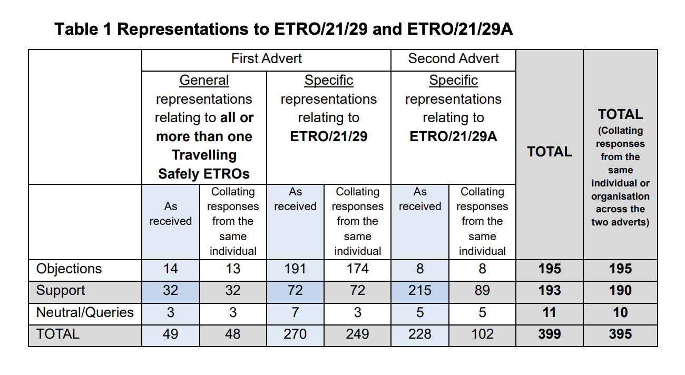
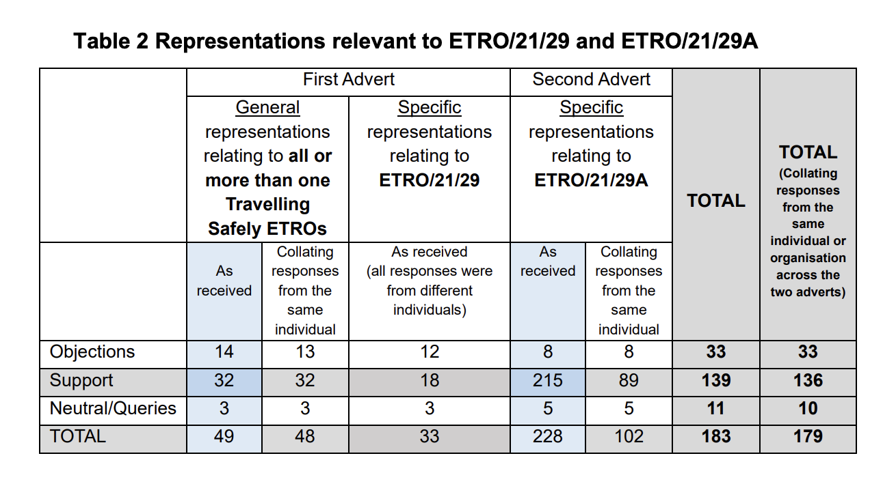

The meeting papers have been published for the council's [Traffic Regulation Order Sub-Committee](https://democracy.edinburgh.gov.uk/ieListDocuments.aspx?CId=645&MId=7797&Ver=4){target="_blank" rel="noopen noreferrer"} (or 'TRO Sub') meeting this Tuesday 16th December.

The sub-committee exists to make 'quasi-judicial' decisions on Traffic Regulation Orders, which have a specific statutory framework that has to be followed, considering objections to proposals in an isolated and self-contained manner (i.e. cannot be lobbied or externally influenced). The 'TRO Sub' survived a recent review process which concluded that while the remit and processes around the committee need to be clearly outlined and convened, it would continue to be the way that the City of Edinburgh Council ('CEC') makes the final decision on 'making' the Traffic Orders that shape our streets.

At their last meeting, on the 4th September, we saw an important victory following our [open letter with Spokes and sixteen other organisations](https://buttondown.com/edi.bike/archive/edibike-an-open-letter-to-the-city-of-edinburgh/){target="_blank"}, which lead to a course-correction from the Council regarding the remit of the committee — who on multiple occassions, deferred making a decision on the 'East Areas' segregated on-road cycleways becoming permanent in Duddingston, Willowbrae, London Rd and beyond, nearly leading to the order expiring and the removal of the cycleways.

## 📋 Agenda 

While we're not expecting anything as dramatic this Tuesday, there's still some cycling-related orders up for decision on the sub-committee's agenda:

* 🪄 4.3 **Travelling Safely - South Area** ETRO/21/29A - 📄 [Report](https://democracy.edinburgh.gov.uk/documents/s91695/4.pdf){target="_blank" rel="noopen noreferrer"} [PDF] »
* ↕️ 4.4 **One Way Streets Exemptions for Cyclists Batch One** TRO/24/27 - 📄 [Report](https://democracy.edinburgh.gov.uk/documents/s91696/4.pdf){target="_blank" rel="noopen noreferrer"} [PDF] »

_(There are other matters on the agenda regarding controlled parking areas, but we will generally try and 'stay in our lane' and focus on cycle infrastructure and policy.)_

---

## 🪄 Travelling Safely - South Area ETRO/21/29A
📄 [Report](https://democracy.edinburgh.gov.uk/documents/s91695/4.pdf){target="_blank" rel="noopen noreferrer"} [PDF] »

The 'Experimental Traffic Regulation Orders' (ETROs) for the covid-era 'Travelling Safely' schemes have been gradually ending, with the North, East and West area ETRO packages being made permanent at the last sub-committee meeting. The deadline for some of these ETROs were later, partly as the original 'South' package was later subdivided to have separate orders for **Comiston Rd / Braid Rd** and the **Greenbank to Meadows Quiet Route** individually - and the remaining, more newly issued 'South' areas ETRO now has its day at committee to be made into a permanent order.

> By way of a bit of background, our look ahead at the previous meeting's agenda includes some prior reading on the following:
>
> * ✨ The rolling 'Travelling Safely' upgrades budget and overall programme estimate to upgrade routes from 'Rosehill Defender' bollards to kerb segregation (like existing lanes at London Rd, Lasswade Rd, Holyrood Rd)
> * 📊 The prioritisation framework used when upgrading Travelling Safely schemes - how it's decided where in the city it's most pressing to make the change from bollards to kerbs
> * 💰 Breakdowns of costings and timelines to upgrade all Travelling Safely routes to kerb segregation (and where necessary, small amendments to layouts)
> * 🤔 The safety and suitability of rubber 'Rosehill lane defender' units
>
> ➡️ You can [read that coverage here](/articles/2025-08-31-looking-ahead-to-tro-sub-4th-september#travelling-safely-upgrades-budget-and-overall-programme-estimate). These points and their relevant documentation are also included for Councillors as appendices on the South areas ETRO report coming to Committee.

Digging into the report, there's a lot there (particularly with appendixes of legalistic TRO advertisements and endless street plans) but here's our highlights.

_(Some of these pertain to separate orders spun out of the original South ETRO package, as they date back to when it was all under one project)._

---

### 🗺️ Extent of the 'South' area

The 'South' areas ETRO includes protected cycleways on the **Buccleuch Street corridor** (including Lothian Street, Potterrow and Chapel Street); **Causewayside corridor** (including Ratcliffe Terrace); **Craigmillar Park corridor** (including Minto Street, Mayfield Gardens and Suffolk Road); **Gilmerton Road**, **Mayfield Road** and **Old Dalkeith Road**. 

---

### 👏🏼 Support for the measures

Pages [4 to 8 of the Report PDF](https://democracy.edinburgh.gov.uk/documents/s91695/4.pdf#page=4){target="_blank" rel="noopen noreferrer"} detail objections to the South scheme - before and after the 'spin out' of the separate ETROs from its original form:

> **"The majority of representations received in response to the first advert related entirely to one or more of the following three schemes: Braid Road, Comiston Road and the Greenbank to Meadows Quiet Connection. These three schemes were originally advertised under ETRO/21/29 but were not included in ETRO/21/29A and are now the subject of separate scheme specific ETROs.**"

In aggregate, there was just as much support for the schemes as there were objectors:

The title of the table below is incorrect, but when Braid Rd, Comiston Rd and the Greenbank to Meadows Quiet route are removed from consideration as they're now in separate processes, and only comments relevant to the 'South areas' ETRO are included, these are overwhelmingly supportive: 

---

### 👁️ Monitoring scheme impacts

> **"The data collected shows that the measures have regular levels of use and the reallocation of road space as part of programme has not had a negative impact on general traffic journey times."** 

📄 The **2024 Summary Report** by Stantec for the Travelling Safely schemes [can be found beginning at page 59](https://democracy.edinburgh.gov.uk/documents/s91695/4.pdf#page=59){target="_blank" rel="noopen noreferrer"} of the report PDF. Nothing particularly surprising; some interesting stats on peak times to and from town, including routes that buck common direction trends.

📄 The **2025 Travelling Safely Supplementary Monitoring Summary Report – Southern Routes**, also carried out by Stantec, [can be found starting from page 86](https://democracy.edinburgh.gov.uk/documents/s91695/4.pdf#page=86){target="_blank" rel="noopen noreferrer"} of the report PDF. 

For reasons known only to themselves, Stantec undertook re-measuring the levels of cycling in the schemes — originally captured in June 2023 — in 4°C weather in February 2025. This, it won't surprise you to learn, means the comparative user counts in the report are about as useful as a political manifesto pledge. [Appendix 14 at page 249](https://democracy.edinburgh.gov.uk/documents/s91695/4.pdf#page=249){target="_blank" rel="noopen noreferrer"} features Officers' response to the monitoring and evaluation of the routes, which does mention this seasonality snafu - and in spite of the summer vs. winter data, two corridors did see a significant increase in cycle journeys between these points of measurement.

The report contains around fifteen pages of cycling counting data and information on journey times.

---

### 💬 Feedback from consultation

Skipping the raw and unfiltered responses provided in 'Appendix 6', [**Appendix 7** from page 194](https://democracy.edinburgh.gov.uk/documents/s91695/4.pdf#page=194){target="_blank" rel="noopen noreferrer"} of the report PDF is a summary of the themes raised in the feedback, including a response from Council officers and whether any action is being considered in response. 

It's disappointing to see a key issue with the **Craigmillar Park Corridor** scheme noted, but no further action slated:

> **Despite restrictions and prohibitions, unauthorised motor vehicle drivers regularly load/unload and/or park on advisory lanes and/or bus lanes during bus lane operating hours impeding the intended use of the space and benefits for cyclists and buses.**

This has been many folks experience of this corridor, coupled with a dreadful quality of road surface making riding within the segregated space something of a dangerous experience in itself; we would have loved to have seen Officers propose how measures could be strengthened to combat this unauthorised use of the lanes here rather than wishing they didn't.

[Appendix 9 from page 203](https://democracy.edinburgh.gov.uk/documents/s91695/4.pdf#page=203){target="_blank" rel="noopen noreferrer"} contains a list of **"Recommended amendments to restrictions not trialled on the ground and locations with 24hr loading restrictions"**. Some of these are loading restrictions that have never actually been enacted; but others are a relaxation around loading that we would very much hope don't negatively impact the experience of cycling safely through the area.

---

The precedent has been set in September that the Travelling Safely schemes are a vital addition to Edinburgh's on-road cycle network and should be made permanent; our hope is that this prevails for these South schemes too come the voting on Tuesday.

---

## ↕️ One Way Streets Exemptions for Cyclists Batch One TRO/24/27
📄 [Report](https://democracy.edinburgh.gov.uk/documents/s91696/4.pdf){target="_blank" rel="noopen noreferrer"} [PDF] »

> **Proposals in TRO/24/27 would exempt pedal cycles from existing one-way orders. The proposals would be introduced, alongside complementary measures such as additional signage and road markings, on the following streets:**
>
> 4.2.1 **Cassel’s Lane**;
> 4.2.2 **Circus Lane**;
> 4.2.3 **Drummond Street**;
> 4.2.4 **Richmond Lane**;
> 4.2.5 **Rose Street**;
> 4.2.6 **Simpson Loan**;
> 4.2.7 **Thistle Street**; and
> 4.2.8 **Wishaw Terrace**.

As per the report, **"No objections were received to the proposals for Cassel’s Lane, Circus Lane,
Drummond Street, Simpson Loan and Wishaw Terrace"**. 

16 supporting comments, 1 neutral (enquiry) and 10 objections were received during consultation. Of these, three were from _"statutory consultees for the purposes of this Traffic Regulation Order"_ - namely the Edinburgh Access Panel, Living Streets Edinburgh, and New Town and Broughton Community Council.

## 🙈 Living Streets and the bane of the cyclistas

Naturally, rather than taking the opportunity to champion the rights of those travelling actively and noise up the council for less vehicular intrusion on Rose St — the **primary cause of pedestrian deaths and serious injuries UK-wide**, no less — Living Streets Edinburgh [penned an objection](https://www.livingstreetsedinburgh.org.uk/2025/12/09/lseg-comment-on-council-plans-to-allow-two-way-cycling-on-rose-street/){target="_blank" rel="noopen noreferrer"} to the terrible and dangerous notion of two-way cycling on Rose St, ignoring the many examples from across Europe where pedestrians and cyclists manage to exist in the same space courteously - including but not limited to **the very street they're claiming shouldn't have two-way cycling access**, on which **cycling is already permitted**.

Shall we have a look through it point by point?

> Rose Street is the closest thing that Edinburgh has to a pedestrianised street. 

Always good to open an argument by decimating it yourself. **Rose St is not a pedestrianised street** - it is a carriageway with time-limited loading on its main strip, and 24hr one-way access for motor vehicles to its various lanes. Leaping to its defence in the face of a few more bikes and saying nothing about its persistent motor vehicle access is very much the Turkeys voting for Christmas while decrying the Easter Bunny.

> Cycling through the street, as opposed to accessing the shops and restaurants on it by bike, should be strongly discouraged. 

Remember that story about the pedestrian collision with someone cycling through Rose St, a cycling option that's already permitted? You don't, because it hasn't happened at any significant level in either severity nor frequency.

The idea that there is even any extant mechanism by which one can allow cycle access only for local destinations is also fantasy.

> Encouraging cycling on this unique street would invite conflict with pedestrians, as has been widely acknowledged and especially create a more hostile space for older, disabled and blind people. Even in the Netherlands and Copenhagen’s famous Strøget, cycling on pedestrian shopping streets is discouraged – or prohibited entirely.

_"As has been widely acknowledged"_ — where, and by whom? Mainstream media parroting NIMBY talking points don't count. Or perhaps below, in a single report into something that's no longer being proposed?

> Council officials recommend setting aside objections by LSEG, Edinburgh Access Panel and New Town and Broughton Community Council to proposals to allow two-way cycling on Rose Street in a report to the TRO subcommittee on 11 October 2025.
> 
> The report claims that there is no intention to use Rose Street as an alternative cycle route to George Street. However, the report to TEC (30 January 2025, Item 7.2) which first suggested exempting Rose Street from the one-way prohibition set out exactly this as the rationale for this exemption: “4.21 Redirecting cyclists down Rose Street offers a low-cost alternative route [to George Street] that can be implemented quickly without the need for major infrastructure changes.” Using Rose Street as a cycling route “presents a quick and low-cost solution”. These comments were made under the heading: “CCWEL Alternative Routes Prior to George Street Completion”.

LSEG are correct that a report came to TEC in January exploring possible temporary cycle diversions  leading up to — and during — the redevelopment of George St. Thistle St (and its continuances) and Rose St were both looked at as options, as well as the potential for Queen St being used as an alternate route for cycle traffic. The purpose for this look at diversionary routes was set out clearly in the report:

> **"Given the current programme for the George Street project and the potential street disruption during construction, it is important to explore alternative routes to connect the CCWEL before the construction of George Street. Options include Queen Street, Rose Street and Young, Hill and Thistle Streets."** — [Report, paragraph 3.3](https://democracy.edinburgh.gov.uk/documents/s79522/7.3%20-%20CCWEL%20to%20George%20Street%20Active%20Travel%20Connections.pdf#page=2){target="_blank" rel="noopen noreferrer"} » [PDF]  

However, **these were subsequently ruled out at TEC in June** in favour of requiring contractors to maintain two-way cycle access on George St itself for the duration of the works. The decision [recorded at page 19 of the minutes](https://democracy.edinburgh.gov.uk/documents/g7248/Printed%20minutes%2026th-Jun-2025%2010.00%20Transport%20and%20Environment%20Committee.pdf?T=1#page=19){target="_blank" rel="noopen noreferrer"} includes as its point 9, from the Green group amendment, **"To agree that, for the duration of the works, two-way cycling would be retained along the entire [George] street wherever possible"**.

The standing democratic decision on Rose St as a potential diversion route is formed not only of the original report LSEG are quoting above, **BUT ALSO the decisions that follow it**. You can't pick and choose from past meetings what to present as the Council's plans without manipulating the truth of the record. The same was true of recent campaigns claiming cycling would be 'discouraged' on the Roseburn Path if the tram ran down it, reflecting a failure to understand that **an original report alone does not represent a council position if it is amended at committee before passing**.

If LSEG still believes that the reason to make Rose St two-way for cycling is to work around George St redevelopment (when the record states it is not) — what do they believe the purpose of making the other seven streets in this TRO two-way is?

> Accordingly, we retain our concerns that removing the one-way exemption would mean that Rose Street could still very much be seen by officers as a viable alternative through-route across the city by bicycle. If Rose Street is no longer considered as a suitable cycle route, then the rationale for introducing the TRO in the first place falls away.

Putting aside that Officers don't decide which way folks cycle through the city for them, and that Rose St is out of the way and not a good option for most east-west-east journeys; there are two — good, reasonable and measured — reasons to introduce two-way cycling on Rose St.

1. **Consistent Policy:** the council are gradually working through one-way streets in the city and allowing contraflow cycling. For the cohesion of route planning before or during cycling across the city, cyclists being able to predict that one-way streets are permissable to travel down both ways on a cycle is a safer approach than either entirely disallowing them (and sending cycles round convoluted routes to reach destinations) or doing so in an inconsistent fashion (with only some one-way streets offering contraflow cycling legally);

2. **Reaching Destinations:** anyone who has cycled through areas with high pedestrian footfall does so because they need to be there. A small subset of Rose St's cycle usage will come from folks using it as a through-route; but the street is rich with shopping and leisure destinations as well as places of work, and these will account for the vast majority of journeys. To allow someone access from the nearest crossing road into Rose St, without having to ride round three blocks to access it with the flow of the one-way, helps make travelling by bike a more viable choice by not providing unnecessary routing friction.

> The report went on to acknowledge that “integrating cyclists into a space primarily designed for pedestrians presents challenges. The narrow width of Rose Street, combined with the high footfall at certain times, could lead to safety concerns between cycling and walking/wheeling.” 

This won't be surprising to our readers, but at times of high footfall, it is generally easier and safer for all involved if the rider dismounts (for those who are able to). It's also possible to cycle at a slower than walking space, to pause and wait for gaps or to give way, and generally co-exist. **All of this happens already on Rose St**. There is a real _'those others over there'_ vibe to a lot of this written objection - out there in the real world, user conflicts in public space are largely mitigated through our own humanity rather than requiring hand-wringing, policy-led mediation.

> While most cyclists are considerate of other road users, we don’t believe that the suggested mitigating measures such as “Share with Care” signage would be effective in deterring those who are not. We hope therefore that the Committee will uphold our objection to the TRO allowing two-way cycling on Rose Street.

Nobody is looking to use Rose Street as their new commuting go-to. The changes being proposed are consistent with elsewhere in the city, will enable certain cycling journeys more direct access to their destination, and otherwise are a tiny sliver of the active travel story in Edinburgh. 

It's exhausting to see so much hand-waving from folks over something with so little impact, and feeling like there's a bun fight over every possible opportunity to make cycling in the capital more viable. 

---

## 📰 More coverage next week!

If you haven't already, [subscribe to edi.bike](https://edi.bike) to receive our weekly news digest about cycling in Edinburgh - and stay tuned for the outcomes from this committee meeting.