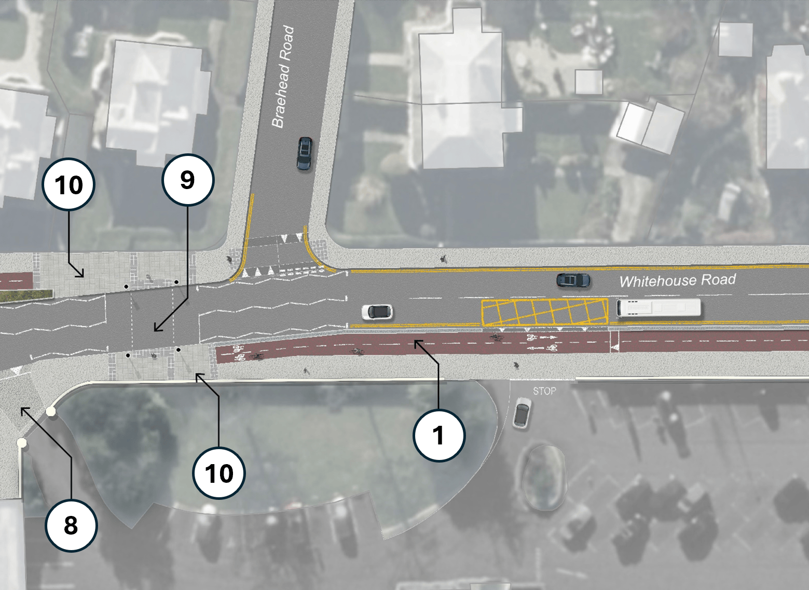

The City of Edinburgh Council's **Transport and Environment Committee** ('TEC') will meet this Thursday, 29th January 2026, and as ever we've had a rummage through the virtual paperwork for the bits that pertain to cycling and safer streets in the city.

> 🌐 [Meeting Page & Agenda](https://democracy.edinburgh.gov.uk/ieListDocuments.aspx?MId=7657){target="_blank" rel="noopen noreferrer"}   PDFs:  📑 [Full Agenda Reports Pack](https://democracy.edinburgh.gov.uk/documents/g7657/Public%20reports%20pack%2029th-Jan-2026%2010.00%20Transport%20and%20Environment%20Committee.pdf?T=10){target="_blank" rel="noopen noreferrer"}     💼 [Business Bulletin](https://democracy.edinburgh.gov.uk/documents/s93336/Business%20Bulletin%20-%20TE%20January%202026.pdf){target="_blank" rel="noopen noreferrer"}     📋 [Work Programme](https://democracy.edinburgh.gov.uk/documents/s93323/Work%20Programme%2029.01.26.pdf){target="_blank" rel="noopen noreferrer"}
---

## 💼 Business Bulletin 
📄 [Report](https://democracy.edinburgh.gov.uk/documents/s93336/Business%20Bulletin%20-%20TE%20January%202026.pdf){target="_blank" rel="noopen noreferrer"} [PDF] »

The Business Bulletin is home to more minor items that don't warrant a full report, or further updates on more significant past reports. 

---

### 💙 Page 7: Fatal Incident Whitehouse Road – update

The business bulletin includes, [on page 7](https://democracy.edinburgh.gov.uk/documents/s93336/Business%20Bulletin%20-%20TE%20January%202026.pdf#page=7){target="_blank" rel="noopen noreferrer"}, an update on the road safety interventions put in place following the tragic death of 11-year-old Thomas Wong who was struck by the driver of an NWH refuse lorry that was exiting the golf club on Whitehouse Rd in March 2024.

A [post from the Transport Convener](https://bsky.app/profile/stephenjenkinson.bsky.social/post/3mcw5uvrqhs2d){target="_blank" rel="noopen noreferrer"} Cllr Stephen Jenkinson saw some discussion about the changes on social media, however these centered around archival photos from Google Street View and we haven't seen a picture of the junction as now improved.

Without engaging in too much speculation around a horrible and unnecessary death - this kind of junction interaction would be far less likely on a road where there's a protected cycleway for kids to cycle to school. And while too late to have avoided this tragedy, the Barnton Connections project — [open for consultation until 9th February](https://consultationhub.edinburgh.gov.uk/sfc/barnton-connections/){target="_blank" rel="noopen noreferrer"} — will include a two-way protected cycleway passing this very spot when implemented.

---

## 🗳️ Items for Decision

### 💰 7.2 Edinburgh Visitor Levy: City Operations and Infrastructure Investment Theme 
📄 [Report](https://democracy.edinburgh.gov.uk/documents/s93326/Visitor%20Levy-%20City%20Operations%20and%20Infrastructure%20Report.pdf){target="_blank" rel="noopen noreferrer"} [PDF] »

Funds from the new Visitor Levy are headed for 'The Well-Kept City Fund' and 'The City Transformation Fund'. Projects have been assessed through Elected Member Workshops with both TEC and also the Culture and Communities committee; and they've also been scored and prioritised by the Edinburgh Visitor Levy Advisory Forum ('EVLAF').

The outcomes from all of this will be voted on at full council in February. 

> 📰 There's a brilliant round-up on the projects and spending [by Phyllis Stephen at The Edinburgh Reporter](https://theedinburghreporter.co.uk/2026/01/council-identifies-what-the-visitor-levy-will-pay-for/) which is well worth the read. 

The headlines for cycling infrastructure are that the [George St and First New Town project](https://www.edinburgh.gov.uk/georgestreet/){target="_blank" rel="noopen noreferrer"} will go ahead, with Visitor Levy funds covering the cost to the council of borrowing the money required to deliver it; and other projects like a Portobello Prom masterplan, another crack at a redesign of Princes St and its gardens, and revamping the famously popular one-way cycling mecca Rose St.

Also spotted in the paperwork were:

> Cowgate: "£1m capital funding is recommended to support Old Town Streets Phase 2 works at the Cowgate. This would cover the quick implementation of road safety improvements, which **may include one way traffic and footway widening**."

and

> Cramond Foreshore: "A capital contribution is recommended to upgrade the car park at Cramond, improve safety, accessibility, capacity **and active travel connections**. In addition, this funding will provide new accessible public toilets and Changing Places."

There are a handful of cycling projects not recommended for Visitor Levy funding (see Appendix 4 below); generally these will be revisited in future, like changes to Charlotte Sq or the continuation of the Hire Bike scheme following its two-year trial; or in the case of the Meadows to George St, meets the criteria for other outside funding opportunities.

The list of projects and their scoring can be found in the Appendices to the report:

- [Appendix 1](https://democracy.edinburgh.gov.uk/documents/s93327/Appendix%201-%20Full%20Project%20List%20Provided%20to%20EVLAF.pdf){target="_blank" rel="noopen noreferrer"} [PDF]: Full Project List Provided to EVLAF Members
- [Appendix 2](https://democracy.edinburgh.gov.uk/documents/s93328/Appendix%202-%20EVLAF%20Project%20Scores.pdf){target="_blank" rel="noopen noreferrer"} [PDF]: EVLAF Project Scores
- [Appendix 3](https://democracy.edinburgh.gov.uk/documents/s93329/Appendix%203-%20City%20Operations%20and%20Infrastructure%20Recommended%20Projects.pdf){target="_blank" rel="noopen noreferrer"} [PDF]: City Operations and Infrastructure- Recommended Projects
- [Appendix 4](https://democracy.edinburgh.gov.uk/documents/s93330/Appendix%204-%20City%20Operations%20and%20Infrastructure%20Projects%20Not%20Recommended.pdf){target="_blank" rel="noopen noreferrer"} [PDF]: City Operations and Infrastructure Projects Not Recommended
- [Appendix 5](https://democracy.edinburgh.gov.uk/documents/s93403/Appendix%205-%20COI%20Budget%20Transport%20and%20Environment%20v2.pdf){target="_blank" rel="noopen noreferrer"} [PDF]: City Operations and Infrastructure Budget (Transport and Environment) 

---

### 🚕 7.4 St James Square access arrangements
📄 [Report](https://democracy.edinburgh.gov.uk/documents/s93337/St%20James%20Square%20access%20arrangements.pdf){target="_blank" rel="noopen noreferrer"} [PDF] »

From the report:

> 2.1 This is the third report concerning access arrangements at St James Square. The two prior reports recommended that the Council promote a TRO allowing limited vehicular access to St James Square. This report takes a slightly different approach, proposing instead that St James Square be stopped up – thus reverting to being private land – and that vehicular access to St James Square be facilitated by the Council in its capacity as landlord (rather than Roads Authority) in line with the lease over the Square.
>
> 2.2 This approach reflects the design of the Square as built in line with the planning permission and avoids challenges associated with outright prohibiting vehicular access to the Square as identified by the engineering consultancy Jacobs. It gives the Council oversight over vehicular access to the Square as landlord while placing responsibility for safety within the Square on the leaseholder.

As an outsider to the whims of the golden turd hotel's ownership and clientele, it's fascinating to see a pedestrianised space encroached on simply to save a subset of the rich, famous and taste-impaired from a 30ft walk across a plaza; it's like the perfect case study in motornormative weirdness. 

No doubt this will not be the last we hear of this space and the issues posed by motoring within it.

---

### 👥 7.7 Updating the External Organisation Membership of the Transport and Local Access Forum
📄 [Report](https://democracy.edinburgh.gov.uk/documents/s93344/Updating%20the%20External%20Organisation%20Membership%20of%20the%20Transport%20and%20Local%20Access%20Forum.pdf){target="_blank" rel="noopen noreferrer"} [PDF] »

This one is very, very 'inside baseball' but it's great to see excellent campaign groups and representative bodies like [Blackford Safe Routes](https://blackfordsaferoutes.co.uk/){target="_blank" rel="noopen noreferrer"} and **Friends of Holyrood Park** join others like  [City Cycling Edinburgh](citycyclingedinburgh.info/){target="_blank" rel="noopen noreferrer"}, [Cyling Scotland](https://cycling.scot/){target="_blank" rel="noopen noreferrer"} and [Edinburgh Festival of Cycling](https://edfoc.org.uk/){target="_blank" rel="noopen noreferrer"} being named on this panel, who feed back to the council on local transport issues.

---

## 🔎 Items for Scrutiny

---

'Items for Scrutiny' are reports that are expected to pass without requiring debate, so may not be discussed at TEC unless Councillors have questions on them and ask for them to be discussed at the start of proceedings.

---

### 🙄 8.7 Democratic Engagement on City Mobility Plan and Transport Proposals - Motion by Councillor Cuthbert 

📄 [Report](https://democracy.edinburgh.gov.uk/documents/s93357/Democratic%20Engagement%20on%20City%20Mobility%20Plan%20and%20Transport%20Proposals%20motion%20by%20Councillor%20Cuthbert.pdf){target="_blank" rel="noopen noreferrer"} [PDF] »

This is a response to a previous motion by Cllr Cuthbert, who felt - as many Scottish Conservatives do - that the council isn't listening to the **right** residents and is pushing through the **City Mobility Plan** to make the city much more liveable, at the expense of people who insist on their sovereign right to drive absolutely everywhere. It's only democracy if the Tories get what they want out of it, you see.

---

## ✍🏽 Motions and Amendments

---

### 🥱 9.1 Motion by Councillor Cuthbert - Review of the City Mobility Plan 2021-2030 

📄 [Motion](https://democracy.edinburgh.gov.uk/documents/s93360/Motion%20by%20Cllr%20Cuthbert%20-%20Review%20of%20the%20City%20Mobility%20Plan%202021-2030.pdf){target="_blank" rel="noopen noreferrer"} [PDF] »

This is a new motion by Cllr Cuthbert, who feels - as many Scottish Conservatives do - that the council isn't listening to the **right** residents and is pushing through the **City Mobility Plan** to make the city much more liveable, at the expense of people who insist on their sovereign right to drive absolutely everywhere. It's only democracy if the Tories get what they want out of it, you see.

---

### ⛔️ 9.2 Motion by Councillor Kinross-O'Neill - Royal Park Terrace and Radical Road 

📄 [Motion](https://democracy.edinburgh.gov.uk/documents/s93361/Motion%20by%20Cllr%20Kinross-ONeill%20-%20Royal%20Park%20Terrace%20and%20Radical%20Road.pdf){target="_blank" rel="noopen noreferrer"} [PDF] »

On weekends where Holyrood Park is closed to through-traffic, residents on Spring Gdns and Royal Park Ter are seeing significant amounts of rat-running taking place; this motion calls for a modal filter to be implemented to preserve local residents' access and remove unnecessary through-traffic, as well as keeping tabs on other matters going on in the park pertaining to the Radical Road.

---

### 🚲 9.3 Motion by Councillor Booth - Voi Cycle Hire Scheme 

📄 [Motion](https://democracy.edinburgh.gov.uk/documents/s93362/Motion%20by%20Cllr%20Booth%20-%20Voi%20Cycle%20Hire%20Scheme.pdf){target="_blank" rel="noopen noreferrer"} [PDF] »

At the September 2025 meeting of TEC, it was agreed that an update on the Cycle Hire Scheme provided by [Voi](https://www.voi.com/){target="_blank" rel="noopen noreferrer"} would be provided to Councillors via the Business Bulletin every six months during the two-year trial of the scheme.

> Cllr Booth's motion recognises that "...some teething problems with the scheme, with reports of bikes being left on footways, obstructing pedestrians and disabled people, obstructing existing cycle parking, being blown over by the wind, and more recent reports of users being unable to drop the bikes at their preferred parking spot due to bike congestion", and calls for a briefing from Voi and council officers within the next couple of months for Councillors and stakeholder groups.

This is vital to address the public realm costs of the cycle hire scheme; which while excellent and performing very well, is also creating issues in some locations with blocked pavements and crossings, as well as saturating available cycle rack parking — the source of [our campaign on the issue](/projects/2025-11-voi-cycle-rack-parking/){target="_blank" rel="noopen noreferrer"}. Voi are clearly capable and willing to intervene and make the scheme as successful for everyone, cycle users or not - but the requirement to engage with stakeholders being set by TEC is vital to give officers the political backing and remit to ensure these issues are being looked at.

---

The Transport & Enviroment Committee will meet this **Thursday, 29th January 2026**, and we'll have a round-up in our subsequent issues.