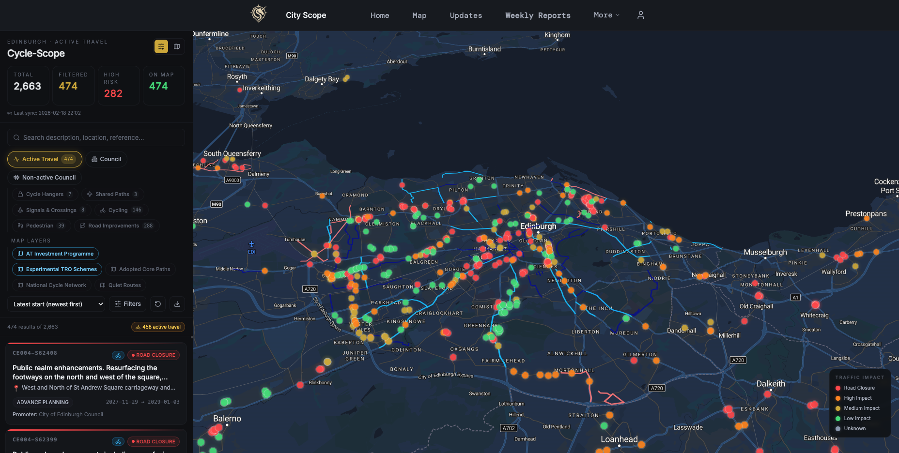
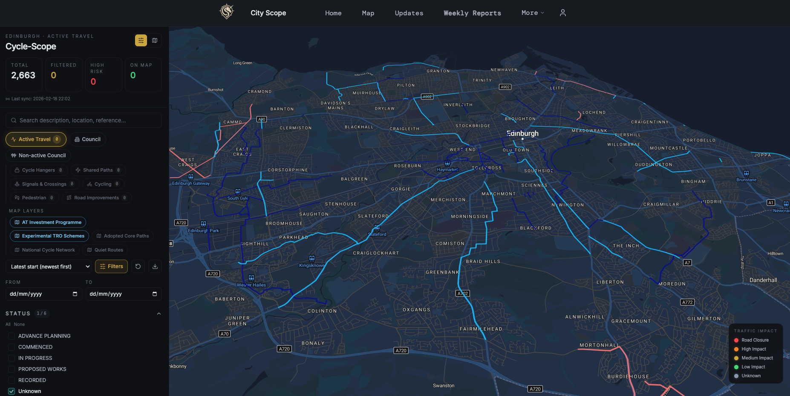
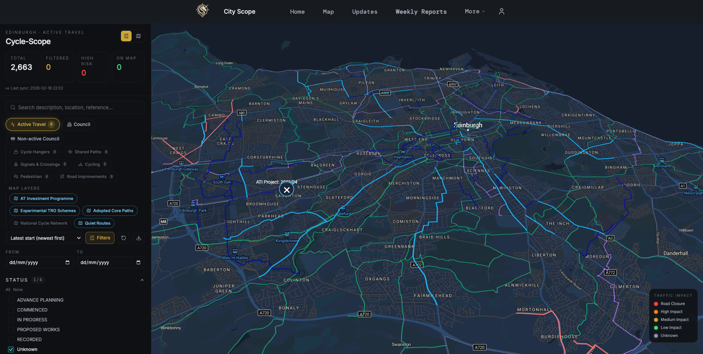

[City Scope](https://www.city-scope.co.uk/){target="_blank" rel="noopen noreferrer"}, a user-friendly and modern planning and development portal built by friend of **edi.bike** [Harry Williams](https://bsky.app/profile/harryjwilliams.bsky.social){target="_blank" rel="noopen noreferrer"}, has this week launched a dedicated active travel portal on its website called [Cycle Scope](https://www.city-scope.co.uk/cycle-scope){target="_blank" rel="noopen noreferrer"} - hot on the heels of their recently released tracker for [Active Travel Investment delays](https://www.city-scope.co.uk/active-travel){target="_blank" rel="noopen noreferrer"}.

The resource is formed from a number of sources of data — the [Scottish Roadworks Commissioner](https://roadworks.scot/){target="_blank" rel="noopen noreferrer"}, the City of Edinburgh Council's [Quiet Routes](https://www.edinburgh.gov.uk/downloads/download/14188/quietroutes-maps){target="_blank" rel="noopen noreferrer"}, [Core Paths network](https://www.edinburgh.gov.uk/downloads/download/12899/core-paths){target="_blank" rel="noopen noreferrer"}, and the [Active Travel Investment Programme](https://www.edinburgh.gov.uk/cycling-walking-projects-1/active-travel-improvements){target="_blank" rel="noopen noreferrer"} - both routes that have been consulted on and approved to proceed, and those still pending approval.

---

With such a wealth of information, it can be hard to know where to start. Using the **'Status'** filter in the sidebar, we can untick all of the roadworks ('Advanced Planning' through 'Recorded'), turning on a couple of the data layers, and take a look at the some of the route maps:

The light blue routes are currently labelled 'Experimental TRO schemes'. Of course, thanks to a run of recent approvals at the Council's Traffic Regulation Order Sub-committee, the majority of these are being made permanent - so there are a handful of routes in light blue that are still 'experimental' in nature, but the majority are guaranteed to stay.

In royal blue, are the Active Travel Investment Programme routes. Some of these are also in red; potentially the distinction between these being that routes in red have not yet been approved at committee following the consultation phase.

---

Other layers that can be turned on with flags in the sidebar include the network of Quiet Routes (in pink) and the 'core path' network (in green). Where these overlap with other layers - for example the Greenbank to Meadows quiet route - these are sometimes overlaid with e.g. Experimental TRO routes. 

---

Enabling just the **'In progress'** roadworks items under the 'Status' sidebar area gives us a smaller subset of roadworks across active travel, and clicking on one of these map nodes such as in the screenshot above of the current Summerhall works gives a summary and scheduled work dates in an additional sidebar, as well as the level of expected disruption to traffic (the basis for the colour-coded map markers).

---

Disabling 'In progress' again in favour of 'Advanced Planning' provides an insight into what's scheduled for future dates - like this work on the Braid Estate scheduled conveniently after local councillors' standards committee hearings over undeclared conflicts of interest when the vote was taken.

---

There's likely more to come from [Cycle Scope](https://www.city-scope.co.uk/cycle-scope){target="_blank" rel="noopen noreferrer"} - another great tool for making sense of ongoing progress towards a safer city for sustainable transport.