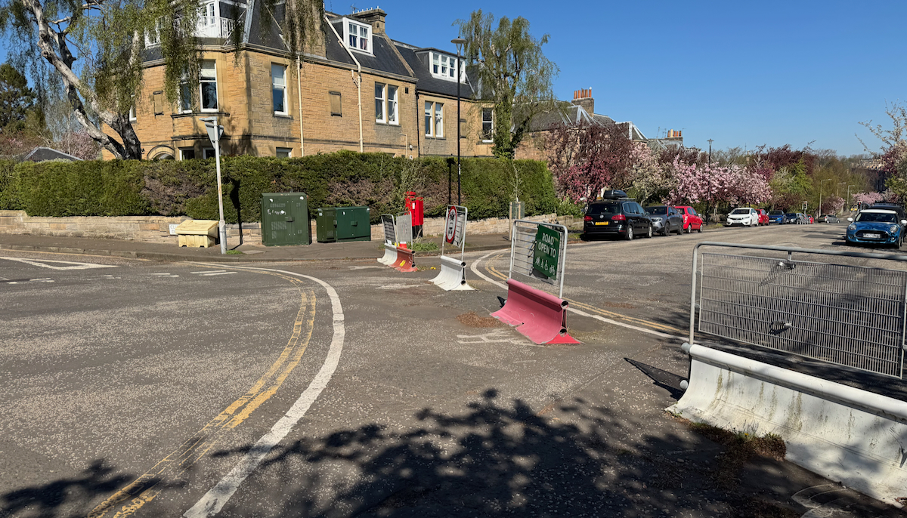

## Capitulation to loud motoring minority as ‘incorrectly worded’ legal order for two modal filters on the Braid Estate sees Officers report ‘recommend removal’ - when not legally required

[ _Deep sighing. A head hits a keyboard before beginning._ ]

The City of Edinburgh Council’s Traffic Regulation Orders Sub-committee will [meet on the 12th of May](https://democracy.edinburgh.gov.uk/ieListDocuments.aspx?CId=645&MId=7799&Ver=4){target="_blank" rel="noopen noreferrer"}, and make decisions on a number of measures to make up Traffic Regulation Orders from the ‘Travelling Safely’ COVID-era measures for walking, wheeling and cycling safely in south Edinburgh. These are:

* **Braid Rd** - waiting and loading restrictions that enable some (steadily more and more diluted and barely present) protected cycleway, and one key modal filter at Braidburn Terrace severing a key through-traffic route down Braid Rd into Morningside;

* **Comiston Rd** - waiting and loading restrictions that enable protected cycleways and bus lanes; _we would encourage readers to scrutinise the proposed changes to loading restriction times in the report;_

* **The Greenbank to Meadows Quiet Route** - a network of modal filters from Greenbank Parish church through to James Gillespies Primary School at Bruntsfield Links, comprised of filters at Braid Rd (in a separate order), Cluny Drive, Braid Avenue, Canaan Lane, Whitehouse Loan at Strathearn Road, and Whitehouse Loan outside James Gillespies Primary. A new filter will also be implemented at Clinton Road to help prevent further through-traffic onto the southern end of Whitehouse Loan.

> Taken together, these schemes form a key safe cycling corridor for the south of the city (an area which doesn’t benefit from the off-road - former railway - paths found elsewhere in the city, and sorely otherwise lacks any safe cycling infrastructure). All other such corridors in the city, split into North, South, East and West area orders, have now been made permanent at this 'quasi-judicial' sub-committee, that makes the final, legal call and oversees the making of Traffic Regulation Orders.

Papers for the ‘TRO Sub’ meeting were published late last week, including the [report on these southern routes](https://democracy.edinburgh.gov.uk/documents/s98026/4.1%20-%20Travelling%20Safely%20-%20Braid%20Road%20Comiston%20Road%20and%20Greenbank%20to%20Meadows%20Quiet%20Connection%20-%20ETRO.pdf){target="_blank" rel="noopen noreferrer"} [PDF] and the relevant [appendices](https://democracy.edinburgh.gov.uk/documents/s98001/4.1%20-%20Appendices%20-%20Travelling%20Safely%20-%20Braid%20Road%20Comiston%20Road%20and%20Greenbank%20to%20Meadows%20Quiet%20Conn.pdf){target="_blank" rel="noopen noreferrer"} [PDF]. 

In these papers we expected to see Council Officers recommend that all three schemes and the measures that they are comprised of be made permanent, and arguably **that’s what the Transport & Environment Committee meeting on 2nd April voted for** - from the information they were provided, a democratic vote was taken at an executive committee of the council, calling for the referral of the Greenbank to Meadows Quiet Route in particular to go before the TRO Sub-committee to be made permanent, and put the issues that have plagued it to bed and move on.

Following the Transport Committee, [residents were celebrating](https://theedinburghreporter.co.uk/2026/04/braid-estate-residents-issue-call-to-maintain-quiet-route-measures/ ){target="_blank" rel="noopen noreferrer"} nearing the end of the uncertainty around the safer streets measures that have now been in place for five years. 

---
 
### 🔥 Let’s follow procedure, and then wildly undermine it

The bombshell moment late last week came when it was realised that a technicality raised by lobbying groups against the quiet route — **that the legal order describing two filters at Cluny Drive and Braid Avenue was not accurately worded compared to measures 'on the ground'** — actually carried water, and that these key traffic-reducing measures at the centre of the anti-safety lobby’s vocal campaigning apparently do have a questionable legal basis, at least as written in the orders as advertised. The plans that accompany the wording have always shown an accurate depiction, and all notes of support and objections **were to the order as implemented** - not the wording involved. 

Council officers therefore recommend their removal. They’ve been there for five years, sure - but **someone’s screwed up the paperwork so let’s shrug our shoulders and rip them out.** Does that sound right, or even vaguely sane, especially given the absolute saga residents and route users alike have endured to get this far?

> Unbelievably, Officers are ignoring the Council’s sustainable transport hierarchy policy and capitulating to the motoring lobby who raised this issue immediately — and appear to be doing so **outside of the democratic process involving Councillors, public scrutiny and committee votes** — without including any suggestion that there are legal ways around correcting these mistakes and preserving what was referred on for permanence by the Transport Committee.

**Is this Edinburgh’s ‘delivery’ phase we were promised** - delivering nothing but disappointment and danger? Is this what we’re to expect when there are hurdles for Council employees to overcome - to throw away a half-decade of successful road safety intervention because someone half-assed the paperwork?

---

### 🏳️ Give up, or let councillors proceed with the decision-making process?

Officers may be less willing to re-advertise so near the end of an Experimental Traffic Regulation Order ('ETRO'), as the 18 month time limit is not supposed to be extended - and the existing ETRO cannot legally be modified to fix the errors, as it’s more than 12 months old.

> However, it’s clear that while the preferred Council pipeline of _Experimental order > Vote on permanence of measures > Full Traffic Order_ can’t continue for these measures, there’s **no legal requirement to completely abandon these measures before they can even be considered by the sub-committee**.

---

#### ⏳ All the time in the world, when it suits...

Firstly, the idea that an experimental order expires and measures have to be immediately removed? There was a seven month period between the expiry of ETRO/21/29 (original ‘South’ area schemes) and the start of the current Quiet Route ETRO (21/29D), **during which time there was no legal order backing the measures on the ground**. The sky didn’t fall in; leave the filters in place, advertise a new _(ideally correctly worded, pay attention lads)_ non-experimental Traffic Regulation Order for these filters, and have their objections reviewed and considered for permanence that way. Remember - **we know from monitoring already** that these have helped fulfil Council policies on safe walking, wheeling and cycling in the area, and have made streets safer.

The pitch to TRO Sub? “_Two of the filters you’re considering to make permanent today have a currently flawed legal basis, and if you decide on their retention, they will be subject to a further TRO process to make good their legal standing._”

---
 
#### 🖍️ Other cities just... fix their mistakes

Secondly - other local authorities, in England, have [raised Temporary Traffic Regulation Orders in the interim to cover errors](https://moderngov.rotherham.gov.uk/documents/s32888/Bramley%20TRO%20objection%20final.pdf){target="_blank" rel="noopen noreferrer"}. The inference being - **if we described something wrongly but it helps make our streets safer, maybe we should fix the description, not reintroduce road dangers**. Council Officers ruled out use of a TTRO to extend the deadline for the Quiet Route in order to ensure it had proper scrutiny and time to be made permanent - the experimental order expiring as it does on 15th June - but a clearly defined window of time allowing for errors in paperwork to be corrected has been used by other councils and could clearly be used here too, **with the political will to see this through rather than give up on our most vulnerable road users**.

---
 
### 🔨 But what else can we tear out?

Worse still, officers claim that these two erroneously-advertised filters are ‘interdependent’ with the traffic filter on **Braid Road at Braidburn Terrace**, proposing to also remove that and reintroduce two-way traffic on Braid Rd north of the junction - a street that had become quiet enough that children have been playing out in it again, along with its key role as a quiet section of the Greenbank to Meadows Quiet Route away from significant through-traffic. 

If these filters are interdependent, why is the Braid Road filter **part of a separate order** being considered at committee? 

Is this, in fact, just further capitulating to a vocal minority of drivers locally? It cannot be overstated how dangerous the relatively new parallel crossings here will become with the reintroduction of southbound traffic firing up Braid Road just to avoid traffic signals on the Comiston Road corridor. **This is a factor that even the most vocal of the quiet route’s opponents had come to terms with**, and their group haven’t been calling for this filter to be removed. Why are we not only fighting minority opponents attempting to pull out properly-advertised modal filters, **but the Officers who implemented them too?**

<iframe src='https://www.youtube.com/embed/rnyp0Jktx0A' frameborder='0' allowfullscreen></iframe>

 

> **"_In any other sensible world, when a mistake is made in the paperwork, IT IS FIXED - not by changing the physical world to match the incorrect documents, but by updating the text._** 
>
> **_Only Edinburgh council could make such a mess of it_"** — Blackford Safe Routes [on Bluesky](https://bsky.app/profile/blackfordsaferoutes.co.uk/post/3mkwsbpybm22v ){target="_blank" rel="noopen noreferrer"}

## ⚠️ We demand answers.

* 🔍 Why does the preservation of a vital traffic calming measure come down to the scrutiny of the public to identify issues? Whether through Council incompetence or the possibility of deliberate sabotage when the orders were made _(and already opposed by a small minority)_, **why are there not review processes in place** to ensure we don’t throw a five-year beneficial scheme down the drain?

* 🖍️ Back in 2023, ‘drafting errors’ in Spaces for People ETROs led to them being reviewed and re-issued; why were the errors in ETRO 21/29 not caught then? **And why is the first instinct of Officers when faced with a mistake to give up and remove vital safety measures**, instead of pulling out all the stops to correct the mistakes?

* 🤔 Given that the TRO Sub considers only objections and Officers' recommendations in the report, **why are they being steered to remove something on the grounds of a paperwork mistake**, instead of being recommended to approve a scheme and fix it with the appropriate orders and legal work as a result of that vote?

* 📢 Why was a former transport committee member heard shouting over to a resident on the Braid Estate that they had **‘_sorted out the quiet route problem_’** and not to worry, or words to that effect? Is it really as simple as sticking a wrench in the democratic engine if the decisions aren’t going your way, and get measures enabling safer streets removed anyway?

* 🗳️ Why is the **democratic decision** of the Transport Committee at 2nd April not being upheld in Officer recommendations, by finding a way around the technical issues while preserving the benefits of the scheme? **Why give up, unless you’re politically motivated to do so?**

Opposition groups on social media are already claiming victory here, and residents within the estate are dismayed - having established and seen the benefit of quieter and safer streets, having seen the Transport Committee push for this scheme to be finally decided on at TRO Sub without any further nonsense - **how the fresh hell is it only now that Officers have thought to check over the legality and detail of their own plans?**

> Politically sensitive time or not, with Scottish elections looming — **the Council administration must provide a robust answer to this dire, mismanaged saga**.

---

The Transport Convener's email address is [Cllr.Stephen.Jenkinson@edinburgh.gov.uk](mailto:Cllr.Stephen.Jenkinson@edinburgh.gov.uk) — and the TRO Sub-committee will convene on 12th May 2026 at 2pm.

📅 [Edinburgh Critical Mass](https://edinburghcriticalmass.wordpress.com/){target="_blank" rel="noopen noreferrer"} are planning a rally outside of the City Chambers (Royal Mile) on the **12th of May**, in support of the key cycle infrastructure in the south of the city referred to be made permanent at the Traffic Regulation Orders Sub-committee meeting that day; with the committee meeting starting at 2pm, this will likely be early afternoon. 
