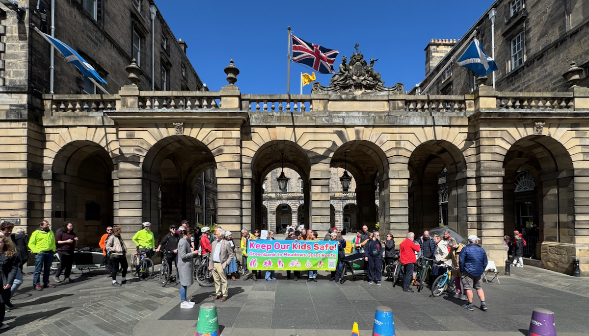
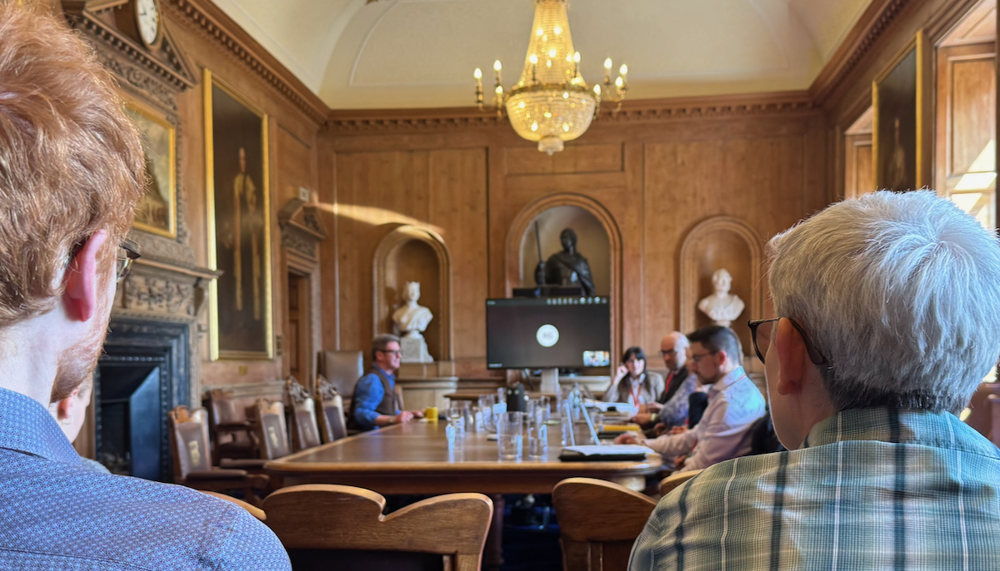
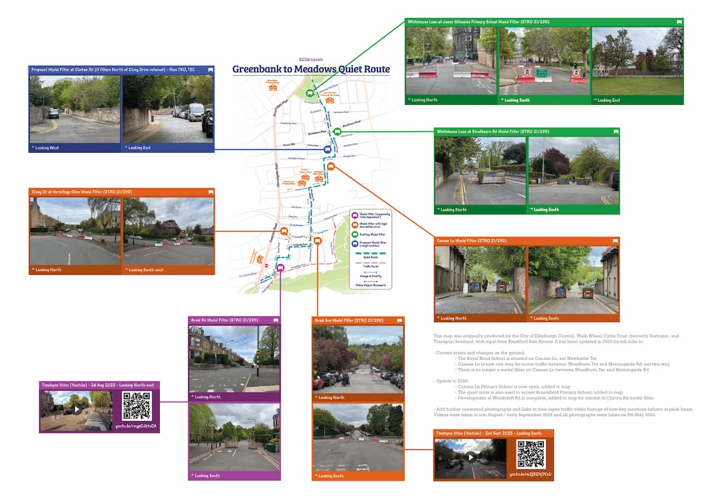
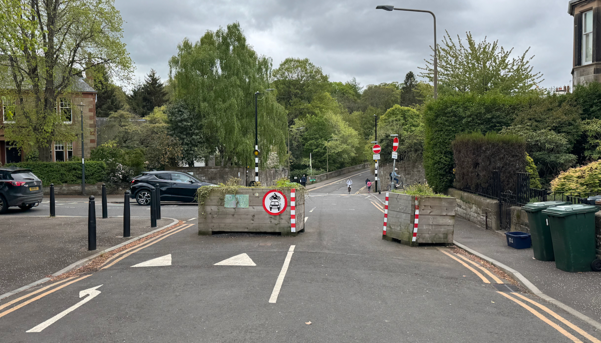

## 'As good as it could have been' - all filters without errors in legal orders made permanent, with report to follow at Transport Committee

The City of Edinburgh Council’s Traffic Regulation Orders Sub-committee [met on Tuesday 12th](https://democracy.edinburgh.gov.uk/ieListDocuments.aspx?CId=645&MId=7799&Ver=4){target="_blank" rel="noopen noreferrer"}, to decide on a number of the final ‘Travelling Safely’ schemes for walking, wheeling and cycling safely in south Edinburgh.

For more background and detail on the schemes up for decision, [read our most recent article](../2026-05-04-quiet-route-paperwork-problems) on the matter for greater context. 

Incredibly, in the week following that piece, it emerged that a third filter on the Greenbank to Meadows quiet route, at Canaan Lane, was also erroneously worded - meaning **officers were recommending removing 66% of the modal filters that protect the 'quiet route' from through-traffic**.

---

## ✊🏼 Councillors met by support rally outside City Chambers

A welcome sight was a rally ahead of the meeting staged by [Edinburgh Critical Mass](https://edinburghcriticalmass.wordpress.com/){target="_blank" rel="noopen noreferrer"} and [Blackford Safe Routes](https://blackfordsaferoutes.co.uk/keep-our-kids-safe/){target="_blank" rel="noopen noreferrer"}. The gathered parents, cyclists, walkers and activists held a banner reading _'Keep our kids safe'_ and led chants, explained what was at stake to passers-by, and greeted Councillors as they arrived for the meeting.

Many thanks to all who turned up - we believe your presence at these key decisions brings the issues to life and underscores we're far more than emails in an inbox.

---

Amended papers for the ‘TRO Sub’ meeting were published ahead, including the second version of the [report on the southern routes](https://democracy.edinburgh.gov.uk/documents/s98371/4.1%20-%20Travelling%20Safely%20-%20Braid%20Road%20Comiston%20Road%20and%20Greenbank%20to%20Meadows%20Quiet%20Connection%20ETRO.pdf){target="_blank" rel="noopen noreferrer"} [PDF] and the relevant [appendices](https://democracy.edinburgh.gov.uk/documents/s98372/4.1%20-%20Appendices%20-%20Travelling%20Safely%20-%20Braid%20Road%20Comiston%20Road%20and%20Greenbank%20to%20Meadows%20Quiet%20Conn.pdf){target="_blank" rel="noopen noreferrer"} [PDF]. 

---

## 💼 The Sub-committee convenes

Thanks to rumours that the meeting, being in a different room than normal, may not be webcast - a number of the supporters from the rally piled into the City Chambers' 'Diamond Jubilee' room for the meeting itself; including us, in-person for the first time in this wee publication's history. 

A smaller room with no microphones, the webcasting and remote join for some employees and councillors was facilitated by 360° webcams on the desk in front of councillors and officers. There was already a tension amongst the supporters of the walking and cycling schemes up for decision, never mind having to remain completely silent to strain and hear the discussion as it took place unamplified in such a space.

Another unusual factor in this meeting was the number of councillors normally on 'TRO Sub' who had to recuse themselves; some due to having children at schools on the route, or having previously expressed opinion on the route in some form. As such, only three of the slated TRO Sub members on the list were in attendance (marked with a star below) - the rest were all substitute members for this decision:

* Cllr Margaret Arma Graham, Convener - Labour*
* Cllr Joan Griffiths - Labour*
* Cllr Jo Mowat - Conservative
* Cllr Neil Gardiner - SNP*
* Cllr David Key - SNP
* Cllr Dan Heap - Green
* Cllr Alex Staniforth - Green
* Cllr Euan Davidson - Lib Dem
* Cllr Jack Caldwell - Lib Dem

---

### 🚲 Braid Rd and Comiston Rd Cycleway schemes

Amazingly, other than a gambit from Conservative Cllr Jo Mowat asking if the amount of unimplemented measures for Comiston Rd present in the legal orders represented some kind of Council 'overreach' — the answer to which was it is very typical for ETROs to outline not only the measures planned to be implemented but potential variations and options to adapt during the experiment, so not an overreach but highly common — **Braid Rd and Comiston Rd were simply not discussed**. 

They were included in the same report as the quiet route, and passed along with some of its measures being made permanent, without any real discussion of objections or amendments. 

This is not surprising given that these are popular routes, and that as per independent monitoring of the schemes there was no significantly negative impact on the flow of traffic through the corridors where protected cycleways were introduced during the pandemic; the objections to this new infrastructure were simply not material enough to warrant any real debate.

---

### 🌳 Greenbank to Meadows Quiet Route

_Our updated map of the Greenbank to Meadows Quiet Route -_ [download as PDF](../../../files/2026/05-G2M-Map-Update/G2M-Map-Update-2026--v2.pdf){target="_blank" rel="noopen noreferrer" download} »

The quiet route was absolutely the focus of debate and questions for officers, mired as this scheme has been by a long saga of consultative mismanagement, and inteference from since-censured local councillors. 

Officers were profuse and respectful in their apologies for wording issues with the legal advertising wording of filters at Canaan Lane, Braid Avenue and Hermitage Gardens; the orders in question were created at a time when the team had over forty legal orders to produce for safe space measures during the COVID-19 pandemic. This is a brutal issue to be at the heart of and have to be accountable for, and officers were very clear in their answers, reasoning and their contrition for these recently discovered problems hampering a full decision on the scheme.

The volume of orders during the pandemic led to mistakes - in part it would seem due to the contractor in use - which were then carried forward from the initial TTRO to two further ETROs covering the quiet route, without checks on whether the orders' wording matched the implementation on the ground. For measures in an ETRO to be a valid 'experiment' and pass to be made permanent, they have to be implemented as described.

> Canaan Lane's order makes reference to an 'access to Newbattle Terrace' that officers say does not actually exist - _we have a different intepretation which matches the plans, but this is rather moot by this point._ Braid Avenue and Hermitage Gardens' diagonal filters were not even close to correctly described, making the description of the motor vehicle prohibition in the legal orders bear essentially no resemblance at all to what was trialled. Because of the ETRO process, officers hands truly did seem to be tied on all of these items, and they could not progress to be made permanent at this meeting.

As it happens, the Council made the move in the last couple of years to less arduous 'map-based TROs', where it's pretty much impossible to have this kind of issue arise - so fortunately, we should never see its like again.

SNP and Green councillors on the sub-committee did an admirable job of interrogating the potential for retaining filters on the day, digging in and trying to get as much clarity as possible on the decisions they were able to make and instructions they were able to give with their specific remit. 

Officers did repeatedly make both apologies for the errors at the meeting, and promises that a report would be coming to the next meeting of the Transport and Environment Committee on 18th June. This has since been confirmed, that not only the 'Business Bulletin' update expected but a full Officers report is to be expected.

---

#### 🙌🏼 Saving the Braid Rd filter

The recommendations in the Officers report for these routes claimed that the filter at Braid Rd was 'interdependent' with the filters at Braid Ave and Hermitage Gdns that needed to be removed, and as such should be removed also.

The position that the Labour administration moved was to accept the Officers report in full, including this recommendation. An amendment tabled by Green Cllr Alex Staniforth asked that instead of removing this filter — which had no legal errors forcing the Council's hand — instead it be retained for the immediate benefits it provides in severing a north-south rat run to avoid the adjacent main traffic corridor, and preserve the benefits felt by residents on the northern half of Braid Rd behind the filter who have a quieter street with slower-moving traffic as a result.

Cllr Jack Caldwell asked a key question regarding the data that lead officers to their recommendation for this filter. The answer was that monitoring data exists only before _any_ of the filters were put in place, and after _all_ of the filters were put in place - so any ill effects being alluded to by officers in this filter remaining were based on best guesses rather than information about this specific filter.

> This tipped the balance, as there is no party whip on a quasi-judicial sub-committee such as this one - so while Conservative Cllr Mowat and Lib Dem Cllr Davidson backed the administration in only making permanent the two northernmost filters at Bruntsfield Links and Strathearn Rd, Green and SNP councillors were joined by Lib Dem Cllr Jack Caldwell in voting to also retain the Braid Rd filter with 5-4 votes.

With this vote, the Braid Rd cycleway and protected cycle lanes on Comiston Rd were also made permanent, fully establishing the southern cycle corridor specified as a primary cycle route in the Council's City Mobility Plan; with the exception of the three filters with issues.

---

## 🔮 What comes next...

The Transport & Environment Committee ('TEC') will meet on the 18th of June, which is three days after the expiry of the ETRO that features the filters with legal wording issues. 

While a commitment was sought at TRO Sub that these filters would not be removed ahead of a Transport Committee decision, this was not forthcoming. However, it seems highly likely they will stay for at least long enough for this to return to TEC.

The administration have ruled out another ETRO, which seems appropriate given that this is no longer an experiment. We've run an experiment, **and it's been succesful**.

---

### We know that there are a significant number of users of the Greenbank to Meadows quiet route. 

### We know there are six schools served by the route, two of whom (Canaan Lane Primary and the Royal Blind School) will face a dangerous and unwelcome reintroduction of through-traffic if these filters are not retained. 

### We know that it is council policy to address road safety issues caused by through-traffic and vehicle speeds near schools and residences. 

### We know that it is council policy to encourage walking, wheeling and cycling where possible. 

### We know that the Greenbank to Meadows quiet route is a vital central south corridor designated by this Council as part of the Primary Cycle Network in the City Mobility Plan.

### We know that these filters need to be made legally permanent, and remain on the ground until this process is complete.

---

➡️ &nbsp;[Follow us](https://bsky.app/profile/edi.bike){target="_blank" rel="noopen noreferrer"} or [subscribe](/){target="_blank" rel="noopen noreferrer"} for more coverage as this saga concludes.