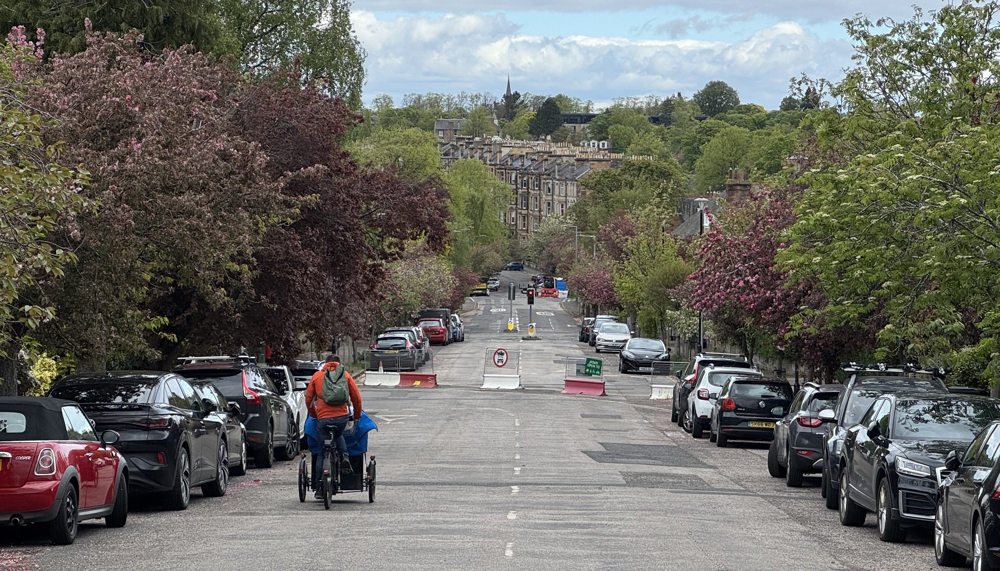

The City of Edinburgh Council's **Transport and Environment Committee** ('TEC') meets this Thursday, 18th June 2026; we've had a potter around the paperwork and rounded up the matters adjacent to cycling and safer streets in the city this committee cycle.

> 🌐 [Meeting Page & Agenda](https://democracy.edinburgh.gov.uk/ieListDocuments.aspx?CId=136&MId=7661&Ver=4){target="_blank" rel="noopen noreferrer"}   PDFs:  📑 [Full Agenda Reports Pack](https://democracy.edinburgh.gov.uk/documents/g7661/Public%20reports%20pack%2018th-Jun-2026%2010.00%20Transport%20and%20Environment%20Committee.pdf?T=10){target="_blank" rel="noopen noreferrer"}     💼 [Business Bulletin](https://democracy.edinburgh.gov.uk/documents/s100216/Item%206.1%20-%20Business%20Bulletin%20-%2018%20June%202026.pdf){target="_blank" rel="noopen noreferrer"}     📋 [Work Programme](https://democracy.edinburgh.gov.uk/documents/s100275/Item%205.1%20-%20Work%20Programme%20-%20June%202026.pdf){target="_blank" rel="noopen noreferrer"}
---

## 💼 Business Bulletin 

📄 [Business Bulletin](https://democracy.edinburgh.gov.uk/documents/s100216/Item%206.1%20-%20Business%20Bulletin%20-%2018%20June%202026.pdf){target="_blank" rel="noopen noreferrer"} [PDF] »

The Business Bulletin is home to less significant items that don't warrant a full report, or further updates on more significant past reports. 

---

### 🚲 A modal filter for Royal Park Terrace

> "At the Transport and Environment Committee on 29 January 2026, a motion by Councillor Kinross O’Neill on Royal Park Terrace... was agreed as follows: To request that officers consider introducing a modal filter along this route to direct traffic along alternative arterial roads and to assess the effects of any proposed modal filter on neighbouring streets, reporting back to committee via the business bulletin within two cycles."

Residents from Royal Park Terrace gave deputation to this motion [back in January](https://edi.bike/articles/2026-01-31-january-transport-committee-roundup#9-2-motion-by-councillor-kinross-o-neill-royal-park-terrace-and-radical-road){target="_blank" rel="noopen noreferrer"} - asking for a modal filter for their street, which suffers from rat-running through traffic attempting to bypass the busy London Road, and increasing the volume of cars passing the school and care home on this narrow residential road. So what are Officers suggesting now, two cycles (16 weeks) later?

> "...introducing a modal filter would be a new project within the City Mobility Plan Capital Investment Programme (CMP CIP) and officers intent [sic] to score this potential project against other existing projects in the CMP CIP. Work on the annual progress update of the CMP CIP is already underway and will be reported to Transport and Environment Committee in September 2026. Through this review process, this potential project will be considered and scored for Councillors to consider." 

So what we're saying is, for a rat-run killing modal filter installation on a single residential street, we need to add it to a [ten-year plan for major projects across the city](https://democracy.edinburgh.gov.uk/documents/s83902/7.5%20-%20CMP%20capital%20investment%20plan.pdf ){target="_blank" rel="noopen noreferrer"} and carefully score it amidst major scheme priorities?

> "Officers note that should the project be taken forward under CMP CIP and subject to obtaining funding, more detailed traffic analysis would be required to better understand the potential impact of a modal filter on the functioning of the wider traffic network, in particular on buses."

So to be clear, after residents bring a road safety issue to committee in January, it's going to end up waiting til September for even a framework for decision, then months of monitoring and network effect analysis and surely end up being over a year of hand-wringing (and however much of Officers' time in the process) to deal with a single street?

CEC has run scared from a vociferous local campaign against filtering measures in Corstorphine, and faced down mulifaceted failures in handling the liveable neighbourhood in the Braid Estate; now their caution has a project as straightforward as placing and monitoring a pair of wooden planters on a single narrow residential street becoming a four-part planning, budgeting and analysis exercise lasting over a year - because woe betide any rapid enactment of the organisation's own policies, lest it inconvenience someone's favourite vehicular shortcut. Bananas.

---

### 📈 Voi hire scheme stats in the Business Bulletin

Really interesting stats, shared with Councillors and stakeholders at the recent Voi / CEC 'teething issues' workshop and now public by way of the Business Bulletin:

> **Edinburgh VOI E-Bike Scheme: Progress, Operational Challenges, and Mitigation Strategies**
>
> **Introduction** 
>
> Since its deployment in September 2025, the Edinburgh VOI e-bike trial has demonstrated significant demand and operational success, positioning the scheme as a core element of the city's sustainable transport network. This report provides an overview of preliminary performance metrics, operational issues encountered, and the mitigation measures being implemented. 
>
> **Scheme Performance and Demand Metrics** 
> * Total ridership: Over 546,000 trips by approximately 53,500 users. 
> * Total distance covered: Over 1.3 million km (over 34 laps of the Earth). 
> * Trip frequency: Peak weekly trips reaching nearly 36,000, with daily averages exceeding 5,000 trips. 
> * Expansion: Initial deployment of 50 bikes across 39 parking zones expanded within three months to 600 bikes and 158 parking locations over 23 km². 
> * Now up to 800 bikes, with 200 parking locations over 29km². 
>
> **Operational Challenges** 
> * **Parking Compliance:** Bikes are designed to be parked within ‘geofenced’ zones, which rely on GPS accuracy. Inconsistent GPS precision causes bikes to be parked outside designated zones, often in cycle racks or obstructing footways. 
> * **Streetscape Impact:** Improper parking in cycle racks reduces their availability for private bikes and can obstruct pedestrian movement. 
> * **Signage and Guidance Deficiencies:** The VOI app currently does not provide explicit guidance on appropriate parking locations, nor are there enforcement mechanisms in place for improper parking. 
>
> **Mitigation Measures**
> * **Physical Infrastructure:** Implementation of on-street delineation of parking bays via painted markings and signage to clearly define acceptable parking areas, reducing improper parking outside designated zones. 
> * **App Integration:** Ongoing negotiations with VOI to enhance app functionality, including real-time guidance, visual cues for designated bays, and feedback mechanisms to discourage illegal parking. 
> * **Enforcement and Compliance:** Development of policies and potential enforcement protocols, including community reporting and targeted reviews, to address persistent improper parking. 
> * **Stakeholder Engagement:** Continued dialogue with VOI and the community to refine operational procedures and infrastructure solutions. 
>
> **Next Steps** 
> * Complete installation of street markings and signage for designated bays, 20 completed to date. 
> * Finalise app updates to incorporate clearer guidance and feedback systems. 
> * Establish enforcement protocols aligned with operational data and community feedback. 
> * Monitor the effectiveness of mitigation measures and adapt strategies accordingly.

Impressive stats, and also good to see these being made public - a very successful scheme, and a very engaged and approachable team handling the integration with it at council level. 

National Records of Scotland put Edinburgh's population at 506,520 in 2020; so the napkin-maths on this is that **around one in ten residents have used a Voi bike since September**, which is very decent going - with usage stats for the scheme being [hailed as one of the most successful in Europe](https://theedinburghreporter.co.uk/2026/06/bike-hire-scheme-is-most-successful-in-europe/){target="_blank" rel="noopen noreferrer"}. No wonder its rollout has earned the team involved [a commendation at the Scottish Transport Awards](https://bsky.app/profile/stephenjenkinson.bsky.social/post/3mo34yitci22i){target="_blank" rel="noopen noreferrer"}.

---

## 🗳️ Items for Decision

### 💰 7.2 'People and Place 2026-27 Grant Award' for Thistle Cycles 

📄 [Report](https://democracy.edinburgh.gov.uk/documents/s100218/Item%207.2%20-%20People%20and%20Place%202026-27%20Grant%20Award.pdf){target="_blank" rel="noopen noreferrer"} [PDF] »

This is the committee approval of a grant to provide:

> "Adaptive cycles - hire/loan support to access adapted bikes/mobility aids, targeted training/promotion of mobility aid friendly routes via disability advocacy networks and buddy events to improve confidence in travelling actively for people with long-term health conditions."

The opportunity is funded through the [SESTran](https://sestran.gov.uk/) 'People and Place' funding, which is _"offered to local authorities, charities and community groups across the South East of Scotland region for projects that will deliver active and sustainable travel behaviour change"._ 

There were two applications to deliver the project, with the award being decided in favour of [Thistle Foundation](https://www.thistle.org.uk/thistle-outdoors){target="_blank" rel="noopen noreferrer"} and their outdoors programme - but any grant over £25k per year needs to be approved at committee as per the council's standing orders.

---

### 🌳 7.3 'Greenbank to Meadows Quiet Connection - Update'

📄 [Report](https://democracy.edinburgh.gov.uk/documents/s100296/Item%207.3%20-%20Greenbank%20to%20Meadows%20Quiet%20Connection%20-%20Update.pdf){target="_blank" rel="noopen noreferrer"} [PDF] »

The [last time this came around](/articles/2026-04-03-april-transport-committee-roundup) was TEC in April, and it was decided that the Traffic Regulation Orders sub-committee would be passed the scheme more or less 'as is' to look to draw a line under the whole sorry ordeal and take something of a final vote.

So the six modal filters that make up the '**Greenbank to Meadows Quiet Route**' traffic filtering measures were sent along to 'TRO Sub' for final, quasi-judicial approval — or so councillors thought.

Shortly after the TEC meeting, [paperwork issues were uncovered](/articles/2026-05-04-quiet-route-paperwork-problems) with two of the filters - at **Cluny Drive**'s junctions with both **Hermitage Gardens** and **Braid Avenue**, unfortunately among the more contentious measures along the route - and shortly after that article, a third wording issue with the legal advertisement of the modal filter on **Canaan Lane** was discovered too.

So when the TRO Sub met, instead of being able to carry out their assigned duties and consider whether or not to set aside objections to the measures and make them permanent, councillors were stymied by procedure and only able to [make three of the six filters permanent](https://edi.bike/articles/2026-05-17-quiet-route-update-following-tro-sub/).

TEC was always to receive a 'Business Bulletin' update on the outcome of the decision at TRO Sub, but this was upgraded following the discovery of the legal wording issues to a full Officers report. And having now had sight of this ahead of Thursday's meeting, there's some positives and some pretty doleful negatives.

---

#### 🚲 Retaining and increasing filters

The report proposes, given the proximity to local schools, to not only advertise a permanent Traffic Regulation Order ('TRO') for the modal filter on **Canaan Lane** between **Newbattle Terrace** and the western entrance of the **Astley Ainslie** hospital grounds, but also to implement a 'TTRO' or Temporary Traffic order to retain it while this paperwork is drawn up, preserving the status quo on the ground. The primary school at Canaan Lane - along with the adjacent Royal Blind school and St. Peter's behind - already experiences issues with motorist behaviour and volume at drop-off and pick-up times, so it's no surprise that these schools and others on the route have penned a strong message to councillors in recent weeks and secured the future of this filter, protecting it from reinstating further traffic ingress headed south from Newbattle Terrace.

Along with **Canaan Lane**, the report recommends the advertisement of a new filter at **Clinton Road**, requested by residents of this street to mitigate for east/west traffic along their road as a result of other filters in the area. While further mitigations for through-traffic on the route are largely welcome, there are some concerns among cycle campaigners such as **Spokes South Edinburgh** that this may displace further journeys onto **Newbattle Terrace**, making the near-blind exit from the top of **Canaan Lane** onto it more dangerous. 

Counting both Canaan Lane and Clinton Road in the grand scheme, this puts us at **five out of seven filters on the route made permanent** if the report passes committee. 

---

#### 🙈 Capitulations and missing mitigations

So what of the other two filters?

The other two measures with issues in their legal paperwork, at **Cluny Drive / Braid Avenue** and **Cluny Drive / Hermitage Gardens**, are slated for removal.

There is an extraordinary lack of quantitative data on support for measures among residents of the Braid Estate given how long this has dragged on, where in many other projects CEC have instigated outsider market research to ensure that a demographically representative check of attitudes is undertaken - and what we know from similar efforts is that generally speaking measures that make streets quieter and safer carry a 'silent' majority support that opponents and supporters alike entirely miss hearing from when projects become contentious enough to cause local division, becoming somewhat taboo as a subject of neighbourly chat. 

If you rely only on consultation responses and the volume of email you're getting from angered residents, you're only hearing from the extremes at each end of the support gamut. That's not the same as fifty-fifty support and opposition.

Back to the report, where **there is not a single affordance suggested to tackle the previous issues of traffic volume and speeding on Braid Avenue that will be reinstated with its reopening**.

There are fair and balanced inputs from residents against the current filter configuration, particularly from residents of Midmar Gardens whose street is used as a north/south rat run at present to circumvent the filter at Braid Avenue and reach the signalised junction at Cluny Gardens - in many cases passing straight over and heading up to pass Canaan Lane primary as a back route to Morningside, adding to the school's traffic woes.

'Leaks' like this, or the Braid Rd filter workaround via Hermitage Gardens and Braid Crescent, could have been dealt with years ago through monitoring and intervention. Within the history of the project there have been measures to tackle these directly suggested by officers; the 'fallback option 1' filter configuration in the censure-tainted 'Option 3' consultation-as-referendum ETRO (TRO/25/17) that was never implemented, included amongst other measures rotating the Braid Ave filter to sever the north-south workaround and added another filter on Braid Rd.

But with such prior art in the form of plans to solve problems in the area, **why does this report now recommend unceremoniously ripping out two traffic-calming, speed-reducing measures rather than making corrections on the ground** to deal with second-order issues? And if it truly is necessary to rip out these measures, **why is nothing proposed to slow or manage vehicles** on Braid Ave, one of Edinburgh's widest roads? 

**Why is a Temporary Order only appropriate for a non-controversial filter** at Canaan Lane, but conveniently not appropriate for one that challenges driver convenience? 

If you had a leak in your kitchen, you'd have your plumbing sorted out and fix the damage. Yet here comes the Council to help, and for some reason they've brought a flamethrower and a wrecking ball instead of a spanner. 

We can only hope that within the as-yet-unpublished amendments and addenda from other political groups on the council there will be a **call for some common sense**.

---

## 🔎 Items for Scrutiny

---

'Items for Scrutiny' are reports that are expected to pass without requiring debate, so may not be discussed at TEC unless Councillors have questions on them and ask for them to be discussed at the start of proceedings.

---

### 🚋 8.1 Trams consultation and market research report

📄 [Report](https://democracy.edinburgh.gov.uk/documents/s100192/Item%208.1%20-%20Trams%20from%20Granton%20to%20the%20BioQuarter-Royal%20Infirmary%20of%20Edinburgh%20and%20Beyond%20Consultation.pdf){target="_blank" rel="noopen noreferrer"} [PDF] »
🌐 [Supporting documents (list of 16)](https://democracy.edinburgh.gov.uk/mgAi.aspx?ID=86871#mgDocuments){target="_blank" rel="noopen noreferrer"} [Webpage, PDF Links] »

**Oh good, this again! _Ding ding_**

The report on the consultation for a new north-south tramline for the city has concluded, and provided this summary ahead of a 'next steps' report due to TEC in September.

Depending on where you read about this, the consultation either proves completely and conclusively that the tram can never ever be built on the Roseburn Path, or anywhere at all, or maybe just the south leg if you're good; or that there is overwhelming support for trams everywhere and anywhere and everyone else is wrong and didn't you know this was a railway bed once? And don't forget the universal and arbitrary inclusion of an uncited percentage figure that it's impossible to track down within the data presented.

Of course, nearly every campaign and outlet that has covered the news also manages to omit that this is a public opinion piece, and is only one contribution to the decision-making process. A decent summary is [this one by the Edinburgh Reporter](https://theedinburghreporter.co.uk/2026/06/tram-consultation-results-fairly-inconclusive/).

Still some way to go for campaigners on either 'side' of the north-south mass transit and active travel conundrum. More from us if this report is discussed at committee, and otherwise later in September.

---

## ✍🏽 Motions and Amendments

---

There are, of course, [published Motions](https://democracy.edinburgh.gov.uk/ieListDocuments.aspx?CId=136&MId=7661&Ver=4){target="_blank" rel="noopen noreferrer"} at this stage - but none of these are directly cycle-relevant, and amendments to other items have not yet been published.

---

The Transport & Enviroment Committee will meet this **Thursday, 18th June 2026**, and we'll have a round-up in our subsequent issues.