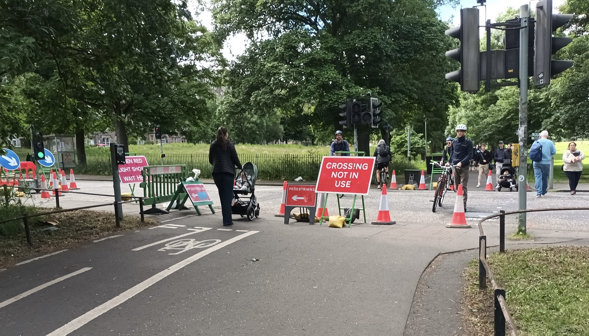
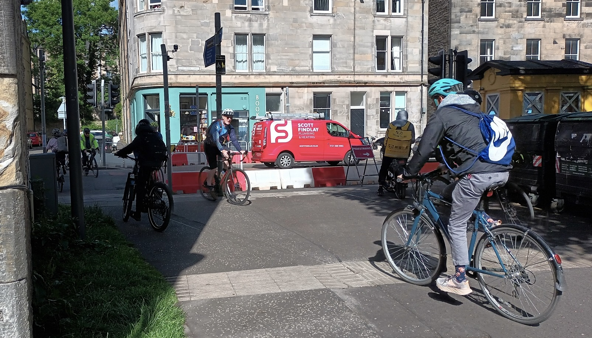

### Following the closures of multiple 'toucan' cycle / pedestrian crossings around busy paths at the Meadows, specifically because of issues with motor vehicles running red lights at speed and endangering those using the crossings, Spokes and Living Streets Edinburgh have written to the City of Edinburgh Council's Citywide road coordination manager highlighting the dangers of these short-sighted closures.

<figure>
  
  <figcaption>Human beings continue to fulfil human transport needs, in spite of naïve car-centric crossing closures | Image: Spokes Planning Group</figcaption>
</figure>

> Dear [CEC Citywide road coordination manager],
> 
> I'm writing on behalf of Spokes, The Lothian Cycle Campaign, and Living Streets Edinburgh Group to unfortunately raise a complaint regarding the coordination of roadworks near crossings of the busy walking and cycling Meadows Path at Hope Park Crescent and Marchmont Road. 
> 
> We are extremely concerned by a pattern of crossing closures near, but not within, roadworks temporary signals and that action has not been taken to prioritise walking and cycling when raised.
> 
> I'm sure you're aware of the need to keep our cities vital off-road walking and cycling paths open for vulnerable users and to maintain a shift towards more sustainable travel.
> 
> In both cases, pedestrians and cyclists have been advised to use temporary crossings located within the nearby roadworks.
> 
> These temporary crossings are unsuitable as:
> 
> - The temporary signals are located away from the desire line, within the nearby roadworks, and take many minutes to activate.
> - The footways leading to them are far narrower than the wide off-road paths, and further obstructed by temporary signage and barriers.
> - There is no cycle access, requiring a dismount that few will accept and para-cyclists may struggle with or be unable to make.
> 
> Whilst well-intentioned, significant safety issues result from large amounts of pedestrians and cyclists crossing uncontrolled between barriers and queuing motor vehicles.
> 
> We believe these safety risks are avoidable, whilst prioritising walking and cycling:
> 
> 1. A one-way restriction could allow the removal of temporary signals and the crossing to be kept open.
> 2. "Crossing still in use" signage could be provided to advise drivers of the potential need to stop.
> 3. The roadworks could be extended to encompass the crossing, allowing a temporary crossing on the desire line.
> 
> Such arrangements have previously been adopted in other roadworks within the city.
>  
> Roadworks undertakers have a duty to provide safety measures for all persons passing the works (NRSWA 1991 Section 124).
> The council, as roads authority, have a duty to co-ordinate works in the interests of safety (NRSWA 1991 Section 118).
> It is our experience that change on the ground only results from the council's intervention as roads authority, and is a critical role.
> 
> Walking and cycling should be prioritised at works even it it causes delays to other traffic, as [stated by the Scottish Roadworks Commissioner](https://www.spokes.org.uk/wp-content/uploads/2024/01/2310-Kevin-Hamilton-Scottish-Road-Works-Commissioner.pdf){target="_blank" rel="noopen noreferrer"}.
> 
> The Red Book states:
_"You must ensure suitable provisions are made for the safety of cyclists passing or crossing the works. Particular care is needed where cycle lanes or cycle tracks are affected by street works or road works because these routes may be especially popular with cyclists. You should consider whether access on the carriageway can be preserved for cyclists, even if it needs to be closed to motor vehicles."_
> 
> The [council's fact sheet](https://www.spokes.org.uk/wp-content/uploads/2021/10/1905-Council-factsheet-based-on-current-law-Access-for-People-on-Bikes-Guidance.pdf){target="_blank" rel="noopen noreferrer"} also states (repeated from TSM chpt8):
> _"D3.32.18 When cycle routes, and other facilities for the exclusive use of cyclists and pedestrians, are affected by the road works the changes should be clearly signed well in advance of the road works._ 
> _D3.32.19 Where there is cycle provision, such as cycle lanes or tracks, efforts should be made to keep these open or to provide an acceptable alternative during the road works."_
> 
> Kind regards,
> 
> Spokes Planning Group and Living Streets Edinburgh Group

  

<figure>
  
  <figcaption>Image: Spokes Planning Group</figcaption>
</figure>

*This article was originally a complaint email sent by Spokes Planning Group and Living Streets Edinburgh Group on the evening of 2026-06-14*