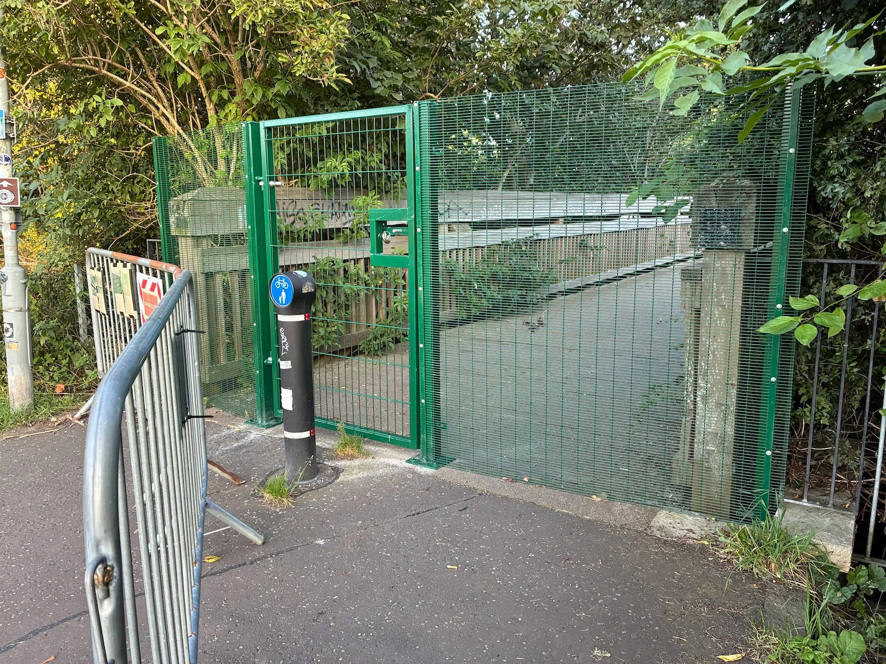
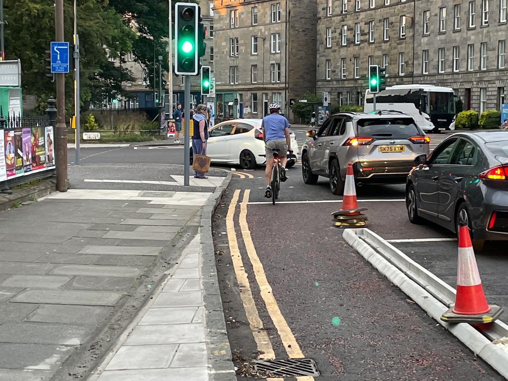
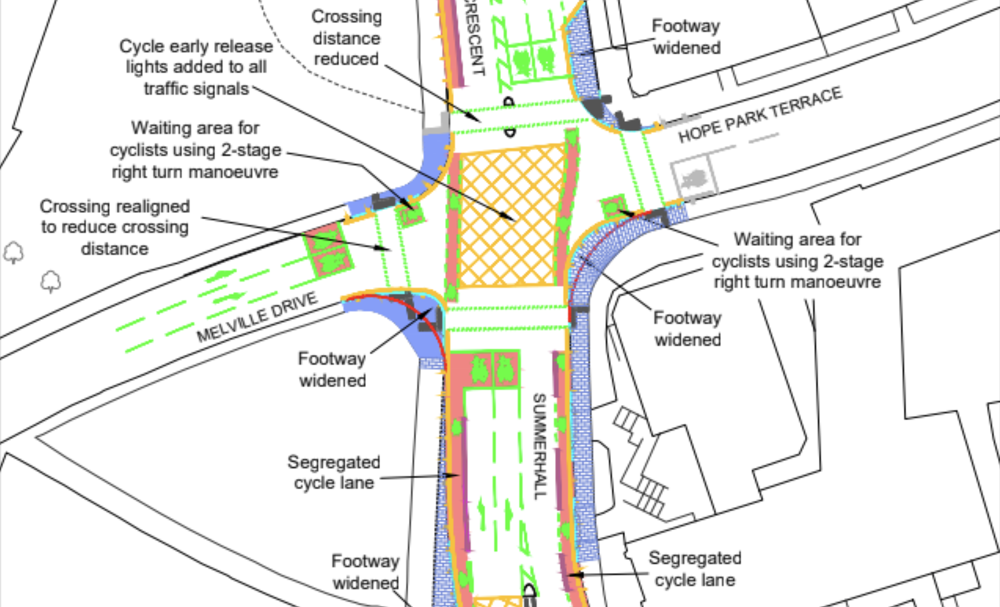
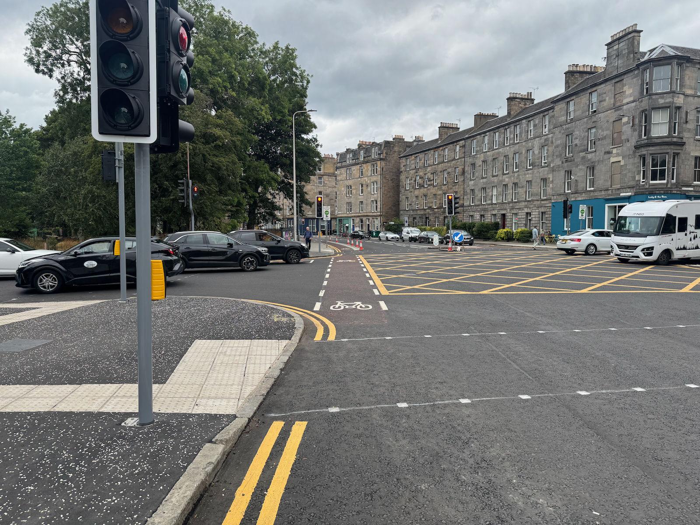

As well as our bi-monthly coverage of the City of Edinburgh Council's **Transport & Environment Committee**, we also keep an eye on items at 'full council' meetings; on Thursday 27th August, the council convened at the City Chambers and included in their agenda were a number of cycling-adjacent items that we've covered below.

> 📆 [Meeting Page](https://democracy.edinburgh.gov.uk/ieListDocuments.aspx?CId=150&MId=7608&Ver=4){target="_blank" rel="noopen noreferrer"}   📺 [Webcast](https://edinburgh.public-i.tv/core/portal/webcast_interactive/1118574/start_time/158000){target="_blank" rel="noopen noreferrer"}    📑 [Motions & Amendments](https://democracy.edinburgh.gov.uk/documents/b28471/Motions%20and%20Amendments%2027th-Aug-2026%2010.00%20City%20of%20Edinburgh%20Council.pdf?T=9){target="_blank" rel="noopen noreferrer"} [PDF]    🙋🏽 [Questions & Answers](https://democracy.edinburgh.gov.uk/documents/b28470/Questions%20and%20Answers%2027th-Aug-2026%2010.00%20City%20of%20Edinburgh%20Council.pdf?T=9){target="_blank" rel="noopen noreferrer"} [PDF]  

---

There's perhaps no better summary of the current state of transport management in Edinburgh than this exchange with the Council leader and Green group Cllr Chas Booth near the start of proceedings:

> Cllr Booth: _"Last week the Council finally introduced a limited trial of extended bus lane hours, covering half the previously agreed route and nearly seven years after it was agreed at Transport Committee._
> 
> _"Meanwhile, we're still waiting for the implementation of the heavy vehicle levy that Transport Committee asked for three years ago. Living Streets have criticised the summertime streets measures in the Cowgate as dangerous and inadequate._
>
> _"And earlier this month, the Council ripped out the modal filters in the Braids Estate, which will expose kids and other vulnerable road users to more road danger. So can the Council leader please explain why, when it comes to supporting public transport and improving road safety, this Council seems to be asleep at the wheel?"_

And the response to what seem like valid criticisms raised — all of these things have indeed happened — on the Council's recent record?

> Cllr Meagher: _"Amusing, but I certainly don't recognise the way that you're characterising this administration. Quite the opposite, so I completely reject the premise of your question."_

😬

---

## 📑 Motions & Amendments

---

### 🔥 The Princes Street fire and aftermath - multiple motions

Following a huge fire at the former Debenhams store, 109-112 Princes St in early July, the city centre has been fairly chaotic, to put it mildly. The building's shell needed significant works to stabilise [its historic structure and facades](https://threadinburgh.scot/2026/07/23/up-in-smoke-the-thread-about-princes-streets-fiery-history/){target="_blank" rel="noopen noreferrer"}, so teetering as a result of the fire that there was seen to be too much risk to continue running traffic, including trams, past the site lest the vibrations caused a collapse; so the street was severed just east of South Charlotte Street until it reopened on Saturday 29th August.

> The matter was discussed 📺 [on the meeting webcast](https://edinburgh.public-i.tv/core/portal/webcast_interactive/1118574/start_time/9512000?force_language_code=en_GB){target="_blank" rel="noopen noreferrer"} from 2h 38m 32s in, until 3h 29m 45s.

All parties brought forward motions and addenda on the matter — heard together on the day, and subsequently drafted as a [composite motion](https://democracy.edinburgh.gov.uk/documents/b28471/Motions%20and%20Amendments%2027th-Aug-2026%2010.00%20City%20of%20Edinburgh%20Council.pdf?T=9#page=16){target="_blank" rel="noopen noreferrer"} [PDF, page 16] — with common central themes and asks:

 📄 **8.1 by Councillor Meagher** (Labour, administration) - _Strengthening Edinburgh’s Transport and City Resilience Following the Princes Street Fires_ - [PDF](https://democracy.edinburgh.gov.uk/documents/s102133/Item%208.1%20-%20By%20Councillor%20Meagher%20-%20Strengthening%20Edinburghs%20Transport%20and%20City%20Resilience%20Following.pdf){target="_blank" rel="noopen noreferrer"}

Instructs officers to _"prepare a report for the Transport and Environment Committee, at an appropriate stage which... reviews the impact of the Princes Street fire on Edinburgh’s transport network, including the operation of buses, trams, active travel routes and the wider road network"_ - and goes into detail about each category of resilience, continuity and planning the Council could and should consider to try and deal with future disruption more readily.

> We'd expect _"at an appropriate stage"_ is to avoid putting a strict deadline on what sounds like a far-reaching and high-effort report... so it might be a while before this surfaces.

📄 Motion **8.5 by Councillor Lang** (Liberal Democrats) - _Closure of Princes Street_ - [PDF](https://democracy.edinburgh.gov.uk/documents/s102137/Item%208.5%20-%20By%20Councillor%20Lang%20-%20Closure%20of%20Princes%20Street.pdf){target="_blank" rel="noopen noreferrer"}

Largely in agreement with the Labour group, the Lib Dem motion _"Believes these events have shown a critical and unacceptable vulnerability and exposure for the city which must be addressed to minimise the chances of such disruption arising again in the future... Therefore requests that, once the priority work to reopen Princes Street is complete, officers initiate a comprehensive review of the business continuity plans and civil contingency arrangements for Princes Street and its surrounding areas."_

It recognises the report to be a significant piece of work, and _"requests that officers provide the November 2026 meeting of the Policy & Sustainability Committee with a timeline for how this work can be undertaken"_ -  including when it might be delivered, and whether any additional budget is required.

📄 **8.15 by Councillor Mumford** (Green group) - _Princes Street Fire_ - [PDF](https://democracy.edinburgh.gov.uk/documents/s102201/Item%208.15%20-%20By%20Councillor%20Mumford%20-%20Princes%20Street%20Fire.pdf){target="_blank" rel="noopen noreferrer"}

The Greens called for various mitigations while Princes St is closed - as in the run up to the meeting, there was no guaranteed reopening announced - including for Officers to _"consider the feasibility of restricting private cars from the blocks bounded by Princes Street, Frederick Street, Queen Street and Charlotte Square except where access is required for the remaining duration of the road closure, in order to ease congestion and the impact on the public transport network"_; to also seek an increase in Voi hire bike numbers, consider compulsory purchase of the site, circulate the council's response to the Edinburgh Bus Users Group's open letters on the subject, as well as passing along a list of the signal changes made to ease traffic in the area; and also called for a similar "lessons learned" report that others were pursuing.

#### 📑 Composite motion and debate

The [composite motion](https://democracy.edinburgh.gov.uk/documents/b28471/Motions%20and%20Amendments%2027th-Aug-2026%2010.00%20City%20of%20Edinburgh%20Council.pdf?T=9#page=16){target="_blank" rel="noopen noreferrer"} [PDF, page 16] formed by the three parties was then discussed with contributions from all groups — worth a watch on the webcast, the administration's take from 2h 38m, and other groups from 2h 47m — with some notable quotes below amidst the commendations for the fire service, contractors and council officers that worked hard to get the street open again.

For the Lib Dems, Cllr Kevin Lang said:

> _"It's possible to have the utmost admiration respect and gratitude for all of those who not only attended the scene on the morning of the incident, but have also worked incredibly hard since to try and get the whole area reopened. It's possible to believe all of that, whilst at the same time believing that it is simply unacceptable for a single fire in a single building on a single road in one part of the city to have caused such huge disruption for over 50 days. That is not a criticism of those who have responded to this incident. It is a reflection of the fact that none of us should be satisfied that this can happen in our city and it's why we've got three motions here today that talk about learning lessons."_ 

Cllr Chas Booth for the Green group said:

> _"I heard from a constituent recently whose usual commute of 45 minutes each way on the bus increased to 150 minutes each way in the immediate aftermath of the fire, and we will all have seen concern from businesses in Leith and across the city that what should have been a really busy month has actually seen a reduced turnover. So we need to look at what more can be done to try to prevent such a devastating fire happening in the future and ensure that if it does happen, that the impact on the city is not quite so crippling. I'm glad that the composite addresses the points raised by Edinburgh Bus Users Group this morning about the resilience of the public transport network. The point has been well made that if reliability of our buses or trams takes a hit, people who experience that unreliability are less likely to use public transport in the future._
>
> _"There has been some interest in the element of our motion that asks officers to consider mechanisms to restrict private cars in the area affected. This is not a particularly radical or bold idea. It's in line with previous council strategies around City Centre Transformation and reflects the priorities of the City Mobility Plan. So in conclusion, Lord Provost, I want to come back to the theme that two things can both be true at once. As Greens, we can be critical of some aspects of the Council response and we can also come together with other parties to agree a unanimous way forward."_

In danger of just turning this 'round-up' into a full transcript of the proceedings, there was a significant and robust call for leadership from SNP Cllr Lesley Macinnes in moving an [SNP addendum](https://democracy.edinburgh.gov.uk/documents/b28471/Motions%20and%20Amendments%2027th-Aug-2026%2010.00%20City%20of%20Edinburgh%20Council.pdf?T=9#page=20){target="_blank" rel="noopen noreferrer"} [PDF, page 20] that plainly lays out some of the many failings of recent months:

> _"The whole lessons learned approach is absolutely necessary... and we need to understand how we can better build resilience inside this city on all of the points that have been mentioned in that._
>
> _"But you don't get to a useful point in that process unless you start with honesty and clarity about what has actually happened here. Now I agree with some of the other contributors that two things can be the same. We've heard from officers, we've understood very clearly the technical challenges at the site, the technical challenges around trying to get the trams reconnected, for example, and we've also heard from communities who have been directly impacted, whether it's people's bus journeys, whether it's business sales being down in parts of North Edinburgh, and all of the additional pieces of concern that have been bubbling up ever since this tragic incident took place. I asked the question this morning whether or not the Council leader would choose to apologise to the city. And I actually think that's a leadership role, but she took it personally._
>
> _"And it wasn't meant personally. What it was meant to do was to highlight the leadership that we're supposed to perform as politicians in this city about how we lead the city forward and how we facilitate change and response to emergency situations. So she didn't accept my characterization of the situation around information flow, understanding, scotching of myths around what could and couldn't be done around this particular incident to get us back to any state of normality. But I wonder if she will instead accept the characterisation that came from Argonaut Books in Leith Walk. They have accused the Council of being asleep at the wheel, while that particular business has watched a 35% drop in sales, a situation I suspect mirrored across many other businesses._
>
> _"They have said that they have felt woefully under supported and under-informed by the council. Now, I think that illustrates the bit of leadership that has been missing. I commend the officers for the work that they have done to try to not only deal with the site and the technical aspects of that, and I heard the comments from others and I absolutely agree with those. The attempts to get the economic impact lessons through some of the actions that have been taking place are helpful and they reflect what we did during the tram extension. And I think that's of benefit._
>
> _"But the simple fact of the matter is that a lot of that information would not have gone to business organisations or to community organisations or to heritage and so on, if we hadn't had the briefing that I had to call for in the press and then had to call for through a specific meeting with the council leader after recess to push to get that underway. And we heard positive responses from that. And the reason for that was that it took away and got rid of all the nonsense that had been spoken around some of this issue and got us right to the heart of it to talk about that technical challenge, to talk about how we take the steps forward._ 
>
> _"Now, I'm sorry, in terms of the Transport Convener bypassing his Facebook post about just knocking it down - that Facebook post ended up on the front pages of the Edinburgh Evening News. It went a lot further than a silly mistake. That's what I'm talking about in terms of leadership. We have to say to the city, here's a position, here's what we're trying to do about it, we will keep you informed... So, really, I want us to see a bit of humility in this approach to the next steps._
>
> _"I want us to see that the Council will recognise the fact that we could have done better and that the political leadership had a key role to play in that. That's why I'm so concerned that we brought forward this addendum, not because I'm trying to cut across the composite \[motion\]. The composite is perfectly valid. It has good, positive things to say, but it has to start from a point of honesty. I want to make one very minor verbal change to this, which is possibly redundant given the news that the Council leader was able to deliver to us — but none of the other Council leaders was briefed on about the possible reopening on Saturday."_

Seconding the [SNP Addendum](https://democracy.edinburgh.gov.uk/documents/b28471/Motions%20and%20Amendments%2027th-Aug-2026%2010.00%20City%20of%20Edinburgh%20Council.pdf?T=9#page=20) [PDF, page 20], Cllr Adam Nols-McVey added:

> _"I too want to thank the Fire and Rescue Service those who work to make the site safe, but there has been a total lack of an emergency mentality from the council's political leadership. Wofl under supported and under informed is the least of it from businesses and residents I've been receiving from people in Leith who were dramatically impacted by this. And I will say something that I don't get the chance to say very often, Lord provost so I will say it with pride. I associate myself very much with the comments of Councillor Lang, and how he set out his position and indeed my Green colleagues — although that's far more frequent._
>
> _"Where were the dramatic actions required to keep the city moving effectively during this level of disruption? We've talked about minor changes to lights and signals. That is the minimum of what you would have expected on day one of this crisis, where were the dramatic traffic regulation changes for the city centre to keep public transport moving and minimise the significant delays that people in Leith and the west of the city in particular were experiencing? Where was the cast iron engagement with Lothian busses to support additional capacity which was stripped out from the non-running of tram, including the council putting money on the table to try and support their efforts on that front? Lothian busses deserve credit for managing the situation as best they can, but the political leadership in finding innovative ways of improving that capacity and keeping the city going were null and void._
>
> _"They were nowhere. And as Councillor Macinnes said, even in the political engagement sphere it took Councillor Macinnes' call for the administration even to bother engaging with other parties and with other people to try and make sure that there was a consistent information flow and that there was some input in the process going forward. We have heard from the \[Edinburgh\] Bus Users Group that five million journeys have been disrupted. I think that's a conservative estimate. We've heard in previous questioning that the impact on people with buggies and parents and people who use wheelchairs and other mobility issues has been incredibly significant during this time._
>
> _"And what have we seen from the administration? An almost laughing-off approach. They should take this seriously, they should have taken it far more seriously until now. And the chaotic communications of a Transport Convener claiming he had a 'Trumpian moment', he's been having a 'Trumpian moment' for the last four and a bit years in this chamber, to try and laugh off the chaos of expectation-raising that those comments of someone who is supposed to be responsible for these services, responsible for keeping the city moving, is depressing... People and businesses of Leith in particular deserve an apology from this Council leader and an apology from this administration. I expect it in your summing up."_

The debate continued with some fairly bitter Labour and SNP back-and-forth; as far as this commentator is concerned, I'd perhaps summarise that while the Labour councillors are clearly committed and professional people making personal sacrifices in a role serving in public office, it's clear to see that there was a lack of strong and decisive leadership in the face of the severing of a key transport corridor and dealing with the second order effects of it - and they were very much called to account during this meeting. Vying for power as they will be in the coming year, with tussles at upcoming byelections and local elections beyond — to say nothing of the national finger-pointing that goes on — Labour and the SNP during this debate both laid blame at the door of the other for lacking leadership and communication, and for politicising a crisis, respectively.

Between Princes Street and the myriad of other problems across the city this summer _(buildouts into the cycleways at George IV Bridge and Gilmerton Rd creating dangerous pinch points, left-hook risk from works at Summerhall, the failure to reopen Tarvit St to cycle traffic without allowing motor traffic to take it over again, filter removals on the Greenbank to Meadows quiet route, the ongoing saga of St Mark's Park bridge)_ one can't help but think strong words from the other political groups at the current Council administration are somewhat deserved. Councillors work hard, Officers too - and yet in crisis the city grinds to a halt and all manner of issues appear. There is simply too much reticence in the current adminstration to grab the transport bull by its horns and take the steps needed in such moments — not only in this situation — to keep people and particularly public transport moving above all else, and the compromise of continuing to allow private motor traffic and doing all re-routing (at least initially) down George Street proved to constrain and choke up the centre of the city during some of its busiest months - and local businesses and everyday travellers bore the brunt.

> Put simply, we need the Council to show the poltical will to take robust, evidence-backed approaches to wrangling transport movements in the city _especially when they're opposed_ - not just to say it in the press and have reports prepared on it, but to **deliver**. It's no surprise to anyone keeping even half an eye on Edinburgh's ability to deliver accessible and reprioritised modern transport infrastucture that we fall apart in a crisis; we're not really managing the table stakes, never mind when the pressure is raised.

After a tense exchange regarding the SNP's comments and tabled addendum, the administration moved the composite motion accepting a [Conservative addendum](https://democracy.edinburgh.gov.uk/documents/b28471/Motions%20and%20Amendments%2027th-Aug-2026%2010.00%20City%20of%20Edinburgh%20Council.pdf?T=9#page=22){target="_blank" rel="noopen noreferrer"} [PDF, page 22] — primarily concerned with establishing why planned secondary stabling for Trams at Newhaven was never delivered — and points six through nine of the [SNP addendum](https://democracy.edinburgh.gov.uk/documents/b28471/Motions%20and%20Amendments%2027th-Aug-2026%2010.00%20City%20of%20Edinburgh%20Council.pdf?T=9#page=20){target="_blank" rel="noopen noreferrer"} [PDF, page 20]; which then passed 45 votes to 14.

**So we will see an extensive report on Princes Street, on crisis management, on how our transport network can become more resilient; as though the answers to this don't already lie in already agreed but undelivered City Centre Transformation plans, the City Mobility Plan, and the myriad other ambitious strategies that have yet to tangibly show up on the streets of the capital and prioritise travel modes with resilience built in.**

---

### 🚫 Motion 8.9 by Councillor Caldwell - St Mark's Park Bridge Closure - plus two further questions

> In addition to this motion by Liberal Democract Councillor Jack Caldwell, there were two questions for the Transport Convener tabled for this council meeting - one from Caldwell, and another by Green Cllr Chas Booth. Covering all three below.

In the months that have passed since the closure of the bridge over the Water of Leith in St Mark's Park, we've seen a number of mentions from the community of the issues the closure creates - possibly best summed up by a recent comment on [City Cycling Edinburgh](http://citycyclingedinburgh.info){target="_blank" rel="noopen noreferrer"}:

> 💬 _"This isn't just some little out of the way "nice to have" footbridge, the existing alternative is much longer and not suitable for many types of people who have limited mobility or need mobility aids, and accessing that end of McDonald Road via the park is the only relatively low-traffic, relatively flat route by bike from North Edinburgh into town unless you want to go all the way around the steep hills via Roseburn or the Foot of the Walk.” — Yodhrin_

[Freedom of Information requests](https://www.whatdotheyknow.com/request/closure_of_st_marks_path_bridge){target="_blank" rel="noopen noreferrer"} by path users revealed that while the report from an engineering firm's inspection in June recommended urgently closing the bridge to the public, there have been no subsequent meetings regarding the asset - with one local user posting:  

> 
>
> _Permanent barrier on Powderhall Bridge._
>
> _Edinburgh Council have now spent more money blocking access than on last 10 years of maintainence._
>
> _No waymarked diversion_
> _No plan for repair_
> _No communication with local community_
>
> — Andrew Heald [on Bluesky](https://bsky.app/profile/andyheald.bsky.social/post/3mtvbdjlmcs2h ){target="_blank" rel="noopen noreferrer"}

Frequent users of the path see it as a vital link in their journeys with no real alternative - and are frustrated with the Council's lack of transparency and communication on the issue, as well as the failure to provide an alternative - all covered in hyperlocal news stirrer [The Spurtle](https://www.broughtonspurtle.org.uk/news/no-new-powderhall-footbridge-until-2028){target="_blank" rel="noopen noreferrer"}{target="_blank" rel="noopen noreferrer"} this week.

#### 📥 Questions for the Transport Convener

📄 [Question & Answer 10.9 by Councillor Caldwell - St Mark's Park Bridge Repair Prioritisation](https://democracy.edinburgh.gov.uk/documents/s102609/Questions%20and%20Answers%20-%20For%20Mod%20Gov%20V2.pdf#page=17){target="_blank" rel="noopen noreferrer"} [PDF, page 17]

📄 [Question & Answer 10.24 by Councillor Booth - St Mark's Park Bridge](https://democracy.edinburgh.gov.uk/documents/s102609/Questions%20and%20Answers%20-%20For%20Mod%20Gov%20V2.pdf#page=44){target="_blank" rel="noopen noreferrer"} [PDF, page 44]

The answers establish:

- No usage data on the bridge is currently recorded;
- _"Acknowledged to be an important route for active travel and for access to and from the park"_;
- _"Highly likely that a full bridge replacement will be required"_;
- _"Officers are seeking cost estimates for full replacement"_; 
- _"There is no current timetable for reopening"_;
- _"Additional funding will be required to install a new bridge"_;
- _"The suggested diversion route, using adopted roads/paths with lighting, will be Warriston Road / Logie Green Road / Broughton Road and vice versa. However, it is acknowledged that this route is not the most direct so officers are investigating how accessibility and lighting can be improved on other routes. Signage will be placed on site as soon as possible."_

And that the local community could face a wait measured in years, not months:

> _"Officers will need to establish budget and undertake procurement of a new bridge. This is likely to take several months. Once tendered, the successful contractor will need to manufacture and install the bridge, which is likely to also take several months. Public utilities are understood to cross within the deck structure, and these will need to be diverted._
>
> _"If funding is not available until the new financial year, i.e., April 2027, then realistically, a new bridge would not be installed and open until at least early 2028. Once approximate costs of a replacement structure are known, and funding has been identified, Officers will provide a written briefing to Transport and Environment members and Ward Councillors. This will outline a timetable for design, construction, and installation and intended to inform budget setting and allocation for 2027/28."_

#### 📄 Motion at Full Council

📄 [Motion 8.9 by Cllr Caldwell](https://democracy.edinburgh.gov.uk/documents/s102141/Item%208.9%20-%20By%20Councillor%20Caldwell%20-%20St%20Marks%20Park%20Bridge%20Closure.pdf){target="_blank" rel="noopen noreferrer"} [PDF]

📺 Webcast [from 4h 31m](https://edinburgh.public-i.tv/site/mg_bounce.php?mg_a_id=88474&mg_m_id=7608&language=en_GB){target="_blank" rel="noopen noreferrer"}

The motion acknowledges the closure, and also a motion from back in November when St Mark's Path and the bridge over the Water of Leith was closed for adjacent development works, until local councillors mobilised to have changes made to the developer's use of the site and got the path reopened. Cllr Caldwell _"Requests a Business Bulletin update in two cycles to the Culture and Communities Committee outlining the next steps and financial costs to reopen or rebuild the bridge."_ - which given this committee has just recently met and is on an eight week 'cycle', is really too long to wait for 'next steps'.

At Full Council, Cllr Caldwell gave examples of local residents use of the bridge, highlighting that alternative routes can feel quieter and less safe for vulnerable path users, as well as being less direct; in presenting a Green group addendum, Cllr Chas Booth said:

> _"There has been real concern as he's \[Cllr Caldwell \] set out about the closure of the bridge amongst many people who regularly use it to walk, wheel and cycle, and there are many questions raised by constituents about whether this crucial part of our active travel network is being treated with the same urgency as if it were a bridge for motorised transport._ 
>
>_"Our addendum simply seeks to maximise the chances of a swiftly reopening the bridge. I acknowledge it's currently the responsibility of parks because it's in a park but what our addendum seeks to do is to see if we can refer it on to Transport Environment Committee, to explore whether the replacement could potentially be funded through the City Mobility Plan Capital Investment Plan. Hopefully that way it can be directed to the funding stream that is most likely to see the swift reopening of the bridge."_

The motion passed - including the Green addendum — with no opposition. The addendum calls for a replacement bridge to be considered at the November 2026 Transport & Environment Committee meeting — potentially shifting the responsible department from Parks to Transport / Active Travel — as part of the annual review of the Council's ten-year investment programme enacting the City Mobility Plan, seen as the most likely route forward for funding a fix for the locality more quickly as the list of prioritised projects is due for review soon.

---

### 🦓 8.10 by Councillor Booth - Continental or Side-road Zebra Crossings

📄 [Motion](https://democracy.edinburgh.gov.uk/documents/s102196/Item%208.10%20-%20By%20Councillor%20Booth%20-%20Continental%20or%20Side-road%20Zebra%20Crossings.pdf){target="_blank" rel="noopen noreferrer"} [PDF]

📺 Webcast [from 4h 35m](https://edinburgh.public-i.tv/core/portal/webcast_interactive/1118574/start_time/16489000?force_language_code=en_GB){target="_blank" rel="noopen noreferrer"}

Speaking to this motion at Full Council, Cllr Booth said:

> _"I acknowledge the work of Councillor Ross in bringing forward this initially in 2021 and for his collaboration on this motion as well. Side road or continental zebras are a lot cheaper than standard zebras. They don't require a Belisha beacon and the associated electricity supply, and the extensive zigzags which often mean that they're not installed on desire lines. Over the last six years, Councillor Ross and many others have pushed the Council to move forward on this._
>
> _"We've consistently been told by the Scottish Government that they don't have the powers to make this change. In March the Welsh Government just went ahead and did it, and in June the UK Government announced that they would also make the required changes to regulations to allow this to happen. So our motion asks for the Council leader to write to the UK Scottish governments to explore how we can speed up that action, and ensure that people walking and wheeling in Edinburgh can benefit from these measures sooner."_

In seconding the cross-party motion, Liberal Democrat Councillor Neil Ross said:

> _"I'd like to thank Councillor Booth for being willing to cooperate on this motion. I think everyone in this chamber supports safer crossings for pedestrians and continental-style side road zebra crossings are just that. Here are three reasons why: they're simple to understand, they're cheap, and they offer a safer way to cross the road._
>
> _"Lord Provost, when I first brought this up to the attention of council in 2021 — following the lead from Living Streets — council officers were willing to go ahead with trials if it hadn't been stopped by the Scottish government. So it's right that we should write letters now - the UK government has given permission to implement these crossings across the UK. Lord Provost, simple side road zebra crossings put pedestrians first. They offer a major improvement in safety at a fraction of the cost - our ambition should be to install them at every side road junction on all our arterial routes."_

This motion came about following news in June when the UK Government announced plans to _"Update the Traffic Signs and Regulations General Directions (TSRGD) by 2028"_, and calls for the administration writing to UK Government for an update — sooner than 2028 — to allow the City of Edinburgh Council to push ahead, and also calls for writing to Scottish Government's First Minister to ask for the same change at the ScotGov level.

The motion was agreed, unchallenged.

---

## 🙋🏽 Questions & Answers

Questions are submitted ahead of the meeting and answered on paper by the relevant committee Convener and Council Officers.

---

### 🗼 10.12 by Councillor Lang - Replacement of Soft Segregation Units

📄 [Question & Answer](https://democracy.edinburgh.gov.uk/documents/b28470/Questions%20and%20Answers%2027th-Aug-2026%2010.00%20City%20of%20Edinburgh%20Council.pdf?T=9#page=23){target="_blank" rel="noopen noreferrer"} [PDF, page 23]

Lib Dem Councillor Lang, sworn enemy of the monochrome bollard, is fishing for updates on the covid-era 'Travelling safely' schemes.

**🕰️ Some History**

Readers may recall a long-running deferral of the decision on retaining these important, protected on-road cycleways and associated black-and-white 'Rosehill defender' units throughout 2025 at repeated meetings of the Traffic Regulation Orders Sub-committee, who eventually were reminded of the extent of their remit and passed the associated waiting, loading and parking restrictions that enabled these lanes in Autumn of last year.

Throughout the back-and-forth across several meetings, there were two key themes:

- Some objections cited Rosehill defenders as a potential trip hazard; and while there were certainly instances where injuries had been reported to the council, these were at a peak in the year or two when they were first install and tapered off dramatically since, to a single incident reported in 2023 and none since;

- The council had recently green-lit a rolling five-year programme to replace some of the materials used for these lanes, changing out Rosehill defender units for hard segregation using filled kerbs and marker bollards instead. This became a sticking point as the way that upgrades were to be identified and prioritised was not based on the same geographic areas as the orders being made permanent, and not all 'soft segregation' units in a given area were guaranteed to be changed out for kerbs as part of the rolling programme, so those seeking to ~~unceremoniously use concern trolling to rip out safe cycleways~~ be reassured that the bollards would be changed when a given scheme was made permanent, were unsatisfied by Officers answering that 'it depends' and that such upgrades weren't guaranteed.

This was eventually resolved when it was pointed out the materials involved were not in the remit of the sub-committee - see [our open letter with Spokes and others](https://edi.bike/articles/2025-08-31-looking-ahead-to-tro-sub-4th-september#an-open-letter).

So, what was the end result of all that? Essentially that a programme existed to prioritise sites where upgraded materials were needed, and as and when it became appropriate to do so in the eyes of officers, it would swap out Rosehill defenders for kerb segregation; and that all of the travelling safely schemes — barring a straggler in Silverknowes due for decision in early 2027 — were made legally permanent.

**📆 In 2026**

Clearly not satisfied that said defender units are nationally rated for permanent carriageway use in both urban and rural settings for a lifespan of ten to fifteen years, Cllr Lang has issued a question regarding the progress of these upgrades. And, having also not been able to let go of the geographically organised nature of the original schemes, has essentially asked - for each area of the city, have any of the defenders been upgraded?

The answers shed further light on Active Travel resources in light of the City Mobility Plan Capital Investment Plan - this is just one project of many, so rather than this being a quick and prioritised endeavour, it takes its place amongst the other works happening. As such, the works will creak along until 2033-34; only one area (east) will see upgraded materials in 2026-27, along bollarded sections of the A1 (including London Rd), Duddingston Rd, Duddingston Rd West and Seafield St. The same expected dates for these works were made available when the TRO Sub made a stooshie of it in 2025 - perhaps the answers got lost at Lib Dem HQ and so needed to be requested again... 

In the southside, Summerhall has also (partly, pending the annual festival roadworks embargo) received an upgrade to kerbed segregation alongside a scheduled resurfacing project - we could well see similar upgrades ahead of these far-flung schedules where similar alignments come up.

---

### 🐕‍🦺 10.22 by Councillor Booth - Pedestrian Build-out on George IV Bridge around Greyfriars Bobby

📄 [Question & Answer](https://democracy.edinburgh.gov.uk/documents/b28470/Questions%20and%20Answers%2027th-Aug-2026%2010.00%20City%20of%20Edinburgh%20Council.pdf?T=9#page=41){target="_blank" rel="noopen noreferrer"} [PDF, page 41]

Apparently _"the Road Safety Audit for this intervention identified signage as an appropriate response to the potential impact on those cycling on the road"_, so if you've had a recent close call going through this intentionally-crafted pinch point on one of the city's busiest cycle routes, **no you haven't**.

Similarly when asked what engagement with Transport committee councillors and stakeholders like Spokes had taken place ahead of the intervention, the answer reassured that _"No engagement took place with Transport and Environment Committee members as this was not felt necessary."_

Great. We can chalk this up with the sometimes / occasional / opt-in drive-through _"closure"_ of the Cowgate as another of the Summertime Streets' more successful interventions to enhance safety without daring to inconvenience a single motorist.

---

### 🅿️ 10.27 by Councillor Booth - Cycle Parking

📄 [Question & Answer](https://democracy.edinburgh.gov.uk/documents/b28470/Questions%20and%20Answers%2027th-Aug-2026%2010.00%20City%20of%20Edinburgh%20Council.pdf?T=9#page=52){target="_blank" rel="noopen noreferrer"} [PDF, page 52]

This request from the Green group — for the number of on-street secure cycle parking hangars, and cycle storage spaces within those hangars, as well as information on requests for spaces and hangars — for each year since 2020 including running totals and plans for the next three years, has yielded some rich and interesting data in the answer pages; probably enough to justify its own article, especially as it also contains information about the total number of public use cycle parking spaces (like on-street 'Sheffield stands').

It's good to see progress - it's also clear from both this data and general waiting list times that this programme is still under-resourced in many ways with significant demand.

---

### ⬅️ 10.28 by Councillor Booth - Summerhall Junction

📄 [Question & Answer](https://democracy.edinburgh.gov.uk/documents/b28470/Questions%20and%20Answers%2027th-Aug-2026%2010.00%20City%20of%20Edinburgh%20Council.pdf?T=9#page=57){target="_blank" rel="noopen noreferrer"} [PDF, page 57]

In response to a question about the 'left-hook' dangers for northbound cycle traffic funnelled through a newly realigned and kerb-segregated cycleway at Summerhall, the Convener responded:

> "The proposals were subject to an independent Road Safety Audit process as part of design development. No Road Safety Audit Problems were identified in relation to a potential ‘left-hook’ at the junction based on the proposed road layout."

Aye, OK then:

<figure>
  
  <figcaption>Image: Blackford Safe Routes <a noopen noreferrer target="_blank" href="https://bsky.app/profile/blackfordsaferoutes.co.uk/post/3msvyutt4bk2j">on Bluesky</a></figcaption>
</figure>

> The road layout here has historically been a left-turn only lane, a painted cycleway, and then straight-on and right-turn only lanes; which if you understand that a cyclist going straight on would generally prefer _not_ to be hit by a car turning left, makes for a fairly reasonable design.

The honest answer in terms of fixing this issue is, to our eyes, to remove the kerbed segregation from the west side of the road entirely at this point, instead providing a wider left-turn-only lane with primary position cycle markings. On passing Melville Terrace as the lanes split, northbound cycle users move out to primary position in the lane to safely cross the junction; if the signal is red, they can filter to the advanced stop zone ('bike box') using the wider lane to pass vehicles on the left or right, and take advantage of the new early release signals to cross safely, but if it's already green they can take the lane and entirely avoid the left-hook situation. The hard segregation provided here is just not worth the risks it introduces - though notably from the Council answers:

> _"It should be noted that a construction defect has been raised in relation to the termination point of the segregation on the northbound approach to the junction, as it was extended beyond where it was specified to terminate."_

Plans circulated to community councils in January show the kerb segregation ending a metre or two ahead of the bike box:

<figure>
  
  <figcaption>Image: City of Edinburgh Council plans</a></figcaption>
</figure>

It's clear from looking again at the photograph above that the kerb is currently extended about two metres further than it should be, right up to the bike box - but as anyone cycling will tell you, that two metres is not enough to merge and take primary safely through the junction, and doing so **would also run counter to the painted guideway installed as part of these works**: 

<figure>
  
  <figcaption>Uh-oh.</a></figcaption>
</figure>

The kerb will be moved back - but not by enough to make a meaningful difference. Cycle users will need to know to take primary in the car lane earlier than the hard segregation begins, creating conflict with a 'perfectly good cycle lane' in the eyes of motorists right alongside them, or risk being driven into if they follow the funnel as designed, into the painted guidance provided. **This cannot be completed as-is**.

> _"Once the works have been fully completed, the Stage 3 Road Safety Audit will be commissioned and any recommendations and wider feedback will be considered once the Stage 3 RSA report has been issued."_

Honestly, **good**. But later than any safety-critical intervention should have been made - we have to hope nobody gets swiped in the meantime. Surely the team implementing this - who have advised that the kerbs are not yet filled and bollarded due to the annual festival roadworks embargo - should be putting a further hold on completing this section of segregation until it's been reassesed; it's not too late to make a vital adjustment.

---

✨ **Donate to edi.bike:** 
