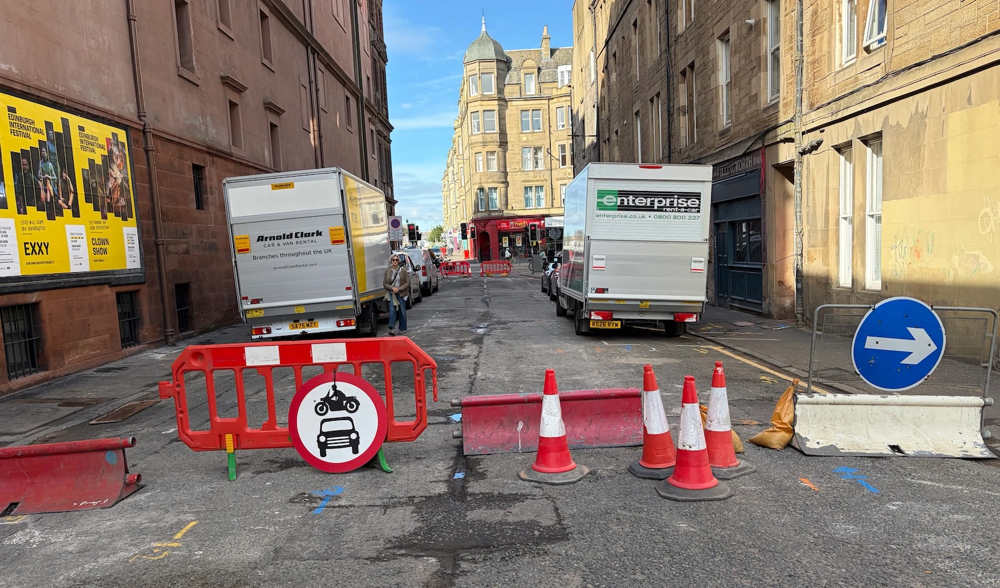

The City of Edinburgh Council's **Transport and Environment Committee** ('TEC') meets this Thursday, 10th September 2026; as always we've had a grumpy ruffle of the paperwork and will attempt to summarise what's on the table below.

### ⬇️ Jump to:

* 🎭  [King's Theatre Public Realm Improvement project update](#kings-theatre-public-realm-improvement-project-update)
* 🚋  [Edinburgh South Suburban Railway Feasibility Study](#edinburgh-south-suburban-railway-feasibility-study)
* 📋  [Broomhall Road, traffic calming measures](#7-1-petition-for-consideration-broomhall-road-road-calming-measures)
* 💰 [New Projects for Edinburgh Visitor Levy funding](#7-4-edinburgh-visitor-levy-new-projects)
* 🚊 [North-south tram, Strategic Outline Business Case](#7-6-trams-from-granton-to-the-edinburgh-bioquarter-royal-infirmary-of-edinburgh-and-beyond-strategic-business-case)
* 🚌 [Turnhouse Road Bus Gate ETRO](#7-7-turnhouse-road-bus-gate-proposed-operating-hours-for-experimental-traffic-regulation-order)
* 💼 [Improvements to the TRO Process](#7-8-traffic-orders-tros-sub-committee-update-improvements-to-the-tro-process)
* 🚙 [Motion: Lothianburn Junction Traffic Trial](#9-2-by-councillor-cuthbert-lothianburn-junction-traffic-trial-a702-a720)
* ⛔️ [Motion: Safe Management of Street Closures](#9-4-by-councillor-gardiner-safe-management-of-street-closures)

---

> 🌐 [Meeting Page & Agenda](https://democracy.edinburgh.gov.uk/ieListDocuments.aspx?CId=136&MId=8122&Ver=4){target="_blank" rel="noopenernoreferrer"}   PDFs:  📑 [Full Agenda Reports Pack](https://democracy.edinburgh.gov.uk/documents/g8122/Public%20reports%20pack%2010th-Sep-2026%2010.00%20Transport%20and%20Environment%20Committee.pdf?T=10){target="_blank" rel="noopenernoreferrer"}     💼 [Business Bulletin](https://democracy.edinburgh.gov.uk/documents/s103043/Item%206.1%20-%20Business%20Bulletin%20-%2010%20September%202026%20v2.pdf){target="_blank" rel="noopenernoreferrer"}     📋 [Work Programme](https://democracy.edinburgh.gov.uk/documents/s102855/Item%205.1%20-%20Transport%20and%20Environment%20Work%20Programme%202026-27%20-%20Report.pdf){target="_blank" rel="noopenernoreferrer"}

---

## 💼 Business Bulletin 

📄 [Business Bulletin](https://democracy.edinburgh.gov.uk/documents/s103043/Item%206.1%20-%20Business%20Bulletin%20-%2010%20September%202026%20v2.pdf){target="_blank" rel="noopenernoreferrer"} [PDF] »

The Business Bulletin is home to less significant items that don't warrant a full report, or further updates on more significant past reports. 

---

### 🎭 King's Theatre Public Realm Improvement project update

This is a minor update summarising the public realm (and small bits of cycle improvement work along the way) changed ahead of the reopening of the King's Theatre in Tollcross recently. All of these changes are welcome, but there remains the slightly thorny matter of Tarvit St:

> _"It should be noted that in conjunction with the removal of the theatre’s refurbishment site compound, Tarvit Street has been permanently closed to general traffic by the introduction of a modal filter that permits cycle access in both directions and loading access for the King’s Theatre. In addition, the nearby one-way street exemptions for people cycling, implemented while Tarvit Street was closed during the refurbishments works, have also been made permanent and will be retained."_

Recent accounts of Tarvit Street being _'permanently closed'_ to traffic have included easily moved fencing and a litany of vehicles accessing the space (having nothing to do with theatre show loading, which is permitted), while also managing to have enough signage clutter as to be harder to pass by cycle - if that gels with your own experience of it reopening for pedestrian and cycle use _'only'_, [let us know](mailto:hello+tarvit@edi.bike).

<figure>
  
  <figcaption>A modal filter strictly for the MacAskills of this world - how's your bunnyhop these days? Image: <a href="https://bsky.app/profile/jestermouse.bsky.social/post/3mtlfbhp5yc2g" target="_blank" rel="noopenernoreferrer">Jester Mouse on Bluesky</a></figcaption>
</figure>

---

### 🚋 Edinburgh South Suburban Railway Feasibility Study

A promising update regarding tram-trains on the South Suburban railway line:

> _"Officers have liaised with Transport Scotland who have confirmed that they will work with Network Rail to identify the key technical requirements for facilitating tram-train services on the route and to assess the feasibility of integrating these services with other rail passenger and rail freight services and the wider public transport network."_

More on [PDF page four](https://democracy.edinburgh.gov.uk/documents/s103043/Item%206.1%20-%20Business%20Bulletin%20-%2010%20September%202026%20v2.pdf#page=4).

---

## 🗳️ Items for Decision

### 📋 7.1 Petition for Consideration - Broomhall Road, Road calming measures 

📄 [Report](https://democracy.edinburgh.gov.uk/documents/s102779/Item%207.1%20-%20Petition%20for%20Consideration%20-%20Broomhall%20Road%20Road%20calming%20measures.pdf){target="_blank" rel="noopenernoreferrer"} [PDF] »

Another Transport Committee meeting, another community worried about traffic volumes and unsafe driving on their street:

> _"I am writing to formally request the implementation of traffic-calming measures along the full length of our street. In recent weeks, we have experienced a substantial increase in through-traffic as a result of the ongoing road works in the surrounding area. A number of vehicles are travelling at speeds exceeding 40mph, which presents a serious safety concern for all residents. The street is predominantly occupied by elderly individuals, families with young children, and parents with prams. Given the volume and speed of the traffic, the risk of a collision — either involving a pedestrian or resulting in damage to property — is, in my view, unacceptably high. I respectfully urge the council to assess the situation as a matter of priority and to consider the installation of appropriate traffic-calming measures to ensure the safety and wellbeing of the community."_

One would hope that councillors on the committee are paying attention to the regularity of these kinds of requests coming up - is the response going to be another plan to make a plan to add this to a ten year programme of work?

---

### 💰 7.4 Edinburgh Visitor Levy: New Projects

📄 [Report](https://democracy.edinburgh.gov.uk/documents/s102782/Item%207.4%20-%20Edinburgh%20Visitor%20Levy%20-%20New%20Projects.pdf){target="_blank" rel="noopenernoreferrer"} [PDF] »

Edinburgh's 'Tourist tax' spending plans continue here, following a Special Council Meeting back in February which included a handful of new projects added to be assessed and considered - including a few under the transport remit:

* 🏝️ **The Causey Project** - _The Causey Project aims to transform West Crosscauseway, and its traffic island, from a space dominated by vehicles into a vibrant, people-focused area._ This includes a reversal of the one-way direction of motor traffic on West Crosscauseway between Buccleuch St and Nicolson St, where two-way cycling will be maintained, the removal of some parking and loading space, and public realm improvements;

* 🌊 **Access to Lost Shore and the Edinburgh International Climbing Arena (EICA)** - relating to a trial bus service currently running from the city centre to Ratho and the EICA, wherein _"If the trial of this route is successful, and Council decide to implement this route permanently, it is proposed that the Visitor Levy will make a financial contribution to the cost of the additional route commensurate with the number of passengers using the service to access the visitor attractions (e.g. Lost Shore and the EICA)"_;

* 🔮 **City Centre Public Realm (Princes Street and George Street)** - _"As a decision is yet to be made on the development of Princes Street and George Street, officers recommend that the £31.75m that was previously allocated for George Street and First New Town, is ringfenced for the development of city centre public realm improvements"_ - to be released once members have considered the upcoming report on a strategy for developing and improving these streets.

---

### 🚊 7.6 Trams from Granton to the Edinburgh BioQuarter / Royal Infirmary of Edinburgh and Beyond Strategic Business Case

📄 [Report](https://democracy.edinburgh.gov.uk/documents/s102786/Item%207.6%20-%20Trams%20from%20Granton%20to%20the%20Edinburgh%20BioQuarter-Royal%20Infirmary%20of%20Edinburgh%20and%20Beyond%20St.pdf){target="_blank" rel="noopenernoreferrer"} [PDF] »

#### Appendices:

* 📗 [Report 'Easy Read' summary](https://democracy.edinburgh.gov.uk/documents/s102787/Item%207.6%20-%20Trams%20from%20Granton%20to%20the%20Edinburgh%20BioQuarter-Royal%20Infirmary%20of%20Edinburgh%20-%20Appendix%201.pdf){target="_blank" rel="noopenernoreferrer"} [PDF]
* 📑 [Strategic 'Outline' Business Case](https://democracy.edinburgh.gov.uk/documents/s102908/Item%207.6%20-%20Trams%20from%20Granton%20to%20the%20Edinburgh%20BioQuarter-Royal%20Infirmary%20of%20Edinburgh%20-%20Appendix%202.pdf){target="_blank" rel="noopenernoreferrer"} [PDF]
* 💰 [National Wealth Fund Engagement](https://democracy.edinburgh.gov.uk/documents/s102788/Item%207.6%20-%20Trams%20from%20Granton%20to%20the%20Edinburgh%20BioQuarter-Royal%20Infirmary%20of%20Edinburgh%20-%20Appendix%203.pdf){target="_blank" rel="noopenernoreferrer"} [PDF]
* 🔎 [Benefits & Impacts Summary](https://democracy.edinburgh.gov.uk/documents/s102789/Item%207.6%20-%20Trams%20from%20Granton%20to%20the%20Edinburgh%20BioQuarter-Royal%20Infirmary%20of%20Edinburgh%20-%20Appendix%204.pdf){target="_blank" rel="noopenernoreferrer"} [PDF]

A dense and information-rich update to the city's plans for a new north-south tram line, rumbling along; we're reasonably likely to see the much-debated northern section of this put to one side, particularly less than a year out from local council elections and with several political groups backing 'Save the Roseburn Path' — but this is unlikely to be the last we hear of the line to Granton either way...

Transport Convener Cllr Stephen Jenkinson [gave a video interview](https://www.edinburghnews.scotsman.com/news/edinburgh-new-north-south-tramline-officials-recommend-prioritising-southern-section-saying-granton-route-needs-more-work-8952593) to Ian Swanson at the Edinburgh Evening News this week, discussing the north and south sections of the route and touching on the notion of tram-trains for reopening the South Suburban line. 

A new campaign backing use of the Roseburn Path's former railway bed from 'Looking for Growth UK' has also been [publishing videos on Instagram](https://www.instagram.com/reels/Dcysm9JNF6W/) making the case for the northern section of the route and use of the path to reach Granton; meanwhile there was also [an instructive poll of Spokes' membership](https://bsky.app/profile/spokes.org.uk/post/3mupcnwugds2d ) regarding their views on the northern leg of the route. Members of [Save the Roseburn Path](https://www.savetheroseburnpath.com/) continue to lobby councillors to find a viable alternative route that spares the path in its current form.

We'll see how this continues to shake out on Thursday.

---

### 🚌 7.7 Turnhouse Road Bus Gate - Proposed Operating Hours for Experimental Traffic Regulation Order

📄 [Report](https://democracy.edinburgh.gov.uk/documents/s102791/Item%207.7%20-%20Turnhouse%20Road%20Bus%20Gate%20-%20Proposed%20Operating%20Hours%20for%20Experimental%20Traffic%20Regulation%20Or.pdf){target="_blank" rel="noopenernoreferrer"} [PDF] »

There's a number of plans and appendices linked to from this item on [the TEC Meeting Page](https://democracy.edinburgh.gov.uk/ieListDocuments.aspx?CId=136&MId=8122&Ver=4){target="_blank" rel="noopenernoreferrer"} »

This is set to be another contentious point for the West of the city, where the car is king; recent housing developments at Turnhouse specified a need to mitigate car dependency and introducing even more traffic, so a bus gate has always been planned here; locals wishing to drive absolutely everywhere with no care for ensuring public transport runs smoothly in order to be an attractive alternative to driving are already up in arms about something that was always on the cards being implemented. The council, perhaps surprisingly given its history with Experimental Traffic Regulation Orders (ETROs) are using one to trial a bus gate on Turnhouse Road and gather feedback and data from Lothian Buses. Expect Lib Dem whataboutery, frothy media pieces and angry comments sections.

---

### 💼 7.8 Traffic Orders - TROs Sub-Committee Update: Improvements to the TRO Process

📄 [Report](https://democracy.edinburgh.gov.uk/documents/s102798/Item%207.8%20-%20Traffic%20Orders%20-%20TROs%20Sub-Committee%20Update%20-%20Improvements%20to%20the%20TRO%20Process.pdf){target="_blank" rel="noopenernoreferrer"} [PDF] »

Back in November 2025, TEC considered the future of its sub-committee responsible for vetting Traffic Regulation Orders ('TROs') and commissioned a follow-up report on potential improvements to the system. And, following the legal paperwork errors that required the removal of filters on the Greenbank to Meadows quiet route in June, it was also asked that a review be undertaken into how those errors came about, which this report also covers.

Of course, not only does the report fail to lay blame at the likely originator of the errors (the consultants who originally drafted the orders), but also claims officers _'discovered'_ the errors in question when in fact they were notified of the issue by a member of the public, an overzealous NIMBY who was against the scheme. It's also been repeatedly asserted that the ETRO for the area was never meant to be made permanent, though having the legal documents in order during a process that wasn't guaranteed to unfold _just right_ might have been wiser than assuming it will all go according to plan, particularly where councillor conduct ends up called into question.

It's also notable the way the council talks about TROs as a fact of life, when it's been pointed out many times that Edinburgh rather over-uses the process, which is time-consuming and has been blamed as one of the main reasons for delays in previous active travel projects. The fact that this report doesn't mention this particular procedural footgun is interesting when considering it offers suggestions to streamline the process further — rather than reducing the amount it resorts to orders to make changes.

If you're interested in the inner legal workings, there's a lot of detail about the recommendations being made, and alongside the report there are also a whopping [nine appendices](https://democracy.edinburgh.gov.uk/mgAi.aspx?ID=88879#mgDocuments){target="_blank" rel="noopenernoreferrer"}, including new templates for TRO Sub-committee reports.

---

## ✍🏽 Motions and Amendments

---

### 🚙 9.2 By Councillor Cuthbert - Lothianburn Junction Traffic Trial - A702-A720

📄 [Motion](https://democracy.edinburgh.gov.uk/documents/s102825/Item%209.2%20-%20By%20Councillor%20Cuthbert%20-%20Lothianburn%20Junction%20Traffic%20Trial%20-%20A702-A720.pdf){target="_blank" rel="noopenernoreferrer"} [PDF] »

On the one hand, this is a really weird motion; the roads in question are not managed by the council but by BEAR Scotland, so the entire thing is essentially a Councillor (who happens to also be a ward councillor for the area the road is in) asking that CEC officers' time be spent on keeping them up to date with _something another organisation is doing_; which surely could have been asked of BEAR directly given the ward interest...

On the other hand, as Green group Cllr Ross McKenzie gleefully pointed out:

> _"Trial changes at Lothianburn Junction don't seem to have given a second thought to cycle safety._ 
>
> _"Cycling south, you either stay in the left lane and get blocked by a line of cones, or move \[to\] the right lane (as instructed) for maximum exposure to vehicles switching lanes._
>
> _"Fortunately, the good people at the Conservative and Unionist Party have brought a motion on Lothianburn Junction to this week's Transport & Environment Committee, so @chasbooth.bsky.social and I will have an opportunity to amend in requests for consideration of cycle safety._
>
> _"We're keen for input from anyone with experience of cycling this route."_
> — Cllr Ross McKenzie [on Bluesky](https://bsky.app/profile/rosssmckenzie.bsky.social/post/3murseb7bnk2c){target="_blank" rel="noopenernoreferrer"} 

If you have cycled through this junction since the trial changes began and can share your experience, you can [use this link to email](mailto:Cllr.Ross.Mckenzie@edinburgh.gov.uk;chas.booth@edinburgh.gov.uk?subject=A702%20Trial%20Measures%20and%20Cycling&cc=hello@edi.bike&body=Dear%20Cllrs%20McKenzie%20and%20Booth%20—%0A%0AI%20am%20writing%20to%20you%20regarding%20the%20BEAR%20Scotland%20trial%20measures%20on%20the%20A702%20as%20covered%20in%20edi.bike%20this%20week...) Cllrs McKenzie and Booth directly, CC'ing edi.bike.

---

### ⛔️ 9.4 By Councillor Gardiner - Safe Management of Street Closures

📄 [Motion](https://democracy.edinburgh.gov.uk/documents/s102827/Item%209.4%20-%20By%20Councillor%20Gardiner%20-%20Safe%20Management%20of%20Street%20Closures.pdf){target="_blank" rel="noopenernoreferrer"} [PDF] »

Requests a report from officers regarding the management of the 'Summertime Streets' closure of the Cowgate, a road which has had many promises of pedestrianisation over the years. A recent attempt at closing it for festival crowds saw unattended barriers moved and passed by through-traffic until it received media coverage following comments and video footage from Living Streets Edinburgh. 

---

The Transport & Enviroment Committee will meet this **Thursday, 10th September 2026**, and we'll have a round-up in our subsequent issues.

---

✨ **Want to leave a tip?** 

