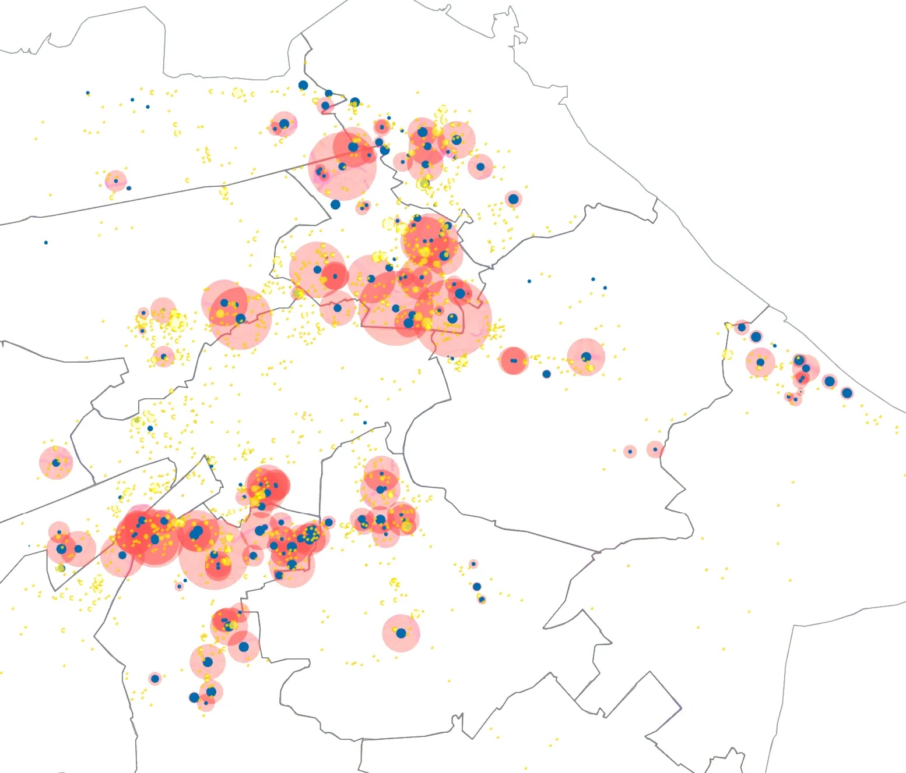
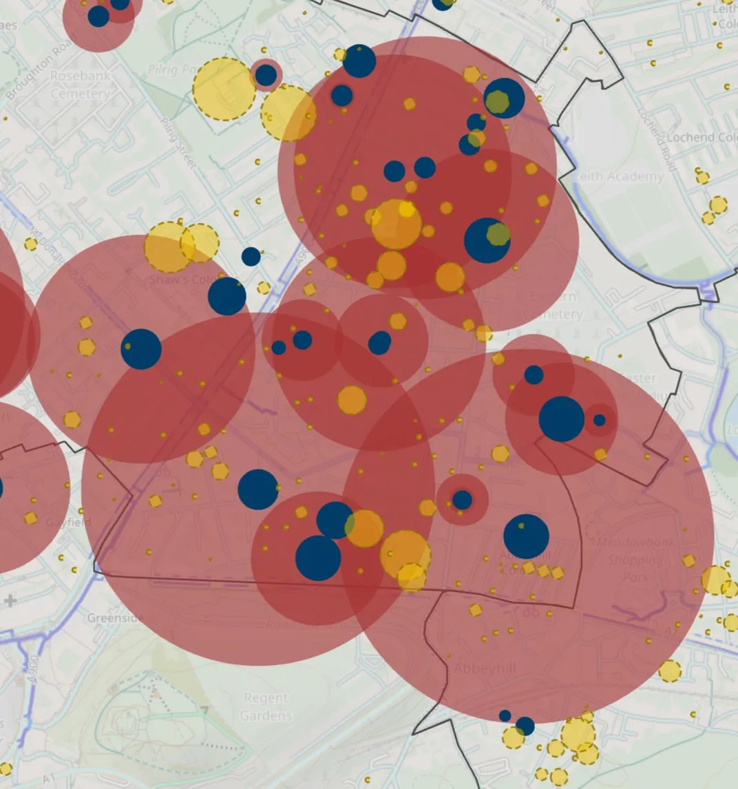

{style="max-height: 80dvh"}

### Demand for spaces in cycle hangars in Edinburgh has increased by 2,700 (50%) in the last 12 months.

After adjusting for duplication across waiting lists,  I estimate that around 7,000 people currently want a spot in one - but Edinburgh Council only provide 1,500 spaces. 

> 📈 [**Interactive - Explore the Data**](https://rpubs.com/edtiss/hangars){target="_blank" rel="noopener noreferrer"} »

The most popular hangar location is Rossie Place near Easter Road, with over 100 people on the waiting list. Across Morningside, 6% of flat dwellers have requested a spot.  

There are now 277 hangars across Edinburgh - to satisfy *current* demand would require an **additional 938**.

{style="max-height: 80dvh"}

The largest ward-level waiting list is Leith Walk,  with **around 1,100 people waiting** on a spot. 190 additional hangars are required, with only 50 provided. 

As a ratio of current provision, there are 7 people for every spot in Inverleith.

📋 **Comparison Table** - [Edinburgh hangar demand and provision by ward (2026)](https://rpubs.com/edtiss/hangars-table){target="_blank" rel="noopener noreferrer"} »

Add this to the very long list of things the council should resolve before it thinks about more trams - hangars are self-funded, deliver more revenue than parking spaces, and **latent demand for them is likely well over 10,000** (assuming that 6% of flat dwellers would want a spot).

---

The raw data is [available here](https://edinburgh.axlr8.uk/disclose/), by searching for request number **63936**.

*This article was originally published as a* [*thread on Bluesky*.](https://bsky.app/profile/edtiss.bsky.social/post/3muyj4rt5hs2u){target="_blank" rel="noopener noreferrer"}