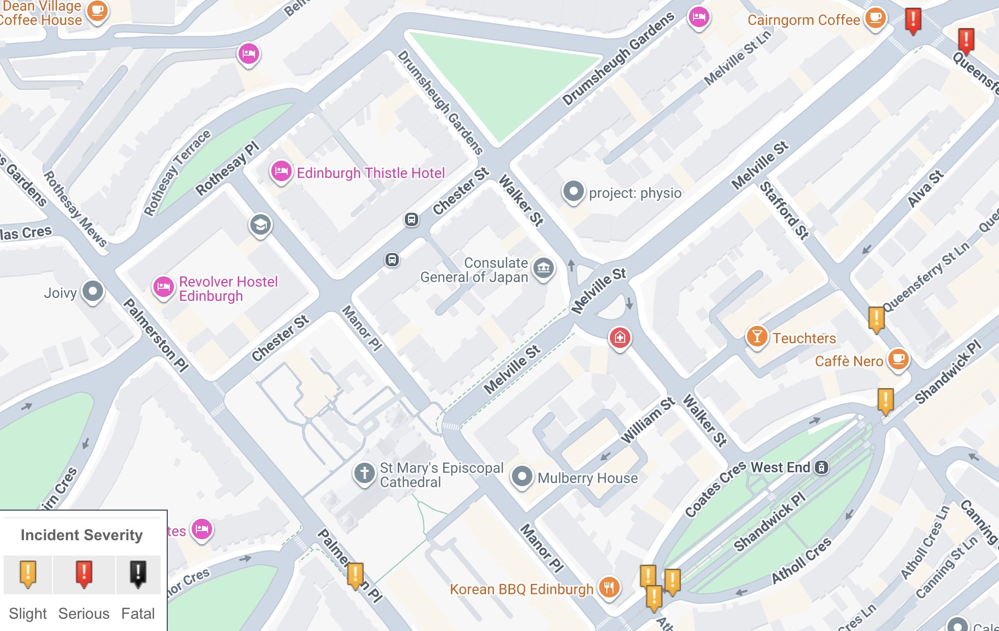

Following the meeting of the City of Edinburgh Council's **Transport and Environment Committee** ('TEC') on Thursday, 10th September, as ever we've rounded up the main cycling-related news from the decisions made below - as well as a few that are more major transport or policy pieces with knock-on effects in the push for better cycling infrastructure.

For background on the items below read [our agenda review from last week](/articles/2026-09-06-september-transport-committee-agenda) »

### ⬇️ Jump to:

* 🎭  [King's Theatre Public Realm Improvement project update](#kings-theatre-public-realm-improvement-project-update)
* 💰 [New Projects for Edinburgh Visitor Levy funding](#7-4-edinburgh-visitor-levy-new-projects)
* 🚊 [North-south tram, Strategic Outline Business Case](#7-6-trams-from-granton-to-the-edinburgh-bioquarter-royal-infirmary-of-edinburgh-and-beyond-strategic-business-case)
* 🚌 [Turnhouse Road Bus Gate ETRO](#7-7-turnhouse-road-bus-gate-proposed-operating-hours-for-experimental-traffic-regulation-order)
* 💼 [Improvements to the TRO Process](#7-8-traffic-orders-tros-sub-committee-update-improvements-to-the-tro-process)
* 🚙 [Motion: Lothianburn Junction Traffic Trial](#9-2-by-councillor-cuthbert-lothianburn-junction-traffic-trial-a702-a720)
* ⛔️ [Motion: Safe Management of Street Closures](#9-4-by-councillor-gardiner-safe-management-of-street-closures)

---

> 🌐 [Meeting Page & Agenda](https://democracy.edinburgh.gov.uk/ieListDocuments.aspx?CId=136&MId=8122&Ver=4){target="_blank" rel="noopener noreferrer"}     📺 [Webcast](https://edinburgh.public-i.tv/core/portal/webcast_interactive/1122295){target="_blank" rel="noopener noreferrer"}    PDFs: &nbsp;  📑 [Full Agenda Reports Pack](https://democracy.edinburgh.gov.uk/documents/g8122/Public%20reports%20pack%2010th-Sep-2026%2010.00%20Transport%20and%20Environment%20Committee.pdf?T=10){target="_blank" rel="noopener noreferrer"}     💼 [Business Bulletin](https://democracy.edinburgh.gov.uk/documents/s103043/Item%206.1%20-%20Business%20Bulletin%20-%2010%20September%202026%20v2.pdf){target="_blank" rel="noopener noreferrer"}     📋 [Work Programme](https://democracy.edinburgh.gov.uk/documents/s102855/Item%205.1%20-%20Transport%20and%20Environment%20Work%20Programme%202026-27%20-%20Report.pdf){target="_blank" rel="noopener noreferrer"}     📣 [Deputations](https://democracy.edinburgh.gov.uk/documents/b28516/Deputations%2010th-Sep-2026%2010.00%20Transport%20and%20Environment%20Committee.pdf?T=9){target="_blank" rel="noopener noreferrer"}     📑 [Motions & Amendments](https://democracy.edinburgh.gov.uk/documents/b28519/Motions%20and%20Amendments%2010th-Sep-2026%2010.00%20Transport%20and%20Environment%20Committee.pdf?T=9){target="_blank" rel="noopener noreferrer"}

---

## 💼 Business Bulletin 

📄 [Business Bulletin](https://democracy.edinburgh.gov.uk/documents/s103043/Item%206.1%20-%20Business%20Bulletin%20-%2010%20September%202026%20v2.pdf){target="_blank" rel="noopener noreferrer"} [PDF] »

The Business Bulletin is home to less significant items that don't warrant a full report, or further updates on more significant past reports. 

---

### 🎭 King's Theatre Public Realm Improvement project update

🔍 [Background on this item](/articles/2026-09-06-september-transport-committee-agenda#kings-theatre-public-realm-improvement-project-update){target="_blank" rel="noopener noreferrer"} »

📺 [Webcast](https://edinburgh.public-i.tv/core/portal/webcast_interactive/1122295/start_time/71350) from 1h 58m 55s

As covered last week:

> _"It should be noted that in conjunction with the removal of the theatre’s refurbishment site compound, Tarvit Street has been permanently closed to general traffic by the introduction of a modal filter that permits cycle access in both directions and loading access for the King’s Theatre."_

Recently it's clear that the barriers are easily moved, and there continues to be parking and vehicle movement (beyond the planned access for theatre show loading) — and that the promised modal filters have ended up an ugly pile of mixed barriers and cones that can be hard to pass.

The Green group's Cllr Chas Booth asked about the filters being moved around, and parking continuing within the site - and whether Officers were on top of the situation.

In answering, Officers said: 

> _"We have a longer-term plan for that street whereby we will completely re-do the streetscape to reflect its new status, however that is some way away from delivery so we've got a phased introduction of how the prohibition will be maintained. At the moment, it's being done by temporary traffic management measures - the plan is that in the near future we will upgrade that — probably using bollards — and the design process for that is underway at the moment. There are issues we have to look at about underground services and the like for those bollards, and then that will bridge the gap before the longer-term scheme that will completely revamp the street, which again may change the way we enforce that prohibition."_

When asked about a timetable Officers could not be drawn on detail but will follow up with Councillors as plans develop.

---

## 🗳️ Items for Decision

### 📋 7.1 Petition for Consideration - Broomhall Road, Road calming measures 

🔍 [Background on this item](/articles/2026-09-06-september-transport-committee-agenda#7-1-petition-for-consideration-broomhall-road-road-calming-measures){target="_blank" rel="noopener noreferrer"}

📄 [Report](https://democracy.edinburgh.gov.uk/documents/s102779/Item%207.1%20-%20Petition%20for%20Consideration%20-%20Broomhall%20Road%20Road%20calming%20measures.pdf){target="_blank" rel="noopener noreferrer"} [PDF] »

The petitioners did not attend the committee meeting to present and discuss, which was mooted as potentially meaning that there's no longer a pressing issue - so this item was continued until November's meeting of TEC and see if the group still wants to be heard. 

---

### 💰 7.4 Edinburgh Visitor Levy: New Projects

🔍 [Background on this item](/articles/2026-09-06-september-transport-committee-agenda#7-4-edinburgh-visitor-levy-new-projects){target="_blank" rel="noopener noreferrer"}

📄 [Report](https://democracy.edinburgh.gov.uk/documents/s102782/Item%207.4%20-%20Edinburgh%20Visitor%20Levy%20-%20New%20Projects.pdf){target="_blank" rel="noopener noreferrer"} [PDF] »

📺 [Webcast](https://edinburgh.public-i.tv/core/portal/webcast_interactive/1122295/start_time/9495000) from 2h 38m

The funding of new projects **The Causey Project** and **Access to Lost Shore and the Edinburgh International Climbing Arena (EICA)**, added to the Visitor Levy Funding list back in February, were only really mentioned in passing, with much of the debate and questions on this item focused on **City Centre Public Realm (Princes Street and George Street)**. 

This follows a decision from the **Planning Committee** earlier this week that rather than pursue a more radical transformation of Princes Street to completely overhaul its approach to transport and public realm, the southern pavement will be extended by 1.5m and access into the gardens will be improved - completely negating using any of the space for frequent and inevitable cycle journeys along Princes St already taking place in spite of the risks cycling with the tramline. 

As such, this agenda item became the proxy by which the future of Princes St and George St were discussed and considered - which the committee has not covered since rejecting the original 'Princes St and Waverley Valley strategy' as unambitious, and since the development of the planned changes to George St was shelved at the 11th hour after restrictions on motor vehicle access had been watered down to the point where the SNP group looked to block its proceeding as-is, with high costs and little perceived benefit. 

> Of course, in the interim a significant fire in the former Debenhams building on Princes St also impacted this 'core city centre' zone with buses and through-traffic re-routed via George St, so there is also a report pending on city centre transport resilience in such situations to avoid the months of disruption caused from happening again.

In questions for Officers, SNP Group Cllr Neil Gardiner asked about having to look at the George St project again in light of the Princes St decision and resilience report, particularly in regard to the gap in the **City Centre West to East Link** ('CCWEL') — currently ending quite unceremoniously emerging into Charlotte Sq from the West and only picking up again at North St David St in the east. 

The response, from Corporate Director of Place Gareth Barwell:

>_"CCWEL is a scheme this council has promoted for a long time, we have delivered it in phases, we have delivered a very high profile phase around the Haymarket area — there are areas to finish — if the point is being made that actually the completion of that should be a priority, I would agree with that, and very much the approach officers took with City Mobility Plan [Capital] Investment Plan in trying to prioritise closing off existing commitments._ 
>
>_"On Princes Street, Planning committee yesterday took a decision on the way forward on Princes St — and Council took the decision just a few weeks back asking for a resilience review after the Debenhams fire. I can confidently say the dependency between Princes Street and George Street is going to have to be looked at and I would speculate slightly change, in what we've learned from the fire on Princes Street and knowing we've got resilience in George Street particularly... I think the principle of looking to prioritise the completion of CCWEL is a good decision from Councillors because it allows us to close that."_

Councillor Gardiner than asked - _"Given you've said that there might be some sort of delay to work through these important issues, is there any sort of temporary measure that officers could bring forward, to create a cycle route along George St to allow that CCWEL-intended connection, obviously the cycle community doesn't have that and it's a wee bit dangerous at the moment — are there measures that you think could be brought forward?"_

Mr Barwell answered that the team would want to give more detail in a report, but that it was quite reasonable to ask officers consider how that could happen, and the various implications.

The ask from the Green Group, by way of [an addendum](https://democracy.edinburgh.gov.uk/documents/b28519/Motions%20and%20Amendments%2010th-Sep-2026%2010.00%20Transport%20and%20Environment%20Committee.pdf?T=9#page=8){target="_blank" rel="noopener noreferrer"} (PDF, page 8) referred to recent council decisions and _"notes that these decisions taken together would potentially leave a gap in the City Centre West East Link (CCWEL) for years to come, and therefore agrees that the report outlined... which will return to committee in due course, should contain proposals on how the completion of existing projects could be prioritised."_ 

In moving the addendum, Cllr Booth said:

> _"All our addendum seeks to do is to note the decision yesterday of the Planning committee... previously we had put George Street on hold with the idea that we might look at cycling on Princes Street and see if whether that could be an alternative for cycling provision; the decision yesterday was to proceed with Option 1, which does not allow for that on Princes Street, so all our addendum seeks to do is to say we have now got a gap in the CCWEL, let's look at what we can do to fill that gap as soon as possible because at the moment cyclists have no protection."_

In seconding, Green Councillor Ross McKenzie added: 

> _"On George Street - we have so many challenging streets to provide cycle segregation and safe cycling in this city, and George Street really isn't one of them - it's really wide, it's like all those big wide Glasgow streets that have excellent cycle segregation. And yet, still after all these years and all this discussion we have this massive gap - so I hope when this report comes back, as Cllr Gardiner has said, that it will include the suggestion for a cheap, temporary solution like planters and removal of parking, that can get this going and can get this gap filled without waiting for the back-and-forth over the expensive public realm projects."_

Conservative Cllr Mowat performed an astounding claim during contributions that residents have to _"take their life in their hands"_ to cross the single lane, uni-directional CCWEL cycleways flanking the prestigious **Melville Street**. Naturally, 2024-2025 crashmap data shows not even a ‘slight’ incident here since CCWEL opened; one would hate to think how residents cope with crossing the carriageway if they find 1.2m of protected cycleway harrowing.

Liberal Democrat Cllr Kevin Lang made the point that the committee paused work on George St, then commissioned a rethink of Princes St, and have now chosen to do something _“quite minimalist”_ there - and expressed the feelings of a number of committee members who _”don't now quite know what we're doing with the 'core city centre'”_. 

In response and summing up, Labour Transport Convener Cllr Stephen Jenkinson outlined that TEC will see a report on George St in November, now that the Planning Committee decision has given clarity for Princes St. He claimed Labour’s own position has been consistent, having described the project to date as _“dead in the water”_ after SNP interventions — but claims this describes the existing plans as _”still afloat but not moving forward”_, and that November’s meeting should see movement. 

Regarding segregated cycling on George St, whether permanent or temporary, he pointed out that _"one of the issues is it's one of the biggest car parks in the middle of the city centre — I just don't think that we have scope to do much change while that's still in existence, but hopefully some clarity will be provided around that as we move forward.”_

The administration accepted the Green addendum, along with a _"pedantic but correct"_ wording amendment by the Conservative group on a technical point, and as such gave the TEC stamp of approval to these additional visitor levy projects - along with **a solid nod to progressing CCWEL's missing middle**. 

---

### 🚊 7.6 Trams from Granton to the Edinburgh BioQuarter / Royal Infirmary of Edinburgh and Beyond Strategic Business Case

🔍 [Background on this item](/articles/2026-09-06-september-transport-committee-agenda#7-6-trams-from-granton-to-the-edinburgh-bioquarter-royal-infirmary-of-edinburgh-and-beyond-strategic-business-case){target="_blank" rel="noopener noreferrer"}

📄 [Report](https://democracy.edinburgh.gov.uk/documents/s102786/Item%207.6%20-%20Trams%20from%20Granton%20to%20the%20Edinburgh%20BioQuarter-Royal%20Infirmary%20of%20Edinburgh%20and%20Beyond%20St.pdf){target="_blank" rel="noopener noreferrer"} [PDF] »

#### Appendices:

* 📗 [Report 'Easy Read' summary](https://democracy.edinburgh.gov.uk/documents/s102787/Item%207.6%20-%20Trams%20from%20Granton%20to%20the%20Edinburgh%20BioQuarter-Royal%20Infirmary%20of%20Edinburgh%20-%20Appendix%201.pdf){target="_blank" rel="noopener noreferrer"} [PDF]
* 📑 [Strategic 'Outline' Business Case](https://democracy.edinburgh.gov.uk/documents/s102908/Item%207.6%20-%20Trams%20from%20Granton%20to%20the%20Edinburgh%20BioQuarter-Royal%20Infirmary%20of%20Edinburgh%20-%20Appendix%202.pdf){target="_blank" rel="noopener noreferrer"} [PDF]
* 💰 [National Wealth Fund Engagement](https://democracy.edinburgh.gov.uk/documents/s102788/Item%207.6%20-%20Trams%20from%20Granton%20to%20the%20Edinburgh%20BioQuarter-Royal%20Infirmary%20of%20Edinburgh%20-%20Appendix%203.pdf){target="_blank" rel="noopener noreferrer"} [PDF]
* 🔎 [Benefits & Impacts Summary](https://democracy.edinburgh.gov.uk/documents/s102789/Item%207.6%20-%20Trams%20from%20Granton%20to%20the%20Edinburgh%20BioQuarter-Royal%20Infirmary%20of%20Edinburgh%20-%20Appendix%204.pdf){target="_blank" rel="noopener noreferrer"} [PDF]

---

#### 📰 Ahead of the meeting

* 🔎 **"Cummings-linked group behind aggressive online campaign for Granton extension"** at [The Edinburgh Inquirer](https://www.edinburghinquirer.co.uk/p/the-curious-case-of-dominic-cummings?open=false#%C2%A7cummings-linked-group-behind-aggressive-online-campaign-for-granton-extension ){target="_blank" rel="noopener noreferrer"} [SubStack]
* 🌳 **"Edinburgh proposed North-South tramline: Refusal to compromise on Roseburn Path 'myopic'"** at [Edinburgh Evening News](https://www.edinburghnews.scotsman.com/news/edinburgh-proposed-north-south-tramline-refusal-to-compromise-on-roseburn-path-myopic-8973670){target="_blank" rel="noopener noreferrer"} »  
* 📝 **Spokes' [deputation on north-south tram](https://www.spokes.org.uk/wp-content/uploads/2026/09/260910-7.6-SPOKES-deputation-Trams-from-Granton-to-Bioquarter.pdf){target="_blank" rel="noopener noreferrer"}** [PDF]  
* 🕹️ **City Scope's interactive [case for Trams to Granton](https://www.city-scope.co.uk/granton-trams ){target="_blank" rel="noopener noreferrer"}** »

---

📺 [Webcast](https://edinburgh.public-i.tv/core/portal/webcast_interactive/1122295/start_time/10878000?force_language_code=en_GB) from 3h 1m to 4h 32m

> ⚠️ **This item was discussed for a full hour and a half. If it's of real interest to you, we'd strongly recommend watching the debate on the webcast - our notes are unlikely to fully summarise nor do justice to the proceedings.**

It's hard to cover tram discussions without resorting to explaining modern cities from first principles. 

Edinburgh is growing at the fastest rate of any city in Scotland, and our road network is a fixed size and shape; there is no scope for new road building, and [induced demand](https://en.wikipedia.org/wiki/Induced_demand#In_transportation_systems){target="_blank" rel="noopener noreferrer"} would soon mean the saturation of any additional capacity anyway. And you can count us among the urbanists pointing at trams' unique profile in terms of sheer capacity, (usual) reliability and customer experience as the [king of the public transport modes](https://www.youtube.com/watch?v=bNTg9EX7MLw&t=1273s){target="_blank" rel="noopener noreferrer"}. It's clear with the population growth we're expecting and existing problems with congestion, that from tram-trains on the South Suburban line to a north-south route, a link from Newhaven to Granton and extensions beyond the city into Midlothian, Edinburgh needs a mass rapid transit solution fit for purpose. 

_(It also needs a vast network of 7-7-7 bus lanes, congestion charging, park and ride, and a ban on parking on all arterial roads, but let's take this one step at a time)._

The committee heard from Ward Councillors Cammy Day (Labour, Forth) and Max Mitchell (Conservative, Inverleith). Day outlined the impact of the existing tramline and the transformation of Leith, the Shore and Newhaven, including an increase in tourist traffic to those areas, and the fantastic statistic that **34% of tram users reported driving less now that it's in operation** — and made a passionate plea for the alleviation of 'transport poverty' and better connection for communities in the north of the city such as Muirhouse, Pilton, Drylaw and Granton. 

Mitchell also spoke very eloquently, but said nothing that made it into our notes. _Weird._ 

The Conservative position on the north-south tram route is essentially _"this has gone far enough, there's no money to build it, so stop now"_. While that's a position echoed by many around the city, it's also echoed by an awful lot of folks who steadfastly refuse to pay heed to the hugely successful existing tram and its usage statistics that went beyond even optimistic projections of it patronage. Should we listen to folks who refute the reality that these are not only an efficient and quick way to move masses of people around a city, but a popular one?

In questions for the ward councillors, the Convener challenged the Conservative position in a question to Cllr Mitchell:

> "_Is it your — and therefore the Conservative group's — position to completely ignore the current congestion issues that Edinburgh faces, and completely ignore the projected growth figures and the congestion that is likely to manifest from that growth? We know Edinburgh’s population is growing exponentially, and we know this is the area of most growth in the country - so is it your position to ignore the evidence, ignore the data and to essentially stick your head in the sand with regards to Edinburgh’s current and future congestion issues, and hope that it can all be solved by a magic wand waved somewhere else?"_

This prompted a very amiable and measured response from Cllr Mitchell that also happened to completely lack any suggestion of a solution to the problems posed or any actual substance on transport policy. 

### ⏳ Where we're at

This meeting was conveyed in most media, both before and after the event, as the point at which a decision was taken regarding the overall route. In fact, there's a wider, regional aspect to what's currently taking place, and this context really deferred anything concrete that we might have expected after a divisive consultation exercise on available route options.

The regional transport partnership for the south-east of Scotland, [SESTran](https://sestran.gov.uk/news/){target="_blank" rel="noopener noreferrer"}, covers the City of Edinburgh and seven other neighbouring Local Authorities — Clackmannanshire, East Lothian, Falkirk, Fife, Midlothian, Scottish Borders and West Lothian. 

They are currently undertaking a project with the "Edinburgh and South East Scotland City Region team", Transport Scotland and Network Rail to develop a Programme Strategic Business Case (SBC) for an integrated regional transport network, which has the working title of **SESTransit**. This work naturally looks beyond Edinburgh at a much wider context - there's some really interesting data about commuting in [this recent report PDF](https://sestran.gov.uk/wp-content/uploads/2026/06/2026-06-19-Item-A7f-SEStransit.pdf){target="_blank" rel="noopener noreferrer"} - and the most likely future for any of the projects to extend Edinburgh's trams is directly related to the case being made by this work.

That project is set to wrap up in a year's time. 

In questions to Officers, it was established that while waiting for the outcome of this work could look like the transport committee avoiding a decision until next Council term following elections in May 2027, actually Officers wouldn't be recommending moving to the next stage (Outline Business Case) at this stage even if there was a fully agreed alignment for the northern section.

The report at hand essentially comes down to: _based on deep assessment of options, potential benefits, and public consultation - Council Officers recommend that the city builds a north-south tramline._ But in terms of next steps, really work is on hold while the regional approach is being assessed, setting the stage for future support.  

### 📆 In the meantime?

Officers will be feeding into the Transport Scotland / Network Rail feasibility study of the South Suburban tram-train project, which is primarily about the technical possibilities - and also supporting the SESTransit regional 'Strategic Business Case' for inter-authority connection across the region.

### 🔀 And the route choices?

The report describes 'prioritising' the southern end of the north-south route.

> _"This [Strategic Business Case] we've presented to you today makes a case for investment in mass transit on a north-south route... there are two route alternatives to the north, and one performs clearly better than the other. But we are acknowledging, through the consultation and some of the things that have happened since that in terms of politics, that there are deliverability challenges with both of those route alternatives to the north. The Roseburn corridor is largely a public acceptability issue, which has translated into a political acceptability issue... The Orchard Brae corridor is much more of a technical deliverability challenge in terms of its role as a primary traffic corridor, public transport corridor, and importance for regional bus service, and clearly Dean Bridge and all the impacts around that as well..._
>
> _"We are saying that there is a case for investment in mass transit — in \[specifically\] Tram, because we have done modal assessment as part of this as well - in Tram, on a north-south corridor - but because we have more certainty and more of a settled view on that southern section, that is the one we suggest that we prioritise for going forward to Outline Business Case, after SESTransit reports... We need a mass transit connection to Granton, the report sets out what the cost of not doing that is - but at the minute it is really challenging to see a way forward on that, so I think we need a bit of time and space to step back and have a bit of a fresh perspective and thinking on how we could deliver that."_ — Deborah Paton, Head of Transport Strategy & Partnerships

Conservative Cllr Neil Cuthbert raised the concerns [expressed by Edinburgh World Heritage](https://ewh.org.uk/our-comments-on-the-north-south-tram-extension/){target="_blank" rel="noopener noreferrer"} about the running of the tram over 'Georgian megastructure' South Bridge, and the dynamic load involved; Officers response was to highlight that this was not a new position but submitted during initial consultation, and that while it was an understandable position, it wouldn’t be expected at this stage to have the detail EWH  have said is missing - where that level of engineering detail and options are at the next stage. However, over on CityCyclingEdinburgh, forum member Arellcat [has a fantastic post](http://citycyclingedinburgh.info/bbpress/topic.php?id=8710&page=76#post-385760){target="_blank" rel="noopener noreferrer"} with some 'back of the envelope' loading calculations that were not only a wonder to read, but also did a great job of contextualising the possible changes. 

This from Corporate Director of Place, Gareth Barwell, was a strong call to members considering mass transit:

> _"I think as a capital city, and south east scotland, we rightly have to be ambitious... We talk about it, because we're in 'Transport & Environment', as a tramline - it's actually an economic development investment, that really has to form the pillar of how this region grows... this should be seen as a hugely significant investment that then unlocks all kinds of opportunities."_

In further questions to Officers, a timeline of nearly eleven years was disclosed; the SESTransit work returning in Autumn 2027, around five years of further planning works, and five years of construction.

In summing up the administration's position, Convener Stephen Jenkinson said:

> _"I have a grand and a bold vision for a mass transit solution that will help Edinburgh solve its future problems, but will also help the region expand, and will actually help Scotland prosper - so there is a win in this for everybody if we can be bold, we can be strong and we can actually take difficult decisions"._

 
 

### 💬 Amendments and Addenda

#### 🟡 Scottish National Party

Asks officers to _"examine other potential route options to North Edinburgh"_ and to commence work on the **Outline Business Case** for the southern section of the route _"as soon as possible", subject to a decision at full council.

Importantly the SNP also claimed 'best pun' of the session with this from Cllr Danny Aston, in moving their position:

> _"I also want to put on record thanks to officers - it might be light rail, but it's a heavy workload"_  🥁 👏🏼

#### 🟠 Scottish Liberal Democrats

The Lib Dem amendment sought to change the report recommendations to: 

> a) not progress the northern section of the line to OBC \[Outline Business Case\] and,
> b) unequivocally rule out building the tram extension on the Roseburn path,
> c) and requests that officers return to committee in two cycles with a report on other possible options for improving public transport in the north of Edinburgh. 

It also called for no further officer time to be spent on the north-south tramline without further committee agreement.

#### 🟢 Scottish Green Party

The Green addendum: 
> "Notes the work that Spokes and others have done in highlighting that over 420 incidents have occurred with cyclists on tram tracks in Edinburgh, with 191 injuries and one fatality, and therefore agrees that in pursuing an Outline Business Case for the southern section of the route to the Bioquarter / RiE, special care and attention should be paid to how to avoid cycle/tram crashes including, but not limited to, consideration of single-tracking of sections of the line, and ensuring that if parallel cycleroutes are pursued as part of a solution, these must be integrated into the tram project."

#### 🔵 Scottish Conservatives

Conservatives wanted to kill the whole thing and not proceed any further. This is because we're _too poor, too wee and too stupid_ to tackle the growth of the city head-on, you see.

#### 💬 In discussion

Lib Dem Cllr Lang expressed fairly visible annoyance at a lack of support from the SNP group for his group's amendment to rule out the Roseburn alignment entirely, essentially accusing them of saying it needed to be preserved for walking and cycling during elections, and then not backing this up at TEC.

In moving the Green amendment, Cllr Chas Booth made the case for designing in cycle segregation from the start:

> _"Spokes have made it clear how serious tram and cycle conflicts can be - we need to learn the lessons of the first tram line where no segregation was built in, and we've seen hundreds of crashes since. Compare that with the Newhaven extension, where segregated cycle lanes on Leith Walk have seen bike/tram crashes all but eliminated and pedestrian casualties — which were previously around a dozen a year — have fallen close to zero in most years since. Segregation saves lives - we're asking that to be designed in from the start of the southern route, not left as an afterthought. That also means any parallel cycle route has to be delivered as part of the tram route itself, not bolted on afterwards as happened with the section between the foot of the walk and ocean terminal where the promised route still hasn't been fully delivered."_

This was followed by a phenomenally strong turn from Cllr Ross McKenzie in seconding the Green position, very much calling a spade a spade in our opinion:

> _"...so irrelevant in this discussion are the Conservatives and the Liberal Democrats; the former can't even engage with the basic reality of population growth in the city, as we saw from Cllr Mitchell earlier; and the latter cannot be relied on to support the tram extension, a tram extension of any kind without sending us on a decade long wild goose chase, a wild goose chase no doubt with great data collection opportunities._ 
>
> _"So we can ignore their political posturing while we're making this very important decision. And we, in this case, are the progressive majority on this council - a progressive majority of almost two thirds of this council, who can send a clear signal today that we support the extension of the tram, and we can be relied upon to continue supporting it. A progressive majority who support the extension unequivocally, and who recognise that radical expansion of public transport provision is the only way to reduce carbon emissions in a rapidly growing city and region. And actually, the only way to make a rapidly growing city and region bearable to move around and live in."_

### 🗳️ The Decision

The Administration moved the Officers report, accepting the Green addendum in full — great news for the consideration of cycle safety on the southern leg of the route — and adjustments to the SNP's amendment to form a combined position:
 
> * Officers recommendations
> * The SNP adjusted position accepting 1.1.3 in full, accepting 1.1.4 with word 'council' removed in front of 'officers', and with  1.1.7 as follows: _Recognises that the best means of securing government funding is being able to demonstrate through a more developed business case level that the project provides a strong case for investment and further recognises the need to give due consideration for the SESTransit work, and therefore acknowledges that a decision to allocate some match funding may become necessary in the future._
> * As 1.1.8, the Green addendum

🗳️ **This was voted through by Labour, SNP and the Greens with 7 votes** - versus two self-votes for the Liberal Democrats and two self-votes for the cynics on their own respective positions. 

Following the vote, the Convener had some further comments:

> _"I want to put on record my thanks to all members of this committee - I think the committee has shown itself in the best light this afternoon, the debate has been excellent and I would also like to put on record my thanks to Cllr Aston and the SNP group regards to the way in which they entered into negotiations this afternoon, I think it was helpful that we got to a good, solid position and I just wanted to thank everybody for their contributions"._

And so, the tram project rumbles on... 🚊

---

#### After the Meeting

🚋 **"Council moves forward on north-south trams extension"** at [The Edinburgh Reporter](https://theedinburghreporter.co.uk/2026/09/council-moves-forward-on-north-south-trams-extension/){target="_blank" rel="noopener noreferrer"} »

🚲 Spokes, [on Bluesky](https://bsky.app/profile/spokes.org.uk/post/3mva4pxyrb22j){target="_blank" rel="noopener noreferrer"}:

> 👍 Great to see SNP/Lab/Green cooperation on entire tram route (tho' no action for 12 months)
>
> 👍 Special thanks Cllr @chasbooth.bsky.social for section re Spokes points on 🚲 #tramline dangers

🟢 Cllr Chas Booth, [on Bluesky](https://bsky.app/profile/chasbooth.bsky.social/post/3mv6epnslvk2h){target="_blank" rel="noopener noreferrer"}:

> I’m glad that 3 parties: SNP, Labour and Greens have agreed a way forward on Edinburgh #Trams.
>
> There is now a way forward on tram to Bioquarter. More work is needed to deliver on the commitment to ensure Granton gets a mass transit connection in the future.

---

### 🚌 7.7 Turnhouse Road Bus Gate - Proposed Operating Hours for Experimental Traffic Regulation Order

🔍 [Background on this item](/articles/2026-09-06-september-transport-committee-agenda#7-7-turnhouse-road-bus-gate-proposed-operating-hours-for-experimental-traffic-regulation-order){target="_blank" rel="noopener noreferrer"}

📄 [Report](https://democracy.edinburgh.gov.uk/documents/s102791/Item%207.7%20-%20Turnhouse%20Road%20Bus%20Gate%20-%20Proposed%20Operating%20Hours%20for%20Experimental%20Traffic%20Regulation%20Or.pdf){target="_blank" rel="noopener noreferrer"} [PDF] »

📺 [Webcast](https://edinburgh.public-i.tv/core/portal/webcast_interactive/1122295/start_time/16404000?force_language_code=en_GB) from 4h 33m 30s

There's a number of plans and appendices linked to from this item on [the TEC Meeting Page](https://democracy.edinburgh.gov.uk/ieListDocuments.aspx?CId=136&MId=8122&Ver=4){target="_blank" rel="noopener noreferrer"} »

### 📊 Data, data, data

Cllr Ed Thornley gave representation as a Ward Councillor for the area, against the bus gate measures. Instead, he asked that committee requested a study of other measures like bus priority signalling, stating that local representatives haven't been told why that's not feasible. In surveying the locality with Liberal Democrat colleague and Lord Provost Robert Aldridge, 84% of residents opposed the bus gate - and as we all know, the best people to make transport infrastructure decisions are people whose driving convenience might minorly suffer to aid the performance and reliability of public transport.  

When asked about whether he accepted the Council's data on traffic levels and queue levels on Turnhouse Road, Cllr Thornley said that he would not argue with the data collected but that it did not agree with his own experience of the area.

### 🏗️ The BIG CRANE issue

An unexpected chapter of this issue pertained to _BIG CRANE_. A long-awaited and much desired active travel bridge from West Craigs to access Edinburgh Gateway and beyond is due to be installed, and _BIG CRANE_ is coming to fit it. _BIG CRANE_ is actually one of the _BIGGEST CRANES_ in the country - and _BIG CRANE_ is unfortunately _NOT BUS_ so what if we put a bus gate in and then we can't have a bridge?

One Officer expressed surprise at how majorly this minor logistics issue had been flagged up in regard to the bus gate, clearly residing in a realm outwith the Lib Dem reality distortion field where _BIG CRANE_ can't pass bus gate or _BIG TROUBLE_ and _NO BRIDGE_. 

_(This might in all honesty be one of the stupidest things I've ever documented.)_ 

The bus gate in the Experimental Traffic Regulation Order consists of signage only, so unless _BIG CRANE_ is scared of bus gate signage, the good people of West Craigs will get their bridge - as officers reassured the worried faces around the room in absolute certainty.

### 🫸🏻  Pushing back on misinformation

In better news for the sane, it was refreshing to see Officers given the opportunity in questions to push back on aspects of the relevant deputation. Officers explained that there was more engagement with the Community Council than with any other group, and that a further two meetings described as having been 'refused an invite for' were not for stakeholder groups, but an All Party Meeting and a separate elected members briefing in which Lothian Buses shared commercial information. 

On the question of traffic counts, Officers expressed gratitude that the local community had undertaken three weeks of counting, but strongly refuted the deputees calling Council traffic counts into question when a full 24-hour count over 7 days was undertaken — no doubt by actual professionals and professionally vetted equipment — at several different locations, ensuring this took place after the Easter school holidays and after the new junction at Craigs Rd bedding in, regarded as a _'really robust dataset'_ in which doubt was now being seeded. Life outside of the distortion field is a place of clarity, you see. Officers also reassured that their teams have been working really diligently on this issue and have had regular contact, with officers being open and honest in all their dealings and are not aware of any misrepresentation at all.

### ⛔️ Cammo Road

Cammo Rd previously had an ETRO in place to close it to through-traffic because of the dangers of sending a lot of traffic along a narrow, rural road - residents were in favour of a closure to general traffic, and the Transport committee was at the time unanimous.

Due to work at the end of Craigs Rd on the new junction, the ETRO on Cammo Rd needed to be lifted in order to provide an alternative flow for traffic. Because of the nature of the ETRO process and its inflexibility, a full new ETRO would be required to reintroduce this closure, and officers want to wait for the introduction of the bus gate ETRO for Turnhouse Rd to see how the area flows as a result before proceeding.

This was a sticking point for the Liberal Democrats, repeatedly stating that there was no way that Cammo Rd could be closed again if Turnhouse Rd was closed to traffic, leaving a single road access in and out of the West Craigs estate.

### 🚌 The Lothian Buses issue

Lothian Buses have said without the bus gate on Turnhouse Rd, they are not able to run the intended bus service into the estate, serving 3,000 houses and a local population of 8,500 people.

Officers pointed out that the estate's planning consents always had an improved Craigs Rd junction, 'low car neighbourhood' attributes, a planned bus service and a planned bus gate on Turnhouse Rd. 

The Conservatives pointed out that the Liberal Democrats were now opposing something they supported during all possible strategic / overview plans for the area - the bus gate being a proposed mitigation for the potential traffic introduced by this estate, and as such has always been on the cards.

> **You have to wonder why the estate was established without all of these measures already in place before people moved in. Start with the junction at Craigs Rd and implement a bus gate from the start. Providing local traffic access for a time only to take it away is the very definition of a resident engagement footgun.**

In moving the report, Convener Cllr Stephen Jenkinson said:

> _"Nobody knows more about running a bus service than Lothian - the decisions that they were taking were fully backed up with data and evidence, and I didn't see anything that convinced me that there was any other option. I think the decision that we've got in front of us today is - does the estate of West Craigs get serviced by a bus, or doesn't it?_
>  
> _"If we all flipped and supported the Liberal Democrat decision — which is exactly what they don't want us to do, let's be honest — we'd be in the incredibly uncomfortable position of supporting not providing a bus service to an area of the city that needs it. The point is rightly made that people bought their properties with the expectation that a bus service would be provided - the Lib Dems are actually campaigning to not provide public transport to an area of the city where they have representation, it seems an interesting position to take, that's all I'll say."_

The motion passed 8 votes to 2, so West Craigs will get its bus gate ETRO and no doubt a highly vocal _'trapped in our hames'_ lobby trying to have the bus service cancelled.

---

### 💼 7.8 Traffic Orders - TROs Sub-Committee Update: Improvements to the TRO Process

🔍 [Background on this item](/articles/2026-09-06-september-transport-committee-agenda#7-8-traffic-orders-tros-sub-committee-update-improvements-to-the-tro-process){target="_blank" rel="noopener noreferrer"}

📄 [Report](https://democracy.edinburgh.gov.uk/documents/s102798/Item%207.8%20-%20Traffic%20Orders%20-%20TROs%20Sub-Committee%20Update%20-%20Improvements%20to%20the%20TRO%20Process.pdf){target="_blank" rel="noopener noreferrer"} [PDF] »

📄 [Appendices](https://democracy.edinburgh.gov.uk/mgAi.aspx?ID=88879#mgDocuments){target="_blank" rel="noopener noreferrer"}, including new templates for TRO Sub-committee reports.

Discussions focused on the further inclusion of Community Councils and more use of 'Plain English' to provide more easily understood lists of the measures included in a Traffic Regulation Order - and also to 'benchmark' against how other local authorities work around the legalese involved in TRO processes.

Also very much worth reading [Spokes' deputation on Council TRO processes](https://www.spokes.org.uk/wp-content/uploads/2026/09/260910-7.8-SPOKES-deputn-TRO-Sub.pdf){target="_blank" rel="noopener noreferrer"} [PDF].

A composite position was formed including various points from the Liberal Democrat and Green contributions, and passed without the need for a vote.

---

## ✍🏽 Motions and Amendments

---

### 🚙 9.2 By Councillor Cuthbert - Lothianburn Junction Traffic Trial - A702-A720

🔍 [Background on this item](/articles/2026-09-06-september-transport-committee-agenda#9-2-by-councillor-cuthbert-lothianburn-junction-traffic-trial-a702-a720){target="_blank" rel="noopener noreferrer"}

📄 [Motion](https://democracy.edinburgh.gov.uk/documents/s102825/Item%209.2%20-%20By%20Councillor%20Cuthbert%20-%20Lothianburn%20Junction%20Traffic%20Trial%20-%20A702-A720.pdf){target="_blank" rel="noopener noreferrer"} [PDF] »

At this stage the meeting had _'gone formal'_, where items scheduled at the end of the day are generally less contentious and are voted through without debate. In this case, Cllr Cuthbert accepted the Green amendment in full:

> **Add at the end of Supporting Information:**
> **1.5** Notes the concerns raised by Spokes and others in relation to cycle safety resulting from the trial measures.
> **1.6** Appreciates that the trial is not being conducted by the Council, but notes that the safety concerns begin around 200m north of Lothianburn Junction, on Biggar Road, where road users approaching the junction are instructed by temporary signage to switch lanes according to their direction of travel.
> 
> **Add at the end of proposed Action/Decision**
> **2.5** Requests that officers meet with BEAR to discuss the concerns in relation to cycle safety highlighted above, and to consider options to improve cycle safety as part of the trial, reporting back in the Business Bulletin within 2 cycles. 

Councillor Ross McKenzie [posted thanks to Spokes and to our readers on Bluesky](https://bsky.app/profile/rosssmckenzie.bsky.social/post/3mvf6o4yrqk26) for their valuable feedback on this junction in the lead-up to the committee meeting, which we would echo - real world experience of cycling issues is a hugely important part of improving safety on the road network.

---

### ⛔️ 9.4 By Councillor Gardiner - Safe Management of Street Closures

🔍 [Background on this item](/articles/2026-09-06-september-transport-committee-agenda#9-4-by-councillor-gardiner-safe-management-of-street-closures){target="_blank" rel="noopener noreferrer"}

📄 [Motion](https://democracy.edinburgh.gov.uk/documents/s102827/Item%209.4%20-%20By%20Councillor%20Gardiner%20-%20Safe%20Management%20of%20Street%20Closures.pdf){target="_blank" rel="noopener noreferrer"} [PDF] »

This again was passed without debate due to the length of the meeting - the SNP accepted the Green addendum in full:

> **Add at the end of supporting Information:**
> **1.7** Notes that this year’s Summertime Streets included a temporary footway build-out on George IV Bridge next to the statue of Greyfriars Bobby.
> 
> **Add at the end of proposed Action/Decision**
> **2.2** Agrees that the requested report will include the following in relation to the temporary footway build-out at Greyfriar’s Bobby:
> **2.2.1** Details of the road safety audit that took place prior to implementation, and consideration of how road safety concerns raised during the period of operation will be addressed in any future plans.
> **2.2.2** Details of the materials used, the cost of implementation, and consideration of whether these were appropriate for a six-week project. 

---

The Transport & Environment Committee will next meet on 12th November 2026, and we'll have coverage of the meeting and its implications for cycling in Edinburgh when the time comes.

---

✨ **Want to leave a tip?** 

