Voi app, as per time of publishing (Thursday 21st August, 2025). Click down into the images to see a description for each. You can move between them with arrow keys or the buttons on-screen.

<link rel="stylesheet" href="/projects/2025-08-voi-app/assets/photoswipe/photoswipe.css">

  

    <a href="./assets/images/1.PNG" data-pswp-width="1179" data-pswp-height="2556" target="_blank">
      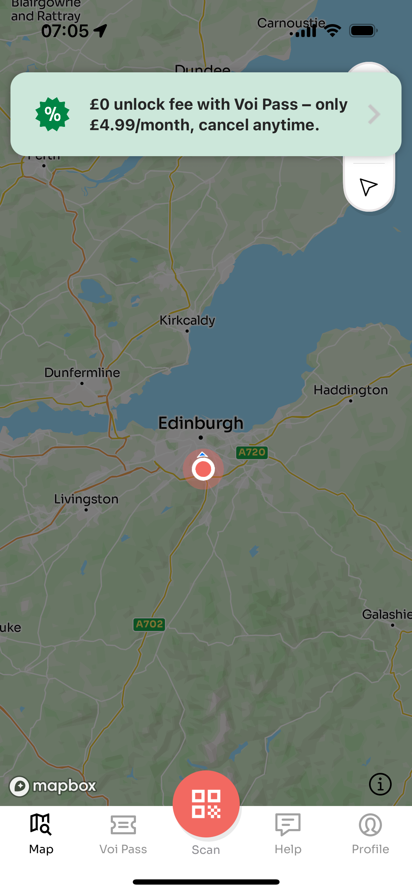
    </a>
    
Edinburgh's not got a perimiter of use available yet, so the app actually defaults to the next closest, Liverpool.

  

  

    <a href="./assets/images/2.PNG" data-pswp-width="1179" data-pswp-height="2556" target="_blank">
      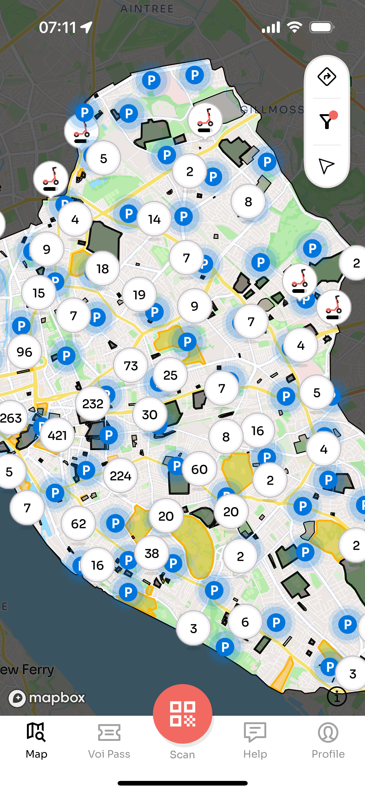
    </a>
    
Here's an example (Liverpool) of how the perimeter of use manifests on the map, with zones and rentable bikes/scooters.

  

    

    <a href="./assets/images/3.PNG" data-pswp-width="1179" data-pswp-height="2556" target="_blank">
      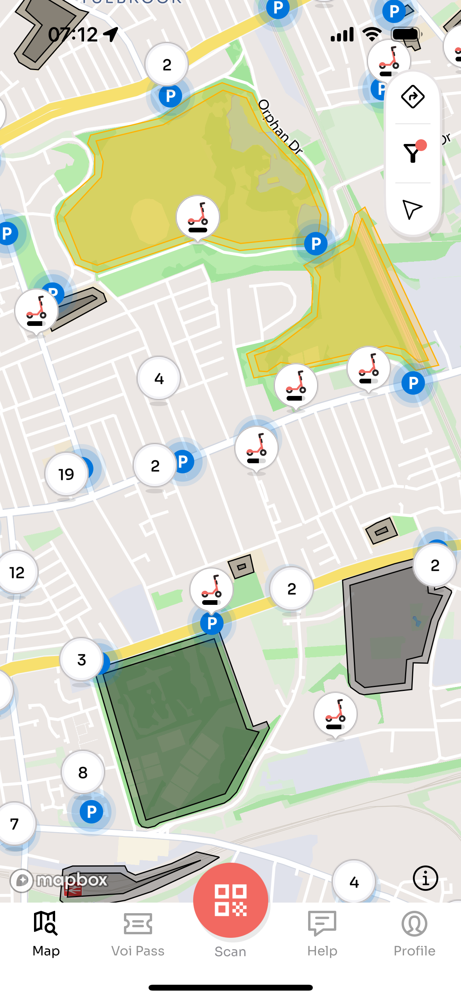
    </a>
    
Zooming in closer we can start to see individual scooters - which won't be in Edinburgh, pending legislation required to allow them - and different zones, parking etc.

  

    

    <a href="./assets/images/4.PNG" data-pswp-width="1179" data-pswp-height="2556" target="_blank">
      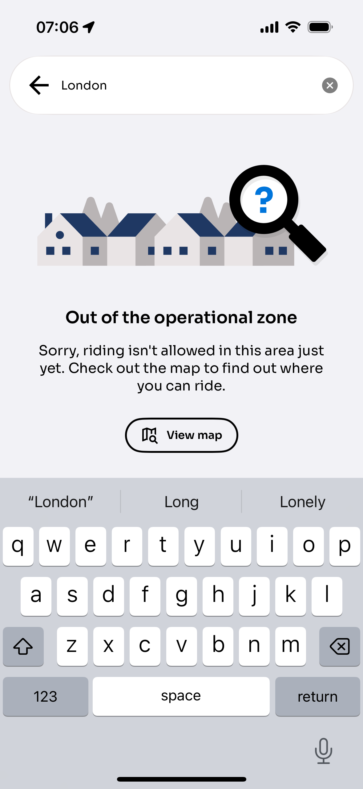
    </a>
    
The top icon on the map view - the direction arrow - looks to offer GPS navigation / directions, but will show a warning if the destination is outside the usage perimiter in your city.

  
  
  

    <a href="./assets/images/5.PNG" data-pswp-width="1179" data-pswp-height="2556" target="_blank">
      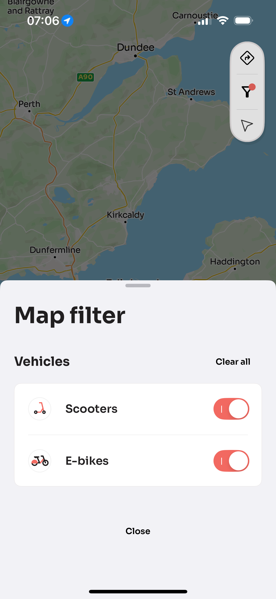
    </a>
    
The second icon in the top corner of the map view is a filter to show only bikes or scooters on the map.

  

    

    <a href="./assets/images/6.PNG" data-pswp-width="1179" data-pswp-height="2556" target="_blank">
      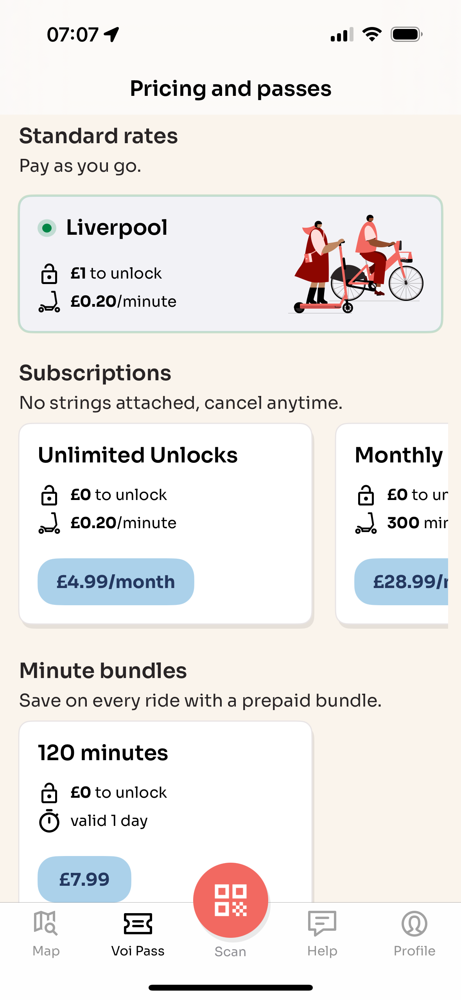
    </a>
    
The 'Voi pass' tab shows pricing options - this, and the next shot, are plans in Liverpool.

  

    

    <a href="./assets/images/7.PNG" data-pswp-width="1179" data-pswp-height="2556" target="_blank">
      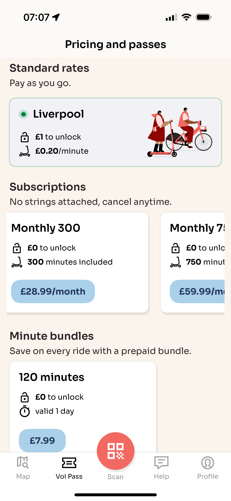
    </a>
    
Scrolling through the different (Liverpool) monthly plans.

  

    

    <a href="./assets/images/8.PNG" data-pswp-width="1179" data-pswp-height="2556" target="_blank">
      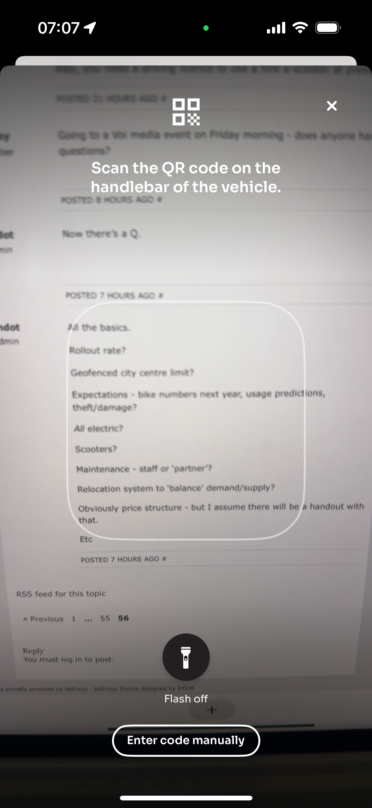
    </a>
    
The 'Scan' tab prompts scanning a QR code on the vehicle handlebars or entering it manually to get started.

  

    

    <a href="./assets/images/9.PNG" data-pswp-width="1179" data-pswp-height="2556" target="_blank">
      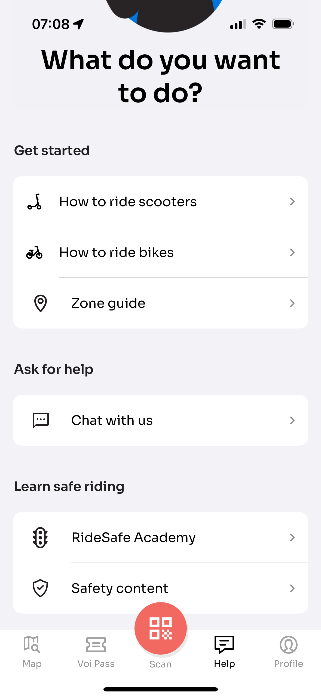
    </a>
    
The 'help' tab has several options, which we'll look through one by one.

  

    

    <a href="./assets/images/10.PNG" data-pswp-width="1179" data-pswp-height="2556" target="_blank">
      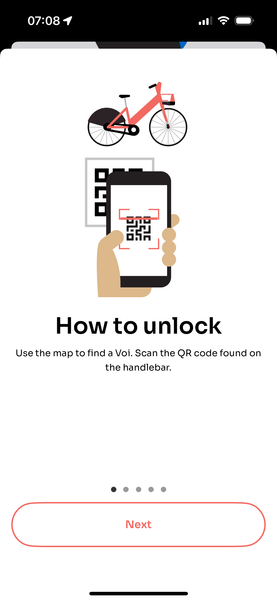
    </a>
    
'How to ride bikes' has several following screens with advice.

  

    

    <a href="./assets/images/11.PNG" data-pswp-width="1179" data-pswp-height="2556" target="_blank">
      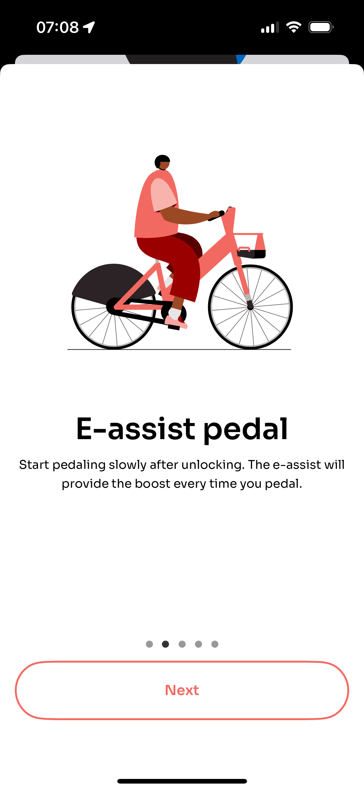
    </a>
    
We're yet to see if Voi bikes will provide less assistance (move more slowly) during initial rides until your 'intro' to the bike is finished, as other providers do.

  

    

    <a href="./assets/images/12.PNG" data-pswp-width="1179" data-pswp-height="2556" target="_blank">
      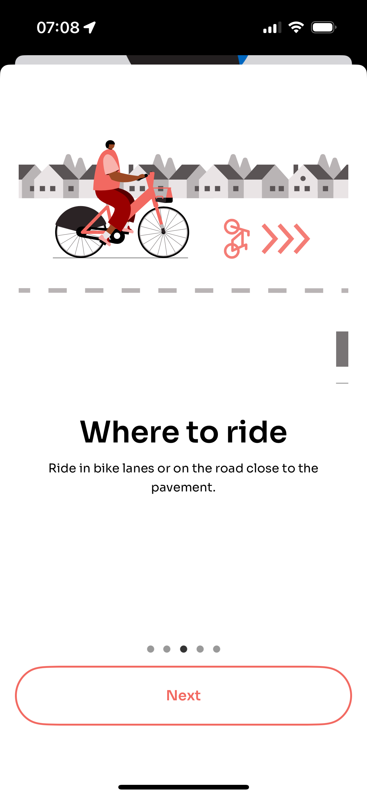
    </a>
    
'On the road, around the potholes' might be more fitting.

  

    

    <a href="./assets/images/13.PNG" data-pswp-width="1179" data-pswp-height="2556" target="_blank">
      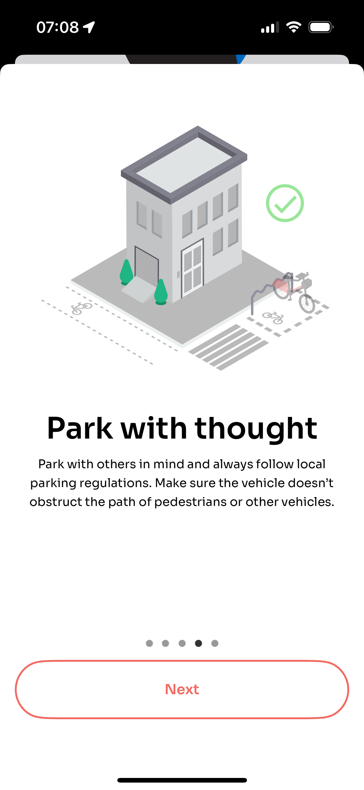
    </a>
    
Most providers allow a journey to be 'paused' without the bike being in a geofenced parking zone, e.g. to pop into a shop; assumedly this is where any parking conflicts will arise.

  

    

    <a href="./assets/images/14.PNG" data-pswp-width="1179" data-pswp-height="2556" target="_blank">
      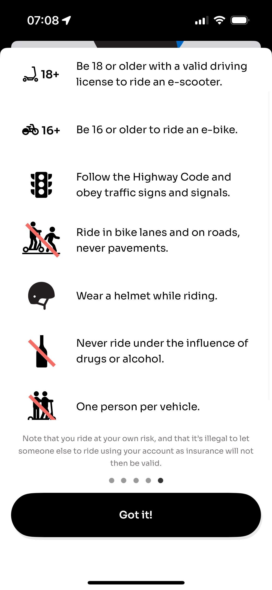
    </a>
    
Helmet advice is interesting given the bikes aren't provided with one!

  

    

    <a href="./assets/images/15.PNG" data-pswp-width="1179" data-pswp-height="2556" target="_blank">
      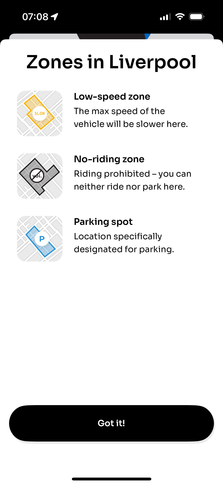
    </a>
    
We'd expect these zone types to match in Edinburgh, by and large.

  

    

    <a href="./assets/images/16.PNG" data-pswp-width="1179" data-pswp-height="2556" target="_blank">
      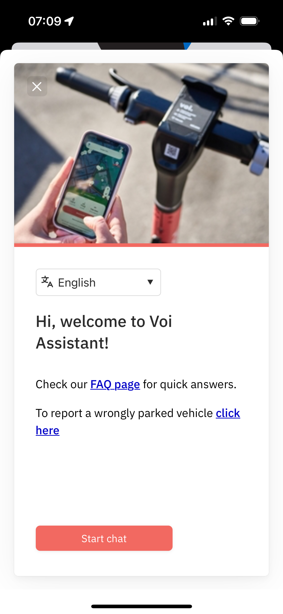
    </a>
    
What you're faced with if you choose 'Chat with Us' from the 'Help Centre' tab.

  

    

    <a href="./assets/images/17.PNG" data-pswp-width="1179" data-pswp-height="2556" target="_blank">
      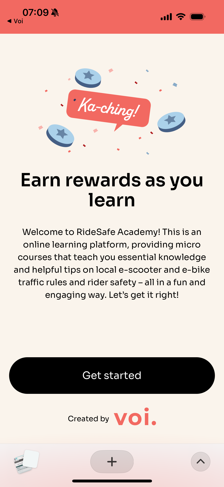
    </a>
    
The Help Centre's 'Ridesafe Academy' links out to the web browser to <a href="https://ridesafe.voi.com/" target="_blank" rel="nofollow">this page →</a>

  

  

    <a href="./assets/images/18.PNG" data-pswp-width="1179" data-pswp-height="2556" target="_blank">
      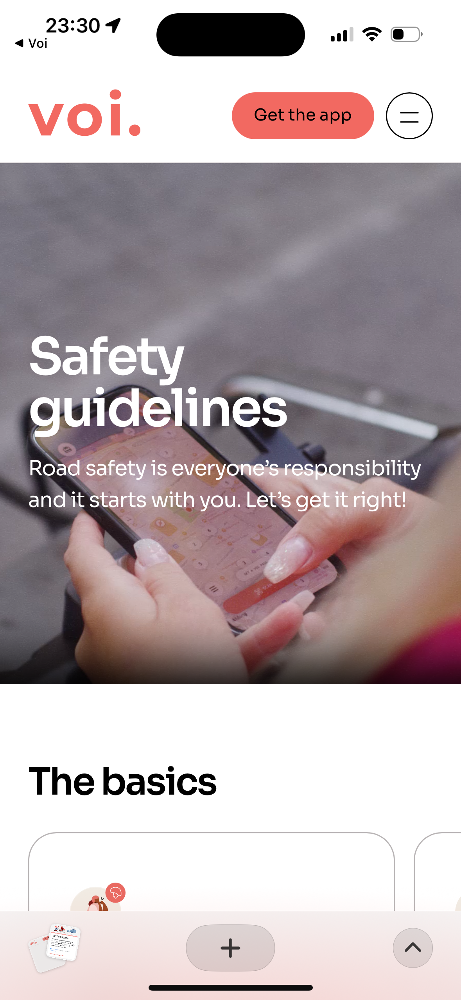
    </a>
    
The same is true of the Help Centre's 'Safety Content', which links out to <a href="https://www.voi.com/ride-safe" target="_blank" rel="nofollow">This page →</a>

  

  

    <a href="./assets/images/19.PNG" data-pswp-width="1179" data-pswp-height="2556" target="_blank">
      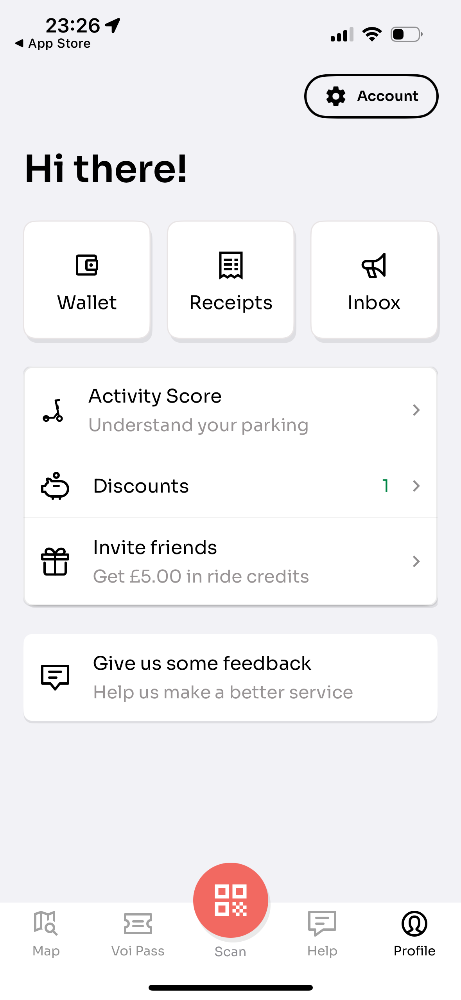
    </a>
    
The 'Profile' tab has a range of controls to access personal details, payment methods, rewards and your rating / score.

  

  

    <a href="./assets/images/20.PNG" data-pswp-width="1179" data-pswp-height="2556" target="_blank">
      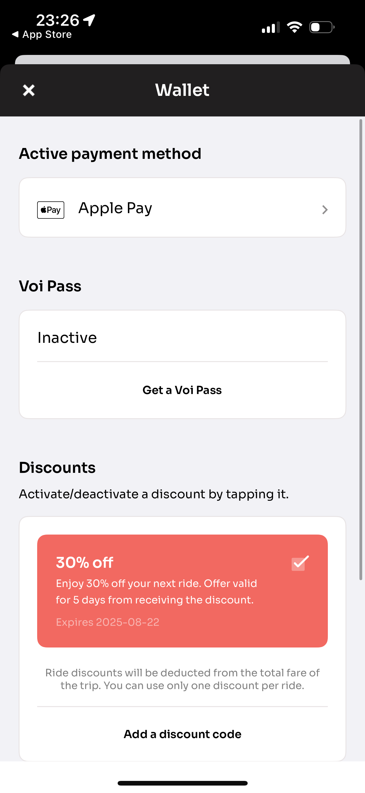
    </a>
    
'Wallet' includes any currently active Voi passes, and discount codes. This one is offered if I add my driving licence in the next five days (required to ride scooters).

  

  

    <a href="./assets/images/21.PNG" data-pswp-width="1179" data-pswp-height="2556" target="_blank">
      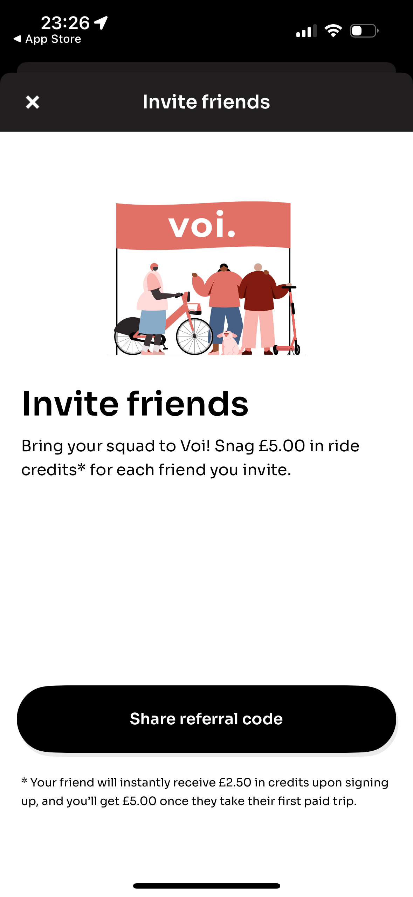
    </a>
    
Referral schemes are always popular when new services launch, as a quick way to get a free try-out.

  

  

    <a href="./assets/images/22.PNG" data-pswp-width="1179" data-pswp-height="2556" target="_blank">
      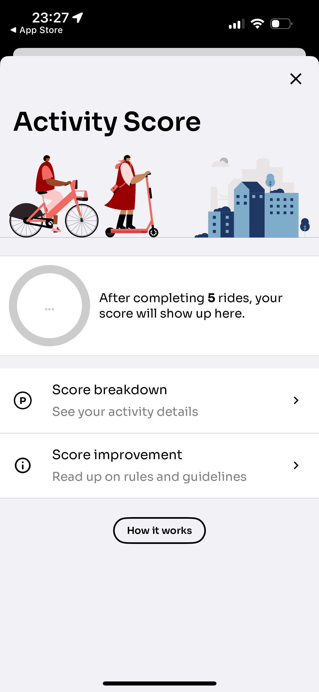
    </a>
    
Your 'activity score' looks like a rating based on how well you're following rules on parking and ending trips, and other guidance.

  

  

    <a href="./assets/images/23.PNG" data-pswp-width="1179" data-pswp-height="2556" target="_blank">
      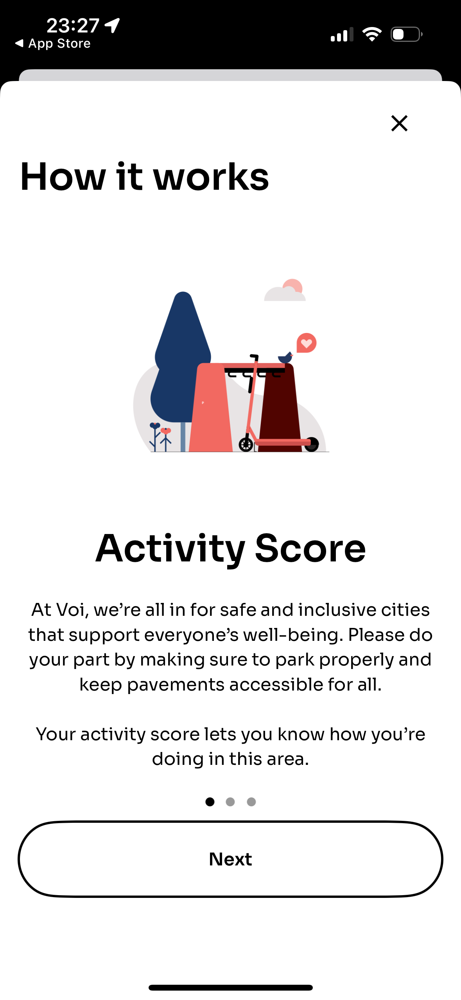
    </a>
    
Activity Score 'How it works' 1 of 3

  

  

    <a href="./assets/images/24.PNG" data-pswp-width="1179" data-pswp-height="2556" target="_blank">
      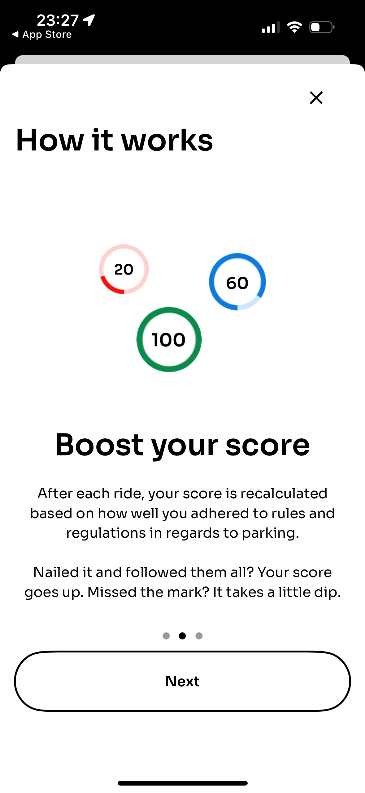
    </a>
    
Activity Score 'How it works' 2 of 3

  

  

    <a href="./assets/images/25.PNG" data-pswp-width="1179" data-pswp-height="2556" target="_blank">
      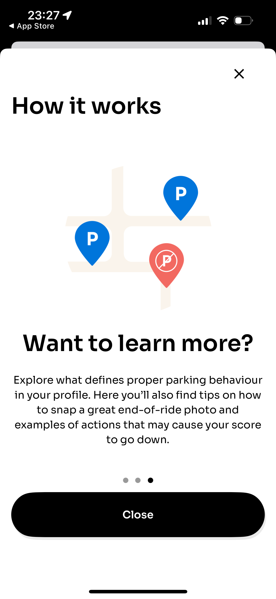
    </a>
    
Activity Score 'How it works' 3 of 3

  

  

    <a href="./assets/images/26.PNG" data-pswp-width="1179" data-pswp-height="2556" target="_blank">
      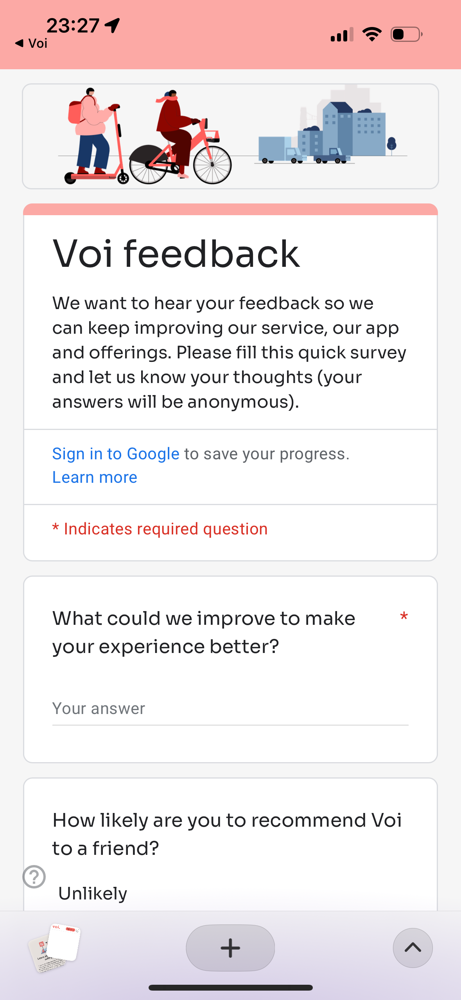
    </a>
    
The link from 'Profile' for 'Give us some feedback' links to what appears to be a branded Google form to reach the team.

  

