_Last updated {{ page.date | readablePostDate }}_

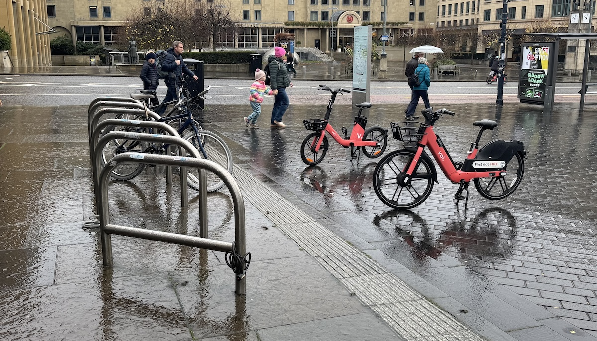

## 🚲 Enjoying the ride, and managing the downsides of bike hire

We're big fans of [Voi](https://www.voi.com/), the new e-bike scheme with hundreds of cycles available for hire across the capital. The prices are reasonable, the bikes are fun to ride, and downright handy if you find yourself in town without your own or need to sprinkle some cycling into a multi-modal journey across town.

During this 'trial' period in Edinburgh, there are a number of issues cropping up with the impact of the bikes on the streetscape - and as some had predicted, the parking of the bikes is creating some less than ideal situations for pedestrians and cyclists alike. Among these is **the parking of Voi bikes in cycle parking racks**, which we're taking up with Voi as something we'd like to see action on.

> 📸 As well as shooting our own photos, we're also taking submissions - send your photo to [hello+voiracks@edi.bike](mailto:hello+voiracks@edi.bike) with a note of the location.

## 📝 Defining the problem

- 🅿️ **Edinburgh is trying to increase its cycle parking provision** — with somewhere safe to lock up when cyclists reach their destination, more cycling journeys are enabled and encouraged;
- ⚡️ **The Voi scheme is a great enabler** for short cycling journeys, introducing people to cycling in the city (and to e-bikes) — and having more parking locations make the scheme more useful;
- 🫥 **Voi parking zones are invisible**, 'geo-fenced' zones, and bikes have to be within these GPS locations for their trip to end, however a lack of precision leads to parking adjacent to the invisible zone;
- 🔒 **Cycle racks are visible** and seem like the natural home for a bike to rest at the end of its journey - folk are just trying to be neat _(thanks to reader Björn & partner for pointing this out!)_;

> 🚳 Voi cycles **don't need to be in cycle racks**; they feature a central stand to hold up on their own, and they have an internal locking system rather than needing locked to something. When they're left in cycle parking, they **block a space to lock up a privately owned bike**, and are heavy and difficult to move — issuing a loud alarm if shifted. 

---

## 🙈 Compounding issues

- 📸 Many of Voi's photos of each parking zone **within their own app** show Voi bikes parked in cycle racks across the city (see below), suggesting this is suitable;

- 🛰️ A number of the parking zones are **located close enough to a cycle parking rack** that users can end their trip with the bike in a rack and this be accepted by the app, because of GPS accuracy / precision;

- 📱 There is **no guidance in the app when parking** a Voi bike to suggest that cycle racks shouldn't be used; 

- 🤖 There is no current rule about cycle rack parking, or enforcement within the mix of artificial intelligence and offshore staff who review parking photos, that would lead to users receiving feedback about using cycle racks to end their trip.

<figure>
  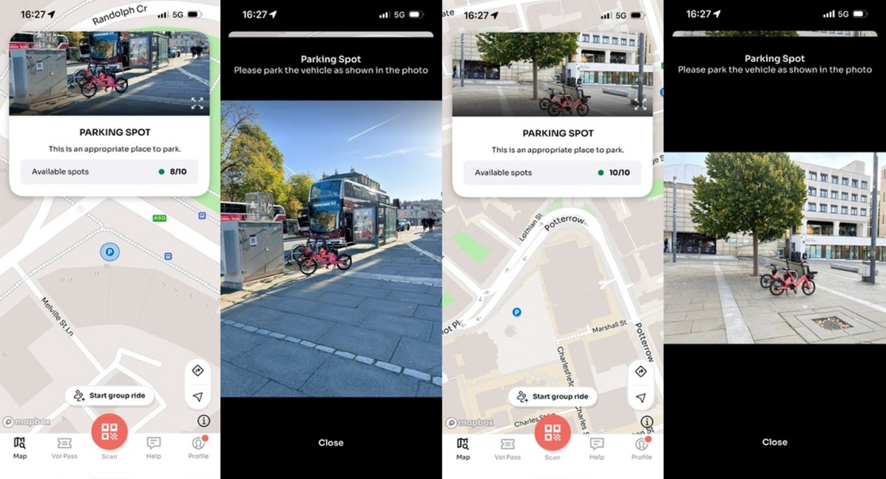
  <figcaption>
    The Voi app recommending parking in two different sets of racks at Drumsheugh Pl, and at Bristo Sq / Potterow 
  </figcaption>
</figure>

### 📱 View 16 more locations where Voi appear to depict parking in cycle racks
Click to view larger images in a gallery:

<link rel="stylesheet" href="/projects/2025-11-voi-cycle-rack-parking/assets/photoswipe/photoswipe.css">

  <figure class="pswp-gallery__item">
    <a href="./assets/images/app-parking-2.jpg" data-pswp-width="1198" data-pswp-height="649" target="_blank">
      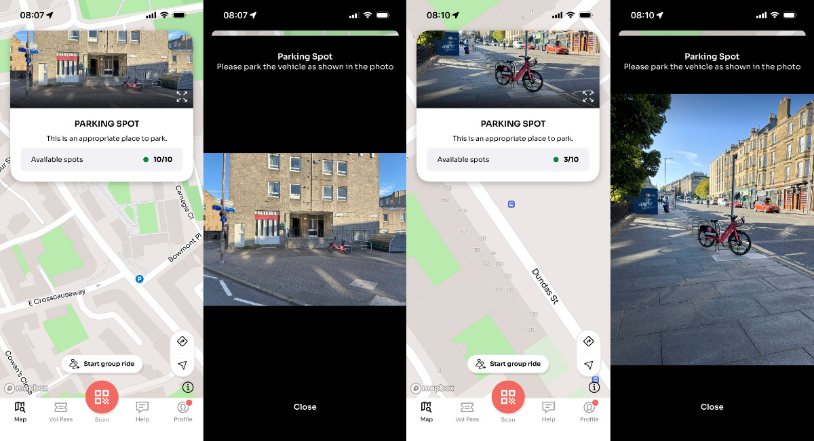
    </a>
    <figcaption class="hidden-caption-content">The Voi app depicting cycle rack parking at Bowmont Place, and close to racks at Dundas St</figcaption>
  </figure>
  <figure class="pswp-gallery__item">
    <a href="./assets/images/app-parking-3.jpg" data-pswp-width="1198" data-pswp-height="649" target="_blank">
      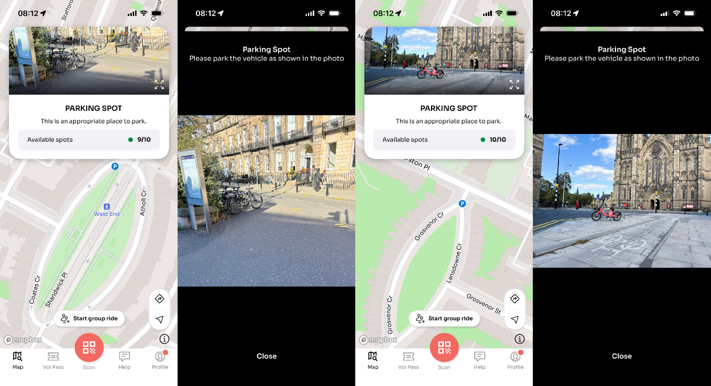
    </a>
    <figcaption class="hidden-caption-content">The Voi app depicting cycle racks (but no Voi bikes) at Coates Cres and blocking racks at Grosvenor Cres</figcaption>
  </figure>
  <figure class="pswp-gallery__item">
    <a href="./assets/images/app-parking-4.jpg" data-pswp-width="1198" data-pswp-height="649" target="_blank">
      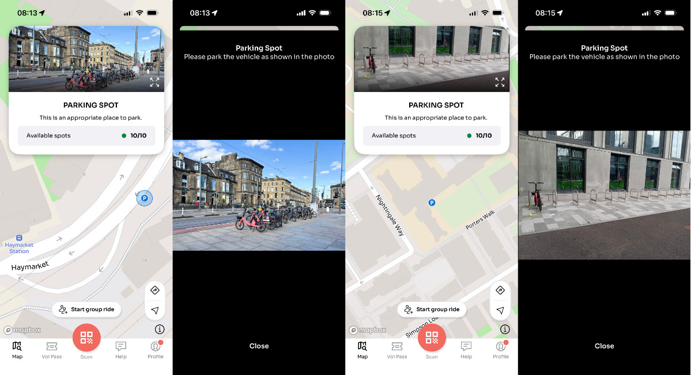
    </a>
    <figcaption class="hidden-caption-content">The Voi app depicting cycle parking right up to racks at Haymarket Station, and within racks at the Edinburgh Futures Institute in Quartermile</figcaption>
  </figure>
  <figure class="pswp-gallery__item">
    <a href="./assets/images/app-parking-5.jpg" data-pswp-width="1198" data-pswp-height="649" target="_blank">
      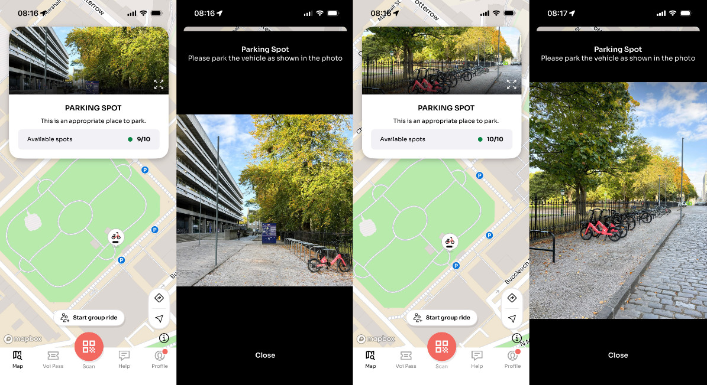
    </a>
    <figcaption class="hidden-caption-content">The Voi app showing cycle parking blocking the end of racks at George Sq, and right up to racks also in George Sq</figcaption>
  </figure>  
   

---

## 🪧 What we're asking for

We're calling on Voi, in partnership with the City of Edinburgh Council, to:

> 🚳 1. **Adopt a policy** that Voi bikes should be discouraged from using cycle rack parking spaces in Edinburgh, which doesn't seem to exist at present;
>
> 📸 2. **Update in-app photos** of parking zones to only show bikes on their stands within the geo-fenced zone, not left in cycle racks;
> 
> 📱 3. **Add guidance when parking** to say bikes should be left on their stand and not in cycle racks, and **update parking photo review** to enforce this.
> 
> 👀 4. **Monitor cycle rack parking**, and where persistent shift the geo-fenced parking zone further away from cycle rack locations to prevent rack parking even in cases of GPS inaccuracy.

Rack parking is far from the only issue with the trial scheme, but it's the first and most easily actionable one we're turning our attention to.

---

## 👁️ Rack parking, in pictures

> 📸 Send your photo to [hello+voiracks@edi.bike](mailto:hello+voiracks@edi.bike) with a note of the location.

<figure>
  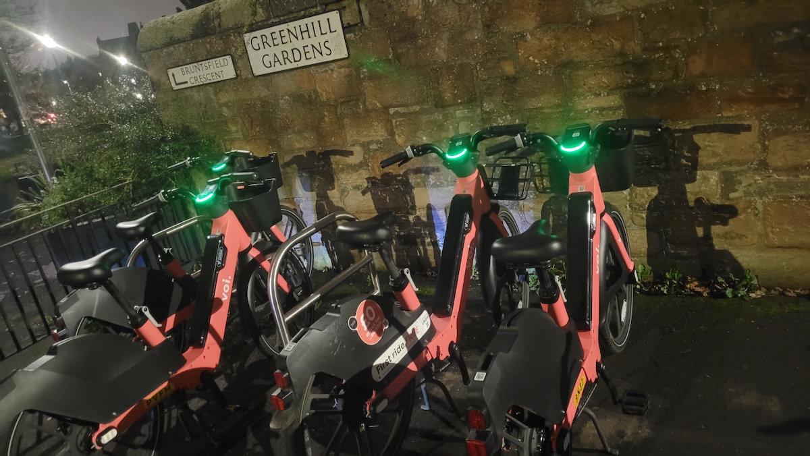
  <figcaption>
    2025-11-12 | Greenhill Gardens | Liam Aiton 
  </figcaption>
</figure>

<figure>
  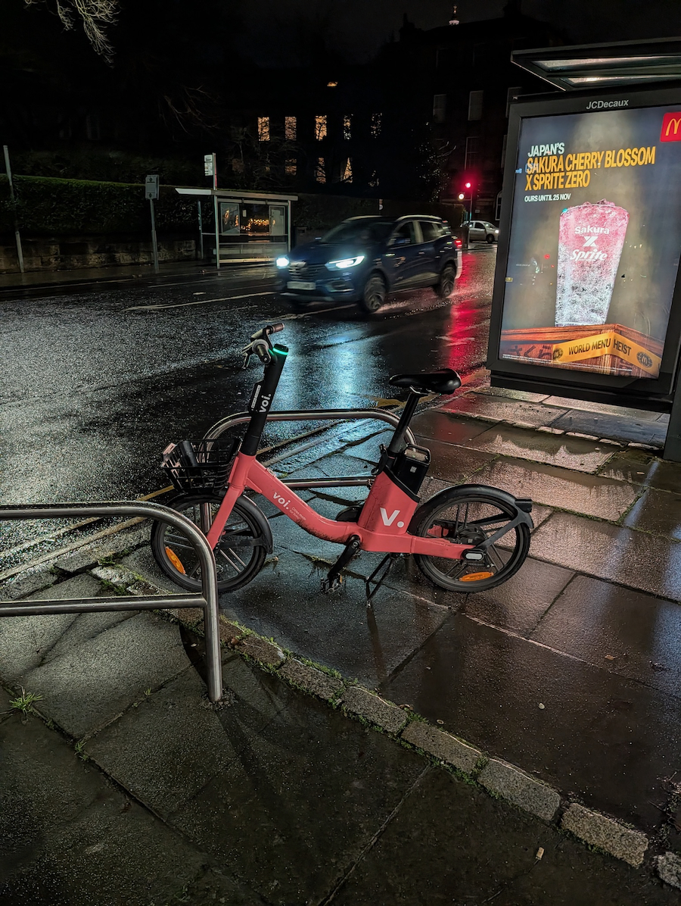
  <figcaption>
    2025-11-11 | Drumsheugh Gardens | Mark Baker
  </figcaption>
</figure>

<figure>
  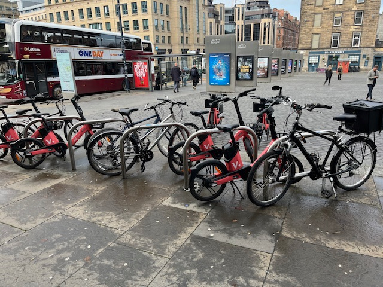
  <figcaption>
    2025-11-11 | Usher Hall, Lothian Rd | Matt McArthur
  </figcaption>
</figure>

<figure>
  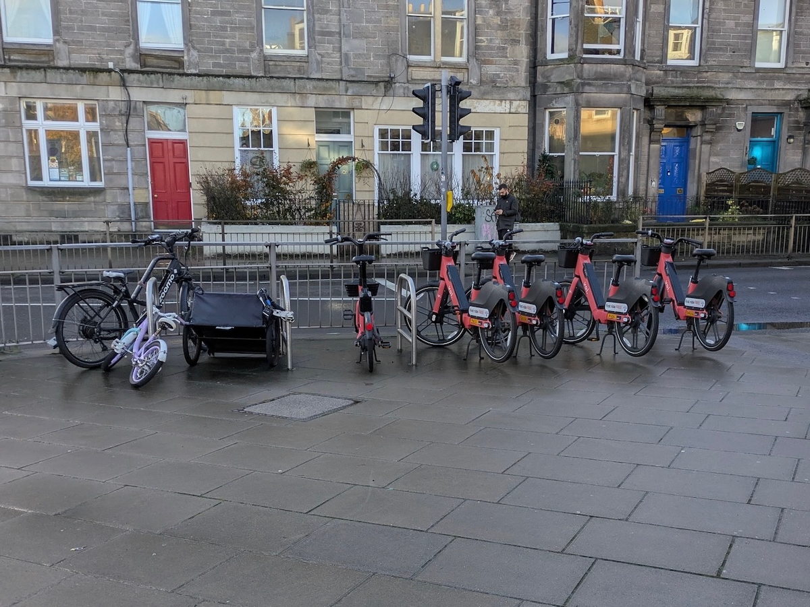
  <figcaption>
    2025-11-11 | Ferry Rd at North Fort St | Clarissa Sutherland
  </figcaption>
</figure>

<figure>
  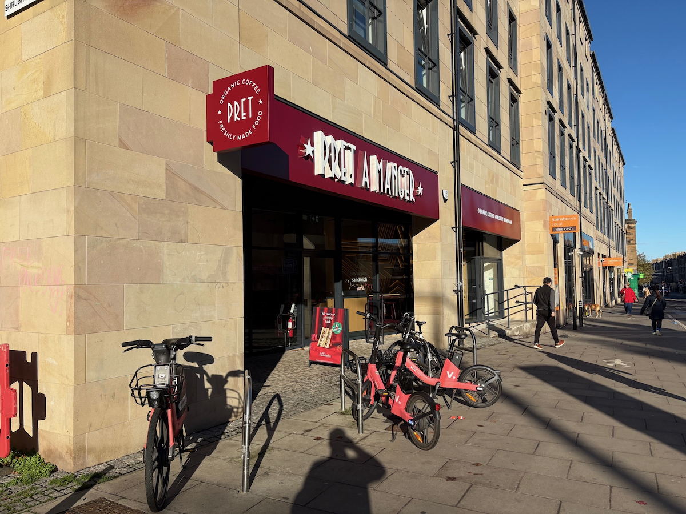
  <figcaption>
    2025-11-10 | Pret on Leith Walk | Martin McDonnell
  </figcaption>
</figure>

<figure>
  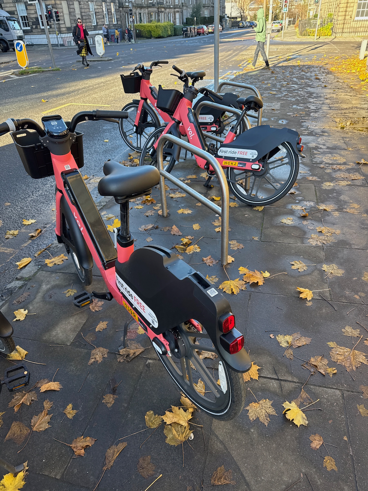
  <figcaption>
    2025-11-10 | Bottom of Dundas St | John Edward
  </figcaption>
</figure>

<figure>
  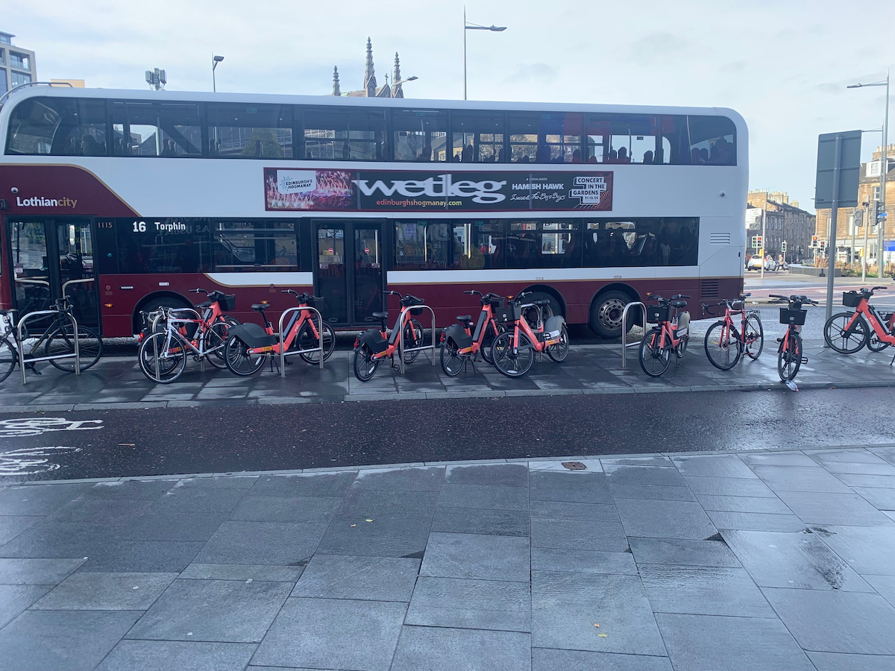
  <figcaption>
    2025-11-03 | Omni Centre | James Preston
  </figcaption>
</figure>

<figure>
  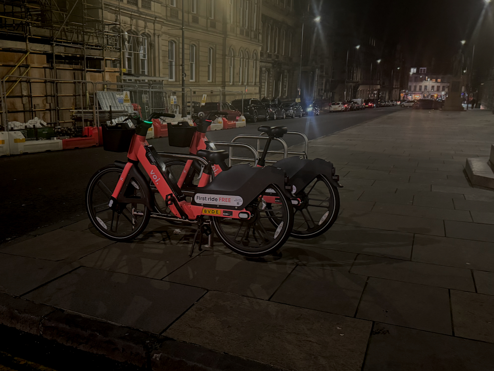
  <figcaption>
    2025-11-01 | Chambers St | edi.bike
  </figcaption>
</figure>

<figure>
  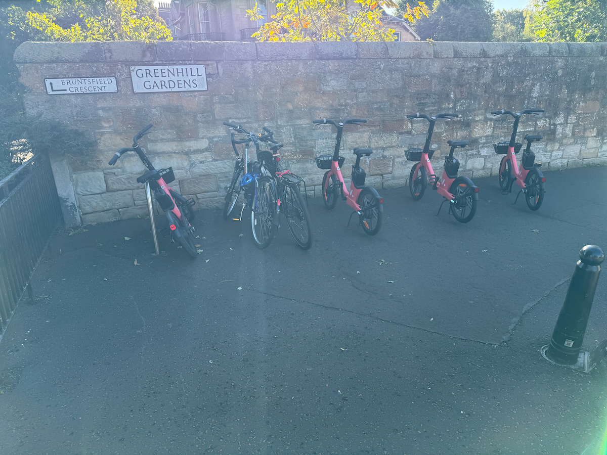
  <figcaption>
    2025-09-22 | Bruntsfield | edi.bike
  </figcaption>
</figure>

<figure>
  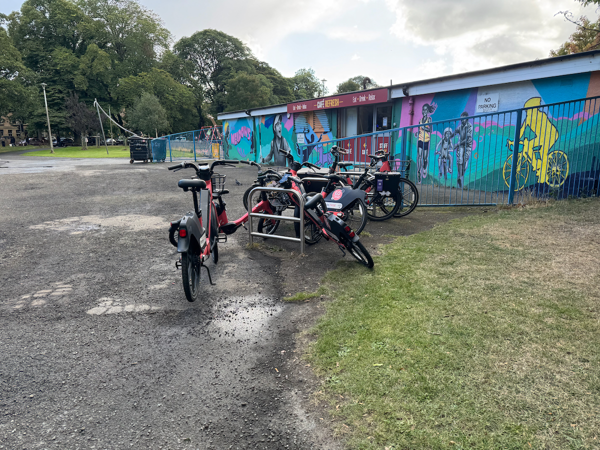
  <figcaption>
    2025-09-12 | The Meadows | edi.bike
  </figcaption>
</figure>

---

## Related:
- 2025-11: [Voi Bikes Scale Up](/articles/2025-11-02-voi-hire-bikes-scale-up)
- 2025-08: [Edinburgh hire bike supplier 'Voi' host press launch ahead of 3rd September start date](/articles/2025-08-24-voi-hire-bikes-media-launch)
- 2025-08: [Gallery: The Voi App ahead of Edinburgh Launch](/projects/2025-08-voi-app)